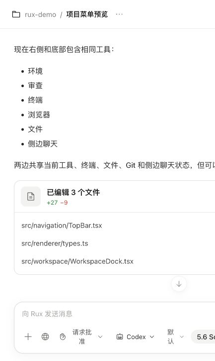
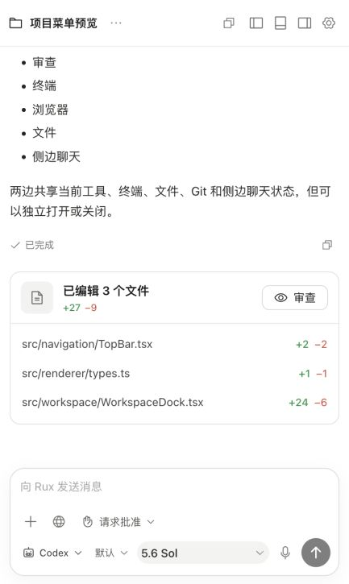
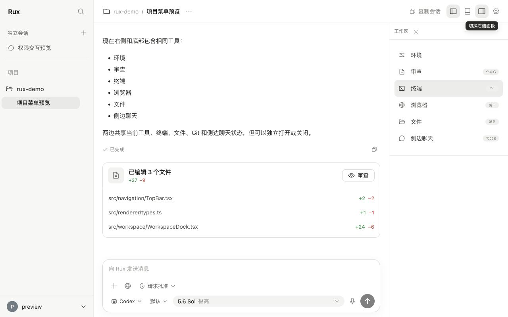
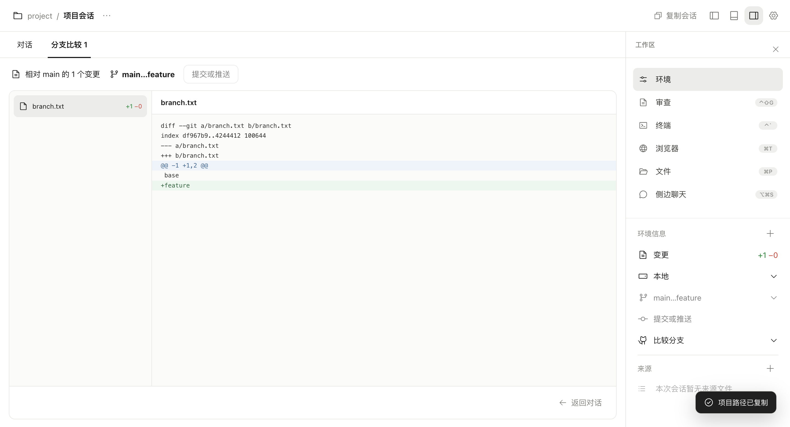
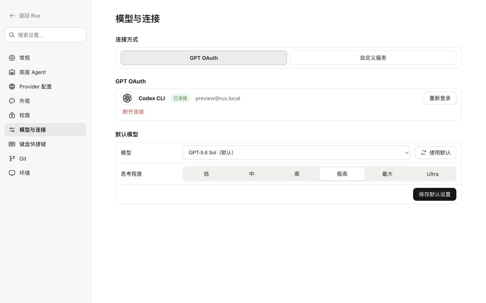

# Rux 多维审查与修复记录

本轮检查覆盖项目/独立会话、消息输入与运行状态、Git 审查、工作区面板、终端和设置。主要问题集中在异步状态隔离、持续输出时的保存开销，以及面板变窄后控件无法完整显示。修复沿用现有灰白色界面、组件和 Agent 能力边界。

| 维度 | 发现的问题 | 已完成的修复 | 验证依据 |
| --- | --- | --- | --- |
| 性能 | 每次流式事件触发历史消息的复制和保存准备；持续输入可能一直推迟保存 | 16ms 合并流式事件；到保存时才处理历史；250ms 合并、最长 1 秒触发写入；写入串行、只保留最新待保存快照 | 100 次连续快照更新合并为 1 次保存；慢写入排序和失败恢复测试 |
| 性能 | 切换项目即扫描文件、读取远程地址；所有工作区工具都加载 xterm | 按打开的工具读取文件/远程信息；终端组件单独懒加载；批量追加终端输出并限制回放缓冲 | 构建产物拆出终端模块；终端生命周期测试 |
| 性能 | 桌面发布的 Renderer 脚本未压缩 | 开启 Renderer 的 esbuild 压缩 | 同轮未压缩构建约 2.249 MB，压缩后约 1.184 MB，减少约 47.4% |
| 用户体验 | 新建会话等待持久化期间，可重复提交并创建重复任务；切换后被旧请求拉回 | 创建阶段立即加锁并显示运行状态；旧请求仅更新所属会话 | 重复发送、创建失败重试、创建中切换会话测试 |
| 用户体验 | 删除最后一个项目后，仍可能停留在已移除的项目；删除草稿未清除草稿内容 | 正确选择剩余会话或新建独立草稿；同步清理草稿与项目关联；异步重命名/删除不覆盖后来选中的会话 | 最后项目移除测试；独立草稿重启恢复 E2E |
| 用户体验 | 顶部“分享”实际只是复制；回复缺少直接复制入口及清晰结束反馈 | 改为“复制会话”；增加回复复制与完成状态；复制/草稿保存失败提供反馈 | 实际界面与 Electron 会话流程 |
| UI | 窄窗口横向裁切；左右面板同时打开时，权限/Agent 模式被挤成多行 | 以实际内容区宽度响应布局；输入控件分行排列；窄窗口面板改为覆盖显示；修复悬浮提示带来的横向滚动 | 1280×800、多面板、433×725 截图；900px 原生窗口控件边界测试 |
| UI | Git diff 缺少行色彩层次；长文件列表无法独立滚动；空白难以区分加载或失败 | 增删行与分段标题着色；文件列表、差异区独立滚动；明确加载、错误重试和空状态 | 原生 Git 截图；新增 diff 行必须进入可视区域的断言 |
| 交互 | 顶部菜单不响应外部点击或 Escape；模型子菜单无法用方向键进入；菜单间空隙易造成关闭 | 补齐菜单关闭、焦点恢复及方向键导航，消除子菜单悬停间隙 | 原生窗口菜单与键盘 E2E |
| 交互 | 关闭终端面板会终止 shell；启动失败后不能正常重试；旧项目输入/输出可能影响下一终端 | 隐藏面板保留 shell；项目切换才关闭；启动/关闭/写入按顺序处理；失败可重试；旧会话数据隔离；合并尺寸变化 | 原生 PTY 命令执行、面板重开后继续执行；延迟启动、切换和失败测试 |
| 功能完整性 | 旧项目 Git 响应或先选文件的慢 diff 可覆盖当前视图；后台刷新覆盖分支比较；暂存后差异过期 | 按项目、比较范围和请求序号校验；保留比较范围；操作后刷新；从会话文件条目进入对应 diff | 跨项目、乱序 diff、比较保持、操作刷新和错误恢复测试 |
| 功能完整性 | 文件按钮只监听双击；展示了未实现的快捷键；无实际通知功能却显示通知入口 | 文件支持标准按钮激活；实现文件/浏览器/侧边聊天快捷键并同步设置说明；移除空通知入口 | 代码事件绑定和 Electron 控件检查 |
| 功能完整性 | 搜索项目名时隐藏了项目下的会话；折叠项目的匹配结果不显示；独立会话无运行标识 | 项目名命中保留其会话；搜索时展开匹配项目并显示无结果状态；独立会话展示运行状态 | 组件断言与侧栏界面检查 |
| 功能完整性 | 模型目录回退后，实际发送参数仍可能使用旧设置；无可用模型时展示不受支持的推理选项 | 发送使用已校验的模型偏好；设置保存同步偏好；无模型时显示说明并禁用推理选项；自定义服务不携带原生速度偏好 | 类型检查、模型组件测试和现有适配器测试 |
| 能力与可访问性 | 侧边任务运行时仍能更改权限；分支比较右侧栏仍显示可执行的提交按钮；部分附件按钮没有名称 | 锁定侧边运行期间的权限变更；比较状态禁用工作树操作；提供附件按钮名称、可见焦点和减少动态效果适配；不支持语音时隐藏入口 | 权限单元测试、原生比较禁用断言、键盘测试；不据此宣称完整 WCAG 合规 |

体积数字比较的是本轮构建中的 Renderer JavaScript 总量，包含懒加载模块，不代表首屏耗时或帧率改善 47.4%。保存频率结论来自受控测试，未进行大型真实项目的 CPU/内存/帧率长期采样。

1. **会话与输入：已修复主要可用性问题。** 输入区按可用宽度换行，主要控件不再被窗口裁掉；回复结束状态和复制入口清晰。下图为本轮同一窄窗口尺寸下的前后对比。

| 修复前 | 修复后 |
| --- | --- |
|  |  |

2. **项目导航与工作区：主流程正常。** 同时开启侧栏与工具面板时，对话仍可阅读、输入。搜索和独立会话运行状态已补齐。此截图采用 Web 预览的固定示例数据，空白终端区域不代表真实 PTY 状态。

3. **Git 审查：状态隔离与视觉复核通过。** 下图来自本轮真实 Electron 测试及临时 Git 仓库，展示 `main` 与 `feature` 的差异。新增行在可视区域内；比较视图中的提交操作禁用。截图复核曾发现新行排在同一水平行的问题，已修复并补充回归断言。

4. **终端与文件操作：功能验证通过，终端视觉证据有限。** PTY 在测试临时项目中执行命令；关闭/重新打开面板后保留输出并继续执行。文件按钮采用标准单击激活。此步骤没有保留真实终端运行截图，结论来自原生自动化断言与生命周期测试。

5. **模型与设置：页面和交互检查通过。** 模型目录与实际发送偏好同步，运行时权限变更锁定；模型子菜单支持键盘进入、选择与 Escape 返回。设置截图使用固定预览账户，未测试真实账号登录或付费请求。

验证结果：

- 基线：21 个测试文件，75 项单元测试通过。
- 修复后：23 个测试文件，93 项单元测试通过；新增 18 项覆盖保存与异步控制器。
- 6 项 Electron E2E 通过：会话/设置、删除、草稿重启恢复、Sticky 导航、真实 Git/SQLite/PTY、窄窗与键盘菜单。
- `pnpm typecheck`、Web/desktop 构建、`git diff --check` 通过。
- `pnpm package` 成功生成 `release/mac-arm64/Rux.app`。这是未签名的 macOS arm64 本地包；未执行分发签名、公证或跨平台验证。
- 原生 E2E 的 Agent 输出由仓库已有 `RUX_E2E` 模式提供；本轮没有用真实 Agent 账号发起任务。Git、SQLite 和 PTY 使用真实本地实现及隔离的测试目录。

源文件中的 Renderer 沙箱、IPC 校验、密钥存储与 Agent 会话归属边界保留。新增 `jsdom` 仅用于开发测试。所有代码和审查素材保留为工作区改动，没有提交或推送。

构建明细见 [verification.json](verification.json)。界面预览可用 `pnpm dev:web` 启动；真实桌面工作流使用仓库根目录的 `pnpm dev`。

## 补充修复

继续复查后，用新增测试复现并修复了四个遗漏：

- 同一项目内切换 Agent 时，尚未返回会话 ID 的旧侧边任务会被标记为已离开；延迟启动完成后再次向原 Agent 发出中断。组件卸载也清理当前侧边任务。
- 侧边批准响应只清除对应任务、对应请求的状态，旧响应不能覆盖新批准请求。
- 终端启动失败时清空待刷新的输出和定时器，并先清理可能已创建的 PTY，再允许重试。
- 保存失败的快照会保留供后续刷新重试，且不会覆盖排队中的较新快照。

四个回归测试均先在修复前失败、修复后通过。完整验证为 93 项单元测试、6 项 Electron E2E、类型检查及 Web/desktop 构建通过。
