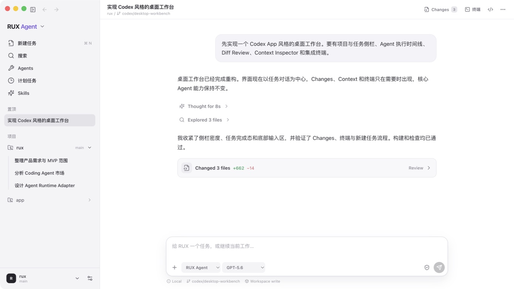
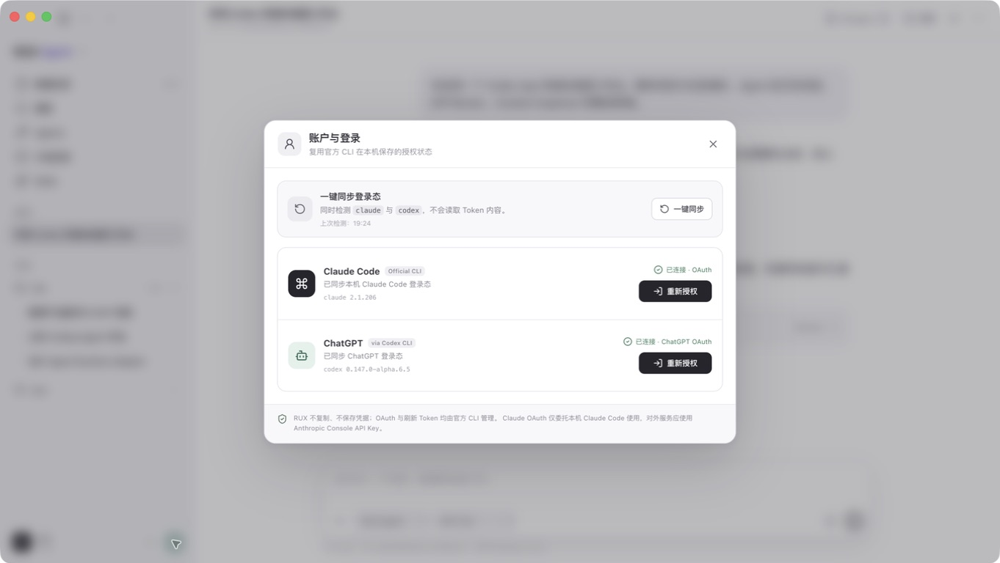
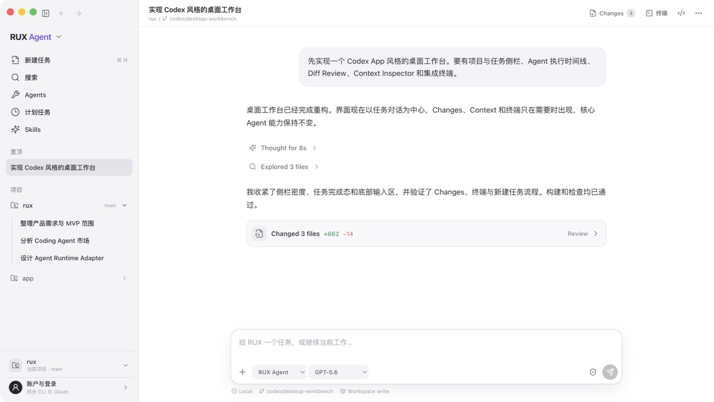
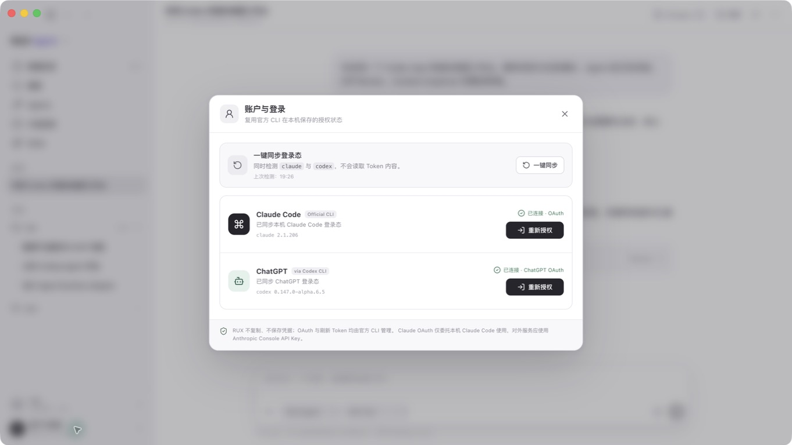

# RUX 账户入口验收

## 范围

- 产品：macOS 打包版 `RUX.app`
- 流程：从主界面底部进入“账户与登录”，确认 CLI 登录态
- 目标：账户入口应可发现、不会与项目切换混淆，并能明确反馈 Claude Code 与 ChatGPT 状态

## 验收步骤

### 1. 修复前主界面 — 不健康

- 底部绝大部分区域表现为带头像的主入口，但实际行为是切换项目。
- 账户入口被压缩成右侧无文字小图标，视觉语义不清楚。
- 虽然图标按钮有“账户与登录”的辅助技术标签，但视觉用户很难发现；点击目标也明显小于相邻项目入口。

### 2. 修复前账户面板 — 功能正常，入口有问题

- 找到右侧小图标后，面板能同步 Claude Code 与 ChatGPT/Codex CLI 状态。
- 登录状态、CLI 版本和重新授权操作清楚。
- 面板语义为模态对话框，并有明确标题与关闭按钮。

### 3. 修复后主界面 — 健康

- 底部拆成两个完整文字入口：“当前项目”和“账户与登录”。
- 最底部账户入口包含用户图标、主标签“账户与登录”、说明“同步 CLI 与 OAuth”和前进箭头。
- 项目入口使用文件夹图标并明确标注“当前项目”，行为预期不再混淆。

### 4. 修复后账户面板 — 健康

- 点击整行“账户与登录”直接打开正确面板，没有触发项目切换。
- 自动同步完成后显示 Claude Code OAuth 与 ChatGPT OAuth 均已连接。
- 入口和对话框在辅助技术树中都有明确名称。

## 仍需后续验证

- 本轮确认了可见层级、点击行为和辅助技术名称；没有据此宣称完整 WCAG 合规。
- 尚未覆盖仅键盘完整走查、200% 缩放、VoiceOver 实机朗读顺序及未安装 CLI/授权失败状态。
