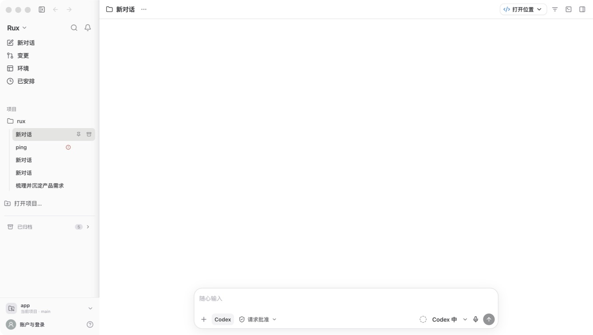
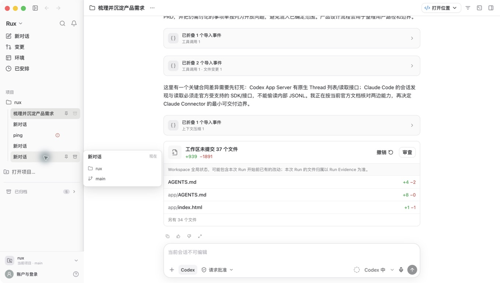
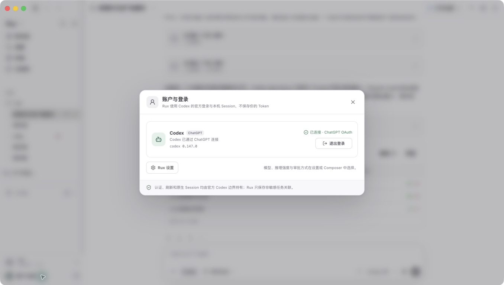
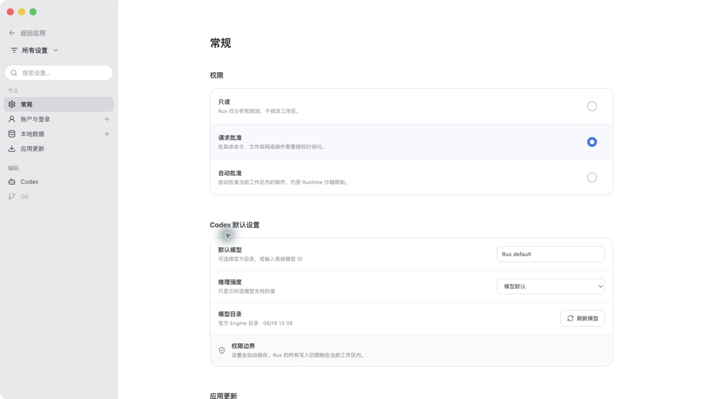
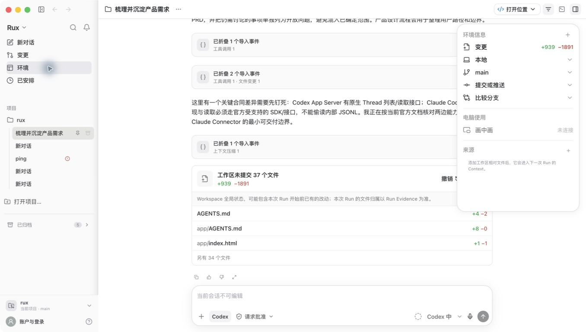

# Rux 与 ChatGPT 客户端 Codex 对齐审计

日期：2026-08-19

## 结论

Rux 目前不能称为与 ChatGPT 客户端 Codex“完全对齐”。

- 对仓库固定的 Codex Desktop `26.810.52044` 基线：核心桌面骨架与主要本地任务路径已接近，尤其是项目/任务侧栏、单任务主区、底部 Composer、审批、变更、环境、Terminal 和 Codex Session 恢复边界。
- 对 2026-08 当前 ChatGPT 客户端 Codex：只覆盖了本地 coding task 主链。Chat/Work、计划任务、插件、云环境、Remote、工作树交接、Subagent 等当前客户端能力并未完整对齐，其中一部分是仓库 v1 范围明确排除的产品决策。
- 当前 ChatGPT 客户端 Codex 基线不提供用户模型切换；Rux 在 Composer 和设置中提供模型选择，是明确的不对齐。
- 因此当前状态更准确地说是“Codex-only 旧版桌面体验的高保真实现”，不是“当前 ChatGPT 客户端 Codex 的 1:1 复刻”。

## 审计范围

- 实际启动 `app/release/mac-arm64/Rux.app`，检查启动、历史任务、账户、设置和环境面板。
- 读取本次画面的可访问性树并保存稳定截图。
- 运行 `npm test` 与 `npm run build:desktop`。
- 用当前 OpenAI 官方文档核对 ChatGPT 桌面客户端与 Codex 的现行能力集合。
- 未修改产品代码。

## 步骤与健康度

### 1. 打包应用启动 — 基本健康

- 优点：浅色平面侧栏、单任务画布、底部 Composer、独立“当前项目”和“账户与登录”入口均符合旧版基线方向。
- 缺陷：Composer 右侧显示可交互模型选择器（画面中的 `Codex 中`）。当前 ChatGPT 客户端 Codex 不支持用户切换模型，因此该控件应移除；实际解析模型只应在 Run 证据中只读展示。
- 风险：“已安排”作为永久禁用主导航项出现。对旧版固定基线可视为占位，但对当前客户端是不完整能力；对 v1 又会制造可见但不可用的入口。
- 风险：本次窗口为 1356×768，未在仓库指定的 1433×812 参考视口完成同尺寸像素对比，因此不能宣称逐像素一致。

### 2. 历史任务与变更证据 — 部分健康

- 优点：长任务保持单一阅读流，工具/导入事件折叠，变更卡片和反馈动作位于 Composer 上方；侧栏任务保持单行密度。
- 风险：历史内容直接展示 Claude Code、Rux Native、Agent 会话导入、跨 Agent 等旧产品概念。仓库允许历史记录可读，但这意味着整个可见产品无法被描述为完全 Codex-only。
- 风险：历史只读任务的 Composer 完全禁用，用户需通过任务操作寻找“复制为新任务”；当前画面缺少就近可见的恢复动作。

### 3. 账户与登录 — 健康

- 优点：只展示 Codex，明确 ChatGPT OAuth、CLI 版本和退出登录；说明 Token 与原生 Session 由官方 Codex 边界持有。
- 优点：账户与项目切换入口分离，符合仓库约束。
- 限制：本次只做只读检查，没有执行真实登出或 OAuth。

### 4. 设置 — 部分健康

- 优点：240px 量级浅色导航、白色内容画布、分组行与 Codex 设置层级接近仓库指定参考。
- 缺陷：整个“默认模型”输入、模型目录刷新和模型切换路径都不应出现在当前 Codex 对齐表面；`Rux default` 的命名泄漏只是这一结构性偏差的次级表现。
- 风险：部分未连接状态把真实控件禁用，说明理由较弱；需要确认键盘用户能从当前控件直接理解下一步。

### 5. 环境面板 — 健康

- 优点：环境以右侧浮层叠加，不永久压缩任务主区；变更、本地、分支、提交/推送、比较分支和 Context 来源按需披露。
- 优点：可访问性树为关键按钮提供了可读名称。
- 风险：面板将 Git 操作、Context 和 Computer Use 聚合在同一层级，能力增加后容易变密；需要继续控制默认展开状态。

## 最高优先级差距

1. **先统一“对齐目标”**：若目标仍是 `26.810.52044`，不要把当前 ChatGPT 客户端新增能力纳入“完全对齐”口径；若目标改为当前客户端，必须重写 v1 非目标和导航范围。
2. **移除用户模型切换表面**：删除 Composer 模型下拉框、设置中的默认模型/手动模型 ID/目录刷新和 Auto 路由入口；实际模型及 Token 仅作为 Run 证据展示。Runtime 兼容能力可以保留但不得进入 v1 UI。
3. **处理“已安排”入口**：旧版复刻若不提供计划任务，应从主导航移除或改为清晰的后续能力说明；当前客户端对齐则必须实现完整的创建、列表、运行历史与结果路径。
4. **建立同尺寸双屏证据**：用允许捕获的官方 ChatGPT/Codex 窗口，在 1433×812 同一内容状态做逐屏对比；目前 Computer Use 被安全策略禁止读取 `com.openai.codex`，所以本次不能完成直接官方画面比对。
5. **补完整键盘与辅助技术验证**：本次 AX 树确认了大部分 accessible name，但未完成 Tab 顺序、焦点可见性、VoiceOver、200% 缩放和对比度测量。

## 验证结果

- `npm test`：通过。
- `npm run build:desktop`：通过。
- 打包应用：成功启动并完成上述只读路径。
- 当前包：未签名；这不影响本地功能审计，但不满足正式分发完成条件。

## 证据限制

- 安全策略禁止 Computer Use 读取当前 `com.openai.codex` 客户端，因此没有本次新捕获的官方对照截图。
- 官方文档可以确认能力集合，不能证明像素、动效或每个交互细节完全一致。
- 未执行真实 OAuth、真实登出、命令审批写操作、Terminal 命令或 Git 提交/推送。
- 截图不能证明完整 WCAG 合规。
