# RUX 桌面端功能闭环审计

- 日期：2026-08-10
- 对象：`app/release/mac-arm64/RUX.app`
- 方法：打包桌面端逐项操作、重启验证、源码和测试对照
- 闭环标准：入口可达 → 输入有效 → 动作真实执行 → 状态与结果可信 → 可审查/可控制 → 重启后可恢复

## 结论

RUX 目前**尚未形成完整的 Coding Agent 产品闭环**。

已经形成真实链路的主要是 Workspace、单终端 PTY 和 CLI 登录态同步；Claude Code Runtime Adapter 已经接线，但本轮未授权执行会改动工作区的真实任务。最关键的 Run 结果、Changes、Context、任务持久化和恢复仍是展示数据、通用文案或无效按钮。因此当前更准确的定位是：

> 一个视觉接近 Codex App、拥有真实桌面 Runtime 骨架的交互原型，而不是可长期工作的完整 Agent Workbench。

## 闭环矩阵

| 功能 | 状态 | 验收结果 |
| --- | --- | --- |
| 原生项目选择器 | ✅ 已闭环 | 可打开原生目录选择器，取消后状态不变；选中路径的授权与激活逻辑在 Main Process 中实现。 |
| 最近项目与受控切换 | ✅ 已闭环 | 最近项目写入 Electron `userData`；只允许重新激活已授权路径；切换时重启 Runtime。 |
| 项目标题展开/收起 | ✅ 已闭环 | 点击项目标题只展开/收起，不会直接切换项目。 |
| 任务点击与项目激活 | ✅ 已闭环 | 任务点击会在必要时激活对应 Workspace，再选中任务。 |
| 侧栏折叠/展开 | ✅ 已闭环 | 可折叠和恢复，偏好写入 `localStorage`。 |
| 搜索 | ⚠️ 半闭环 | 文本过滤有效，但匹配结果位于收起项目时不会自动展开，也没有“无结果/结果被折叠”提示。 |
| 新建任务 | ⚠️ 半闭环 | Prompt 校验、Agent/模型选择、创建与运行入口有效；项目选择按钮与“添加上下文”无动作。 |
| RUX Agent | ❌ 非真实 Agent | 仅 1.2 秒本地事件协议演示，没有模型调用、实现、构建或 Git 变更。 |
| Claude Code Agent | ⚠️ 已接线未完成产品闭环 | CLI 自动发现、stream-json、事件归一化和进程组取消已实现；本轮未执行会写工作区的真实任务，且没有持久化/恢复。 |
| ChatGPT / Codex Agent | ❌ 未接 Agent | 仅实现 Codex CLI 登录态和 OAuth 委托，没有 Codex 执行 Adapter。 |
| Run 实时状态 | ⚠️ 半闭环 | Runtime 事件能驱动运行态；但结果区混入固定 Thought、Plan、Changed 数量和验证文案。 |
| 暂停/继续 | ⚠️ 语义不完整 | “暂停”实际调用取消；“继续”会用最后 Prompt 新开一次 Run，不是真暂停/恢复。短 mock 未能稳定验收暂停态。 |
| Stop Run | ❌ 无动作 | Run Inspector 的 Stop 按钮没有 handler。 |
| Checkpoint / Handoff | ❌ 无动作 | Checkpoint、Handoff 都是静态展示。 |
| Changes / Diff | ❌ 假闭环 | 文件、统计和 Diff 来自硬编码展示数据，不对应当前 Workspace 或 Run。 |
| Accept / Restore | ❌ 无动作 | 两个核心审查按钮均没有 handler。 |
| Context Inspector | ❌ 假闭环 | 31%、文件、Instructions、Skills/Tools 全是展示数据；切换只改本地视觉状态。 |
| 权限设置 | ❌ 无动作 | Composer 的权限按钮无 handler；界面固定显示 Workspace write。 |
| 单终端 | ✅ 已闭环 | 真实 zsh PTY，可输入、返回输出、resize、关闭并销毁会话。 |
| 多终端 | ❌ 无动作 | “新建终端”加号没有 handler。 |
| 一键同步登录态 | ✅ 已闭环 | 实际调用本机 `claude auth status --json` 与 `codex login status`，本轮两者均显示已连接。 |
| Claude / ChatGPT OAuth | ⚠️ 接线完成、未重授权 | 委托官方 CLI 登录并复查状态；本轮未点击重授权，避免未经确认改动持久登录状态。 |
| 任务历史持久化 | ❌ 未闭环 | 新建并完成的审计任务退出重启后消失。 |
| Run event store / resume | ❌ 未实现 | 无 Run 数据库、断点恢复或 Claude session resume。 |
| Agents / 计划任务 / Skills | ❌ 无动作 | 侧栏入口可见，但点击没有导航或反馈。 |
| 编辑器打开 / 更多操作 / 附件 | ❌ 无动作 | 顶栏和 Composer 的这些按钮没有 handler。 |

## 逐步验收

### 1. 首页、项目与任务 — 健康度：中

视觉层级清楚，项目 disclosure 与任务行区分明确。原生项目选择器和侧栏折叠都可用。不过首页同时暴露多个尚未实现的导航入口，会让用户误判产品范围。

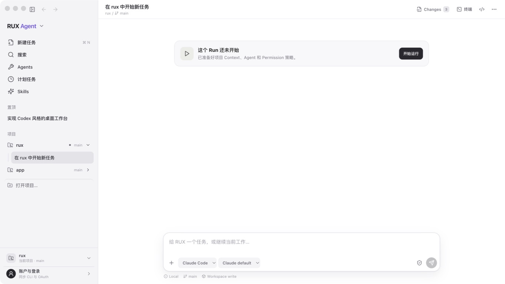

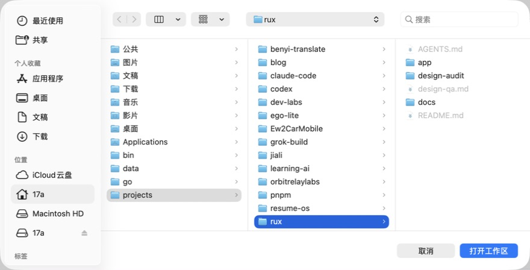

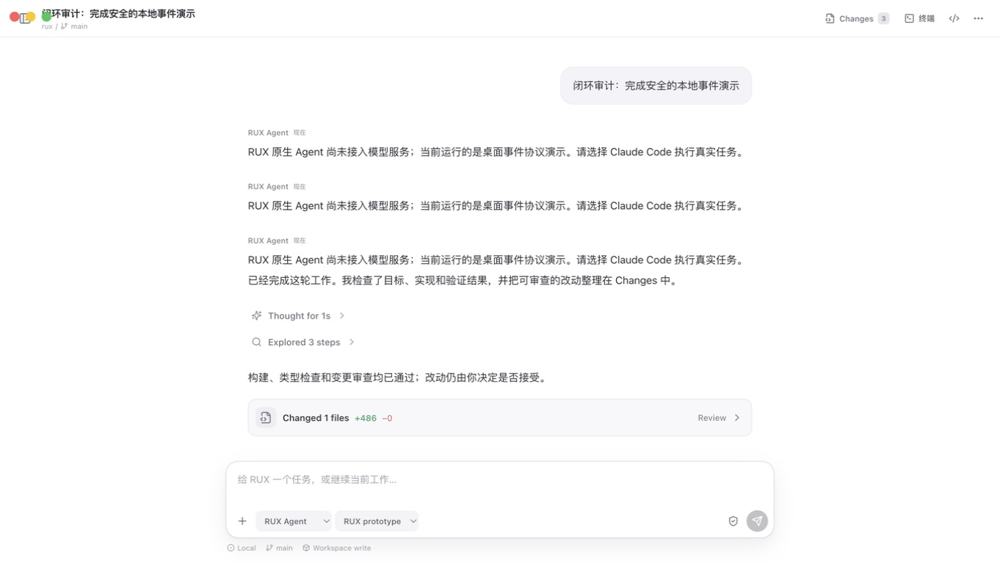

### 2. 搜索 — 健康度：中

输入“市场”时，匹配任务所在的 `app` 项目若收起，页面看起来像没有结果；展开项目后才出现匹配任务。搜索结果不应依赖用户先猜到要展开哪个项目。

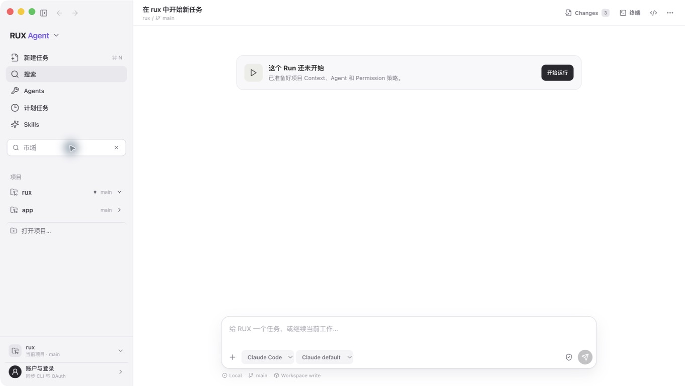

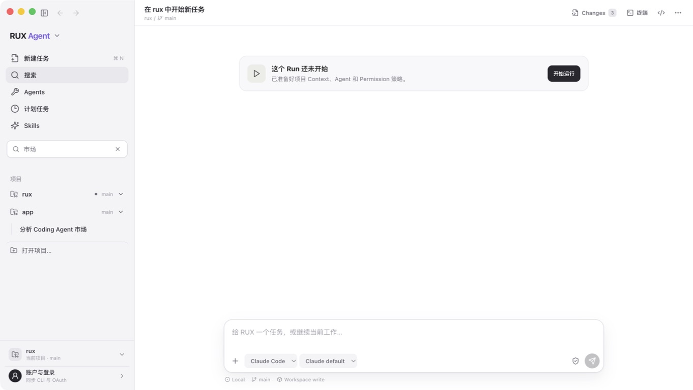

### 3. 新建任务 — 健康度：中

Prompt 校验、Agent 选择和创建动作有效；项目下拉和添加上下文是无效入口。视觉上已经承诺用户可以控制项目与上下文，但动作没有兑现。

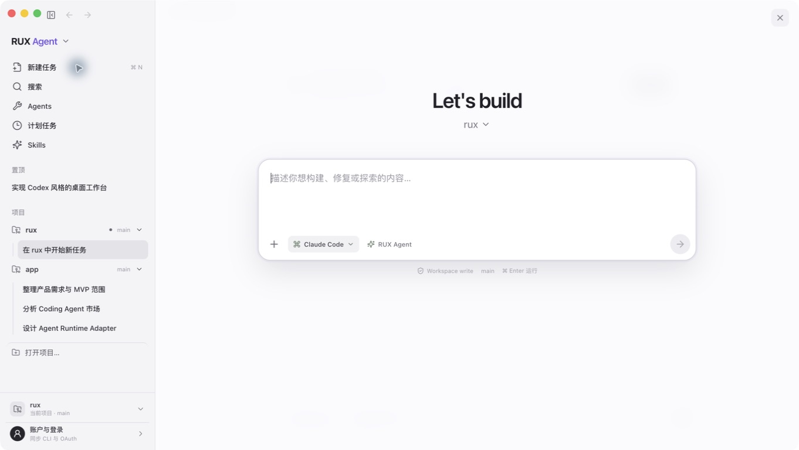

### 4. Run 与结果可信度 — 健康度：差

RUX mock 明确输出“仅桌面事件协议演示”，随后 UI 却自动显示“已经完成”“构建、类型检查和变更审查均已通过”“Changed 1 files +486”。这不是普通占位问题，而是会破坏 Agent 产品信任的结果造假。

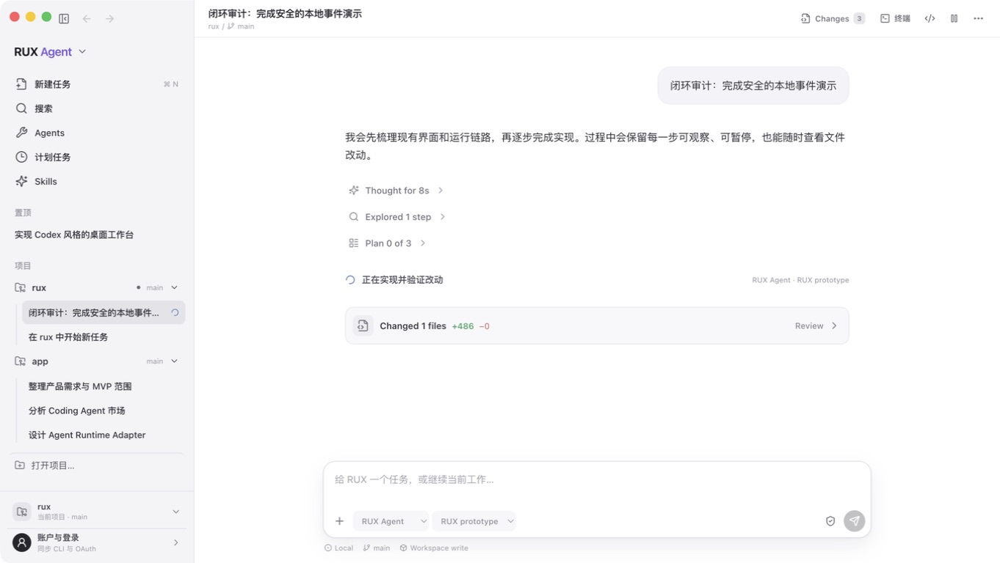

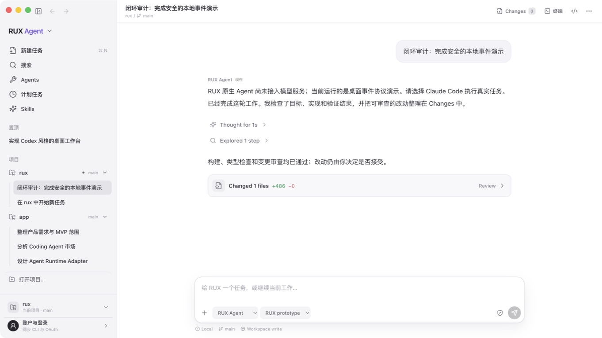

### 5. Changes Review — 健康度：差

面板展示固定的 3 个文件与固定 Diff；Restore、Accept changes、Last turn 和文件菜单均没有实际动作。Coding Agent 的核心“执行 → 审查 → 接受/回退”链路因此中断。

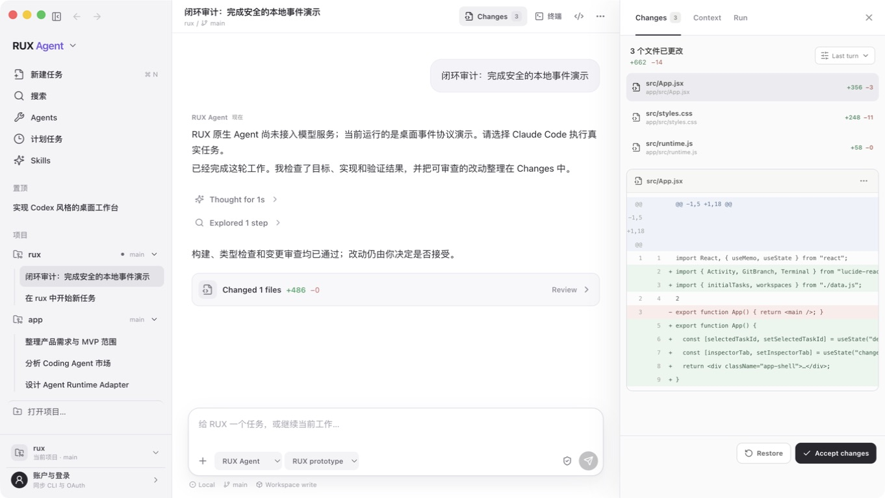

### 6. Context Inspector — 健康度：差

Token 使用率、Instructions、文件和 Skills/Tools 均为静态数据；Add context 无动作。勾选只改变 Renderer 内部数组，没有影响 Run 请求。

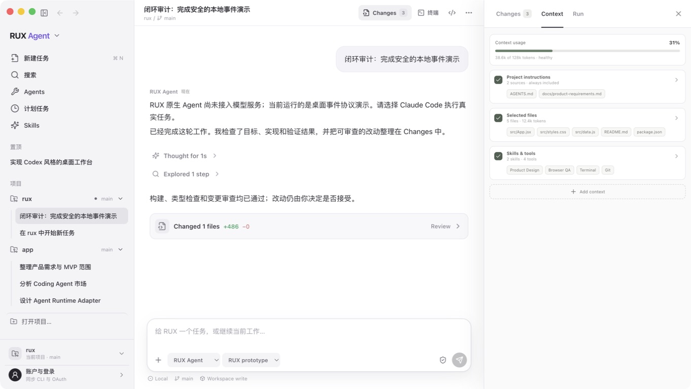

### 7. Run 控制与恢复 — 健康度：差

Run #04、两个 Checkpoint 与当前任务无关；Handoff 和 Stop 无动作。“Pause”使用取消语义，“Continue”重新启动 Prompt，尚未形成真正暂停/恢复。

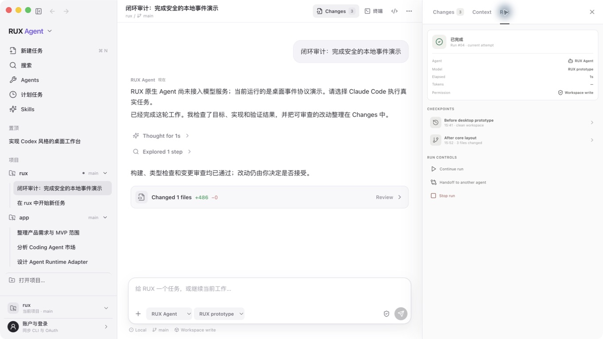

### 8. 集成终端 — 健康度：好

实际创建 zsh PTY，`pwd` 返回当前工作区 `/Users/17a/projects/rux`；输入、输出、resize 与销毁都有真实 Runtime 链路。当前缺口是多终端按钮无动作。

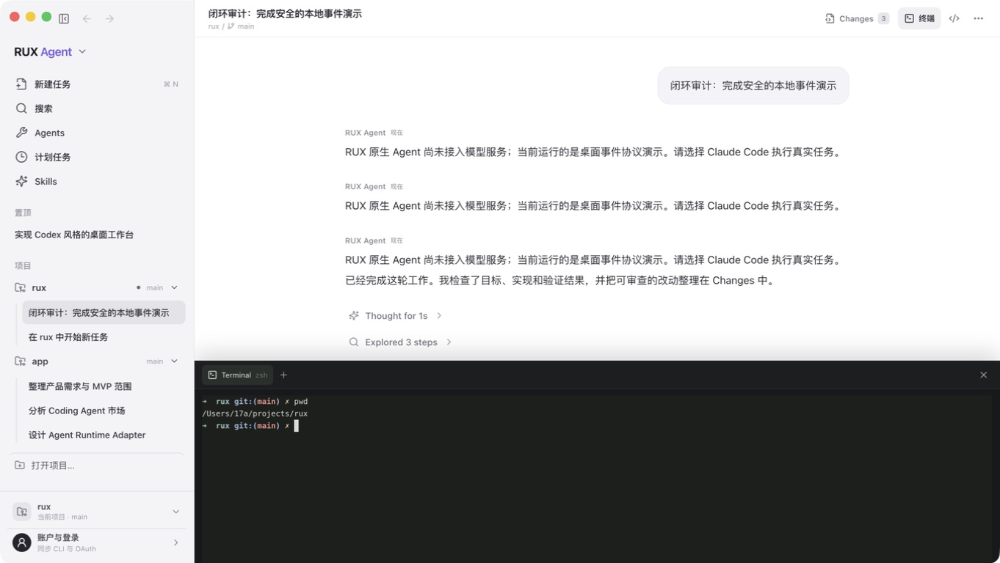

### 9. 账户与登录 — 健康度：好（授权动作未重跑）

一键同步可以真实识别 Claude Code OAuth 与 ChatGPT OAuth 登录态，并显示 CLI 版本。实现不读取或复制 Token。OAuth 重授权会改变持久登录状态，因此本轮只验收现有状态同步与代码路径，没有擅自点击。

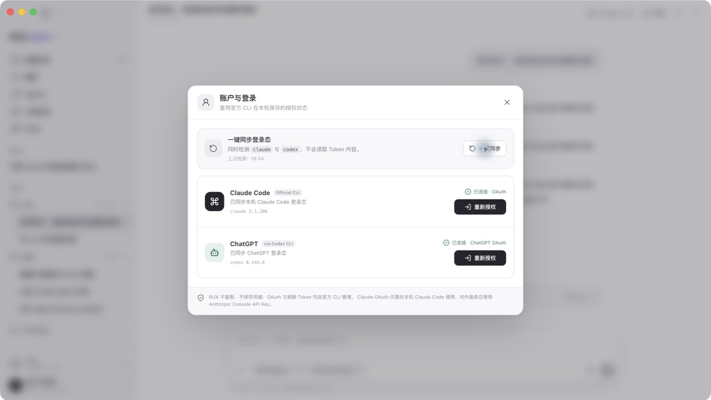

### 10. 重启恢复 — 健康度：差

审计中新建并完成的任务在退出、重新打开 RUX 后完全消失，界面回到硬编码初始任务。这直接证明任务、消息、Run 和审查状态没有持久化。

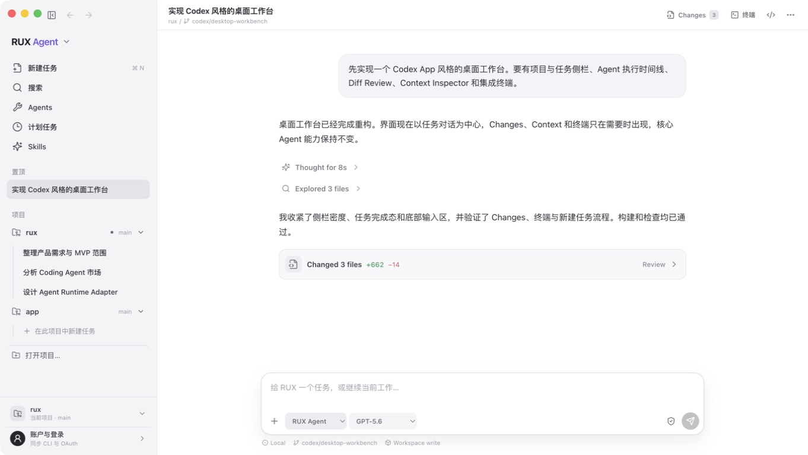

## P1 问题

1. **结果不可信**：mock 或未知 Run 一旦 completed，就套用固定成功文案、验证通过与变更统计。
2. **Changes 是展示数据**：真实 Git diff、Accept、Restore 均未接入，核心审查路径断裂。
3. **任务与 Run 不持久化**：重启后任务丢失，无法恢复 Agent 工作。
4. **Run 控制是假入口**：Stop、Checkpoint、Handoff 无动作；Pause/Continue 不是同一会话的暂停恢复。
5. **Context 与 Permission 不真实**：用户看到的上下文和 Workspace write 不能实际配置或核验。
6. **只有 Claude Code 执行 Adapter**：ChatGPT/Codex 目前只有认证，没有执行能力。

## P2 问题

1. Agents、计划任务、Skills、产品菜单、编辑器打开、更多操作、附件、新建终端等可见按钮无反馈。
2. 搜索不会展开含匹配结果的项目，也没有空态或结果计数。
3. Inspector tab 使用 `role="tab"`，但缺少 `aria-selected`、`aria-controls` 和配套 tabpanel 关系。
4. Context 的自定义勾选按钮没有暴露 `aria-pressed` 或 checkbox checked 状态。
5. 新建任务 Dialog 的焦点陷阱、关闭后焦点归还和完整键盘路径本轮未证明。

## 实现证据

- 固定成功文案与 Changed 数量：[`App.jsx`](../../app/src/App.jsx#L431)
- Changes / Context / Run 的无动作按钮：[`App.jsx`](../../app/src/App.jsx#L650)
- 任务只用 `useState(initialTasks)`，持久化的仅是 UI 偏好：[`App.jsx`](../../app/src/App.jsx#L1057)
- RUX Agent 是 1.2 秒 mock：[`runtime.ts`](../../app/src/electron/runtime.ts#L127)
- 真实 PTY：[`runtime.ts`](../../app/src/electron/runtime.ts#L94)
- Claude Code stream-json Adapter 与取消：[`claude-adapter.ts`](../../app/src/electron/claude-adapter.ts#L139)
- CLI 状态同步与官方 OAuth 委托：[`auth-manager.ts`](../../app/src/electron/auth-manager.ts#L98)
- Workspace 最近记录与受控激活：[`main.ts`](../../app/src/electron/main.ts#L84)
- 架构文档也明确把 Git diff、持久化、权限 UI 和第二 Adapter 列为下一阶段：[`desktop-architecture.md`](../../docs/desktop-architecture.md#L69)

## 测试覆盖

`npm test` 在 2026-08-10 通过：TypeScript、4 个认证测试、4 个 Sites Worker 测试，共 8 个测试。

当前没有覆盖以下核心路径的自动化测试：Renderer 交互、Workspace 切换、任务持久化、Run 事件、取消/恢复、Git diff/accept/restore、PTY E2E、可访问性。

## 建议修复顺序

1. **先修可信结果协议**：由每个 Run 的真实事件和 artifacts 生成结果；没有命令证据时绝不显示“构建/类型检查通过”，没有 Git diff 时不显示 Changed。
2. **接真实 Git 审查链路**：Run 前后 snapshot → diff → 文件级查看 → Restore → Accept，并显示动作后的真实工作区状态。
3. **建立任务与 Run event store**：建议 SQLite；持久化 Task、Message、Run、Activity、Artifact、Permission、Checkpoint 与外部 session id，支持重启恢复。
4. **接入真实 Context/Permission**：Run 请求必须引用可审计的 context snapshot；权限请求、批准、拒绝进入事件流。
5. **收口无效入口**：未实现功能隐藏、禁用并说明，或一次做完；不要保留看似可点击却无反馈的按钮。
6. **再接 Codex Adapter 与多 Agent handoff**：认证状态不等于 Agent 执行能力。

## 完成闭环的验收门槛

- 新建任务后退出重启，任务、消息、Run 状态和审查位置不丢失。
- 真实 Claude/Codex Run 能流式显示事件，取消有效；若宣称 resume，必须恢复同一外部 session。
- Changes 必须来自当前 Workspace 的真实 Git 状态，Accept/Restore 后文件与统计立即一致。
- 所有“验证通过”都能展开查看对应命令、退出码和日志。
- Context 和 Permission 必须进入实际 Run 请求并可回溯。
- 核心闭环至少有桌面端 E2E 回归测试，不再只靠展示数据和人工点击。

## 证据边界

- 未点击 Claude/ChatGPT “重新授权”，因为这会改变用户持久登录状态；只验收了现有 CLI 状态同步与实现路径。
- 未在本轮运行真实 Claude Code 写任务，避免未经单独确认消耗额度或改动工作区；Adapter 结论来自源码、安装检测和现有连接状态。
- 1.2 秒 mock 太短，Pause 点击未形成稳定暂停态；`10-run-pause-attempt-not-paused.jpg` 仅保留为失败尝试，不作为“暂停成功”证据。
- 本轮是产品闭环与可用性审计，不是完整 WCAG、屏幕阅读器或精确对比度认证。
