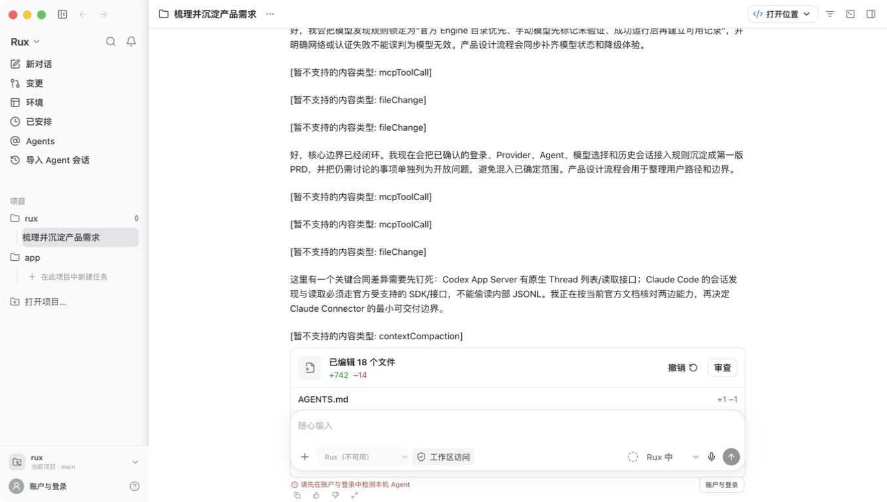
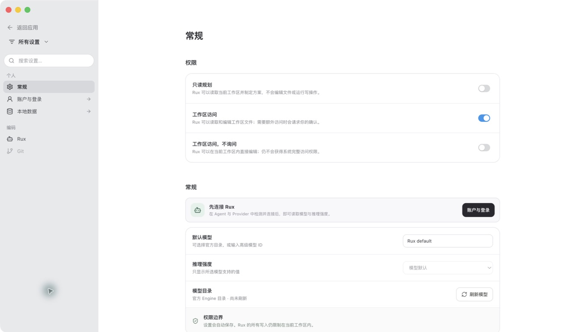
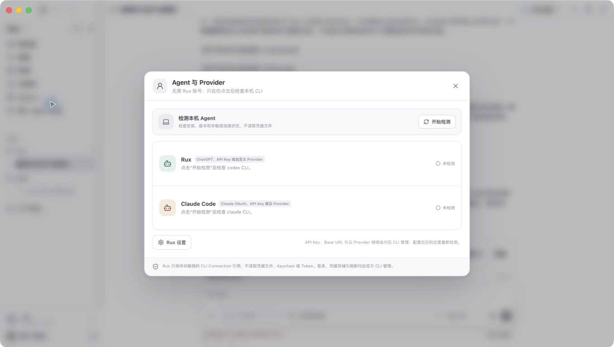
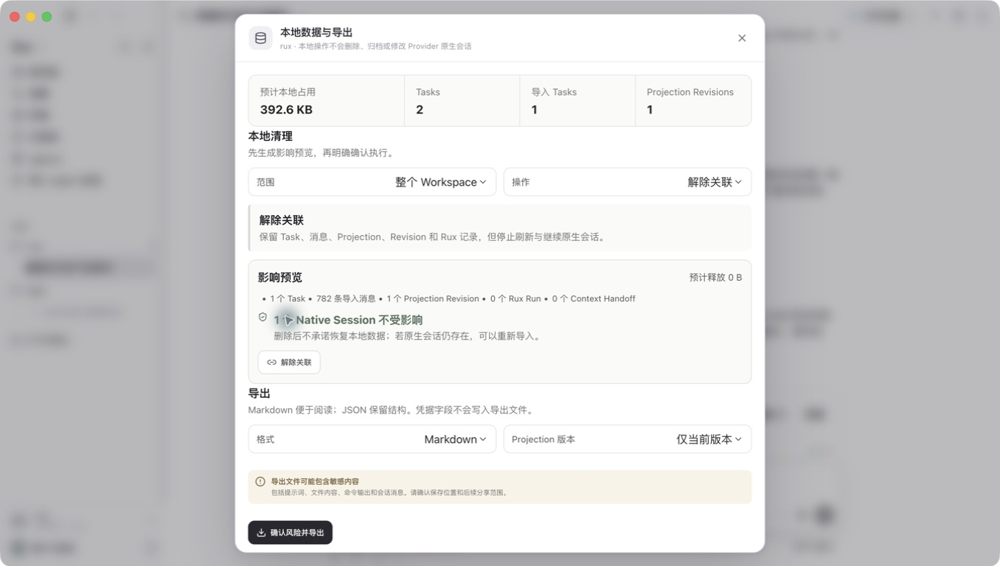

# Rux UI 视觉审计 — 2026-08-13

## 范围与方法

- 审计对象：最新打包版 `Rux.app`，桌面尺寸约 1433 × 812 px。
- 数据环境：真实本地数据的隔离副本；未修改当前正在使用的 Rux 状态。
- 覆盖状态：主任务工作台、常规设置、Agent / Provider、本地数据与导出。
- 本次仅做视觉与交互表达审计，不修改产品代码。

## 总体判断

Rux 已经形成统一、克制、接近 Codex Desktop 的桌面工作台视觉语言：浅色侧栏、单一任务焦点、底部 Composer、按需弹层，以及一致的圆角、边框和间距。当前最大的体验损耗不是风格，而是高信息量状态下缺少降噪，以及同一状态在多个位置重复表达。优先修复这些问题，比重新设计视觉系统更有效。

## 修复复核 — 2026-08-13

本轮高优先级问题已在实际打包应用中复核：

- 导入会话中的连续不支持事件已按类型折叠汇总，并可展开查看。
- Agent 检测入口已收进 Composer，移除底部重复状态条。
- 长会话离开底部后会出现“回到最新”入口。
- 设置权限改为单选视觉，第二个“常规”分组改为“Agent 默认设置”。
- 当前任务选中态、Agent / Provider 次级文字和本地数据影响预览层级已增强。
- 本地数据弹层已完成术语收敛，并在 1433 × 812 桌面窗口中完整显示主要操作。

修复后截图：

- [主任务工作台](./after-01-main-workbench.png)
- [常规设置](./after-02-settings.png)
- [Agent 与 Provider](./after-03-agent-provider.png)
- [本地数据与导出](./after-04-local-data-management.png)

## 流程截图与健康度

### 1. 主任务工作台 — 需要重点优化

主要问题：

1. 导入会话中的 `暂不支持的内容类型` 以逐条正文形式重复出现，抢占了消息内容的视觉优先级，长会话几乎无法快速浏览。
2. 底部同时堆叠 Changes 摘要、Composer 和“请先检测本机 Agent”提示；Agent 不可用又在 Agent / 模型选择器中重复出现，形成多个竞争焦点。
3. 当前任务与普通任务在侧栏中的对比偏弱；长 transcript 中也缺少明显的“回到最新消息”提示。
4. 侧栏次级文字、时间和部分图标颜色偏淡，建议实测对比度和缩放后的可读性。

建议：

- 将连续不支持事件折叠成单个“导入了 N 个暂不支持事件”的可展开块，并按工具调用、文件变更、上下文压缩分类计数。
- 把 Agent 不可用状态收敛到 Composer 内部，只保留一个明确 CTA；检测完成后该区域自然恢复为发送状态。
- 当不在最新消息位置时展示轻量“回到最新”浮动按钮。
- 提高选中任务的底色或左侧标记强度，但保持现有克制风格。

### 2. 常规设置 — 基础良好，控件语义需调整

主要问题：

1. 三个互斥的权限选项在视觉上使用开关，容易被理解为三个可独立开启的布尔项；无障碍树是单选语义，但视觉表达与语义不一致。
2. 页面标题与首个分组标题都使用“常规”，信息架构显得重复。
3. 内容列相对桌面窗口偏窄、右侧留白较大；同时辅助说明与禁用字段的文字过淡。

建议：

- 改用单选圆点、整行选中态或右侧勾选，不使用 toggle 形态。
- 页面只保留一个“常规”标题，把分组改为“默认权限”或直接去掉重复标题。
- 将设置内容最大宽度略扩展，或采用更稳定的双列属性布局；统一提高说明文字的最小字号和颜色层级。

### 3. Agent 与 Provider — 健康，需提升扫描效率

主要问题：

1. 弹层较宽，但核心内容集中在左侧，连接状态位于很远的右侧，视线往返距离大。
2. Provider 名称、认证方式、版本、安装路径等信息字号较小、颜色偏淡；Rux 与 Claude Code 两行的区分度不足。
3. 底部“Rux 设置”和长安全说明分处两端，视觉关系松散。

建议：

- 适当收窄弹层，或把每个 Provider 做成更紧凑的两列卡片：身份与来源在左，状态和操作在右。
- 用固定的信息层级展示“安装 / 连接 / 认证方式”，路径等低频内容按需展开。
- 保留显式“检测本机 Agent”作为主操作；这是当前界面最清楚、最可信的入口。

### 4. 本地数据与导出 — 信息完整，术语和层级仍可收敛

主要问题：

1. 中文界面混用 `Tasks`、`Projection Revisions`、`Workspace`、`Native Session`、`Rux Run`、`Context Handoff` 等术语，理解成本偏高。
2. “影响预览”把多个指标压在一行，信息齐全但不容易比较；“不受影响”和“预计释放 0 B”是最重要结论，却没有形成最强层级。
3. 清理与导出是两种不同心智模型，却放在同一长弹层中；小窗口或放大字体时会显得拥挤。
4. 多处说明文字和风险说明字号偏小，需要在 125%–200% 缩放下验证。

建议：

- 中文化主要术语，并在首次出现时附英文，例如“投影版本（Projection Revision）”；不要在统计栏直接混排中英文。
- 将影响预览改为两段明确结论：“本地变化”和“原生会话不受影响”，再把明细放入网格或列表。
- 视后续功能量考虑“清理 / 导出”页签；短期至少加强分区标题和留白。

## 优先级建议

### P0：直接影响核心任务阅读

1. 折叠和汇总导入会话中的不支持事件。
2. 合并 Composer 周围重复的 Agent 不可用状态，只保留一个行动入口。

### P1：减少误解并提高可读性

1. 将权限互斥选择改成符合语义的单选视觉。
2. 统一次级文字、禁用态、徽标和弹层说明的字号与对比度 token。
3. 收敛中英文术语，并优化 Agent / Provider 与本地数据弹层的信息扫描路径。

### P2：桌面精修

1. 增强侧栏当前任务状态。
2. 增加长 transcript 的“回到最新”入口。
3. 优化设置内容宽度和大型弹层在缩放场景下的响应式布局。

## 做得好的部分

- 工作区切换与账户入口保持了清晰分离，符合产品边界。
- 主壳层、设置页和弹层之间的圆角、边框、阴影与颜色语言一致。
- 关键动作大多有明确文字标签，无障碍树中也能识别按钮、标题、单选项和下拉框。
- Agent 检测、本地数据影响预览、敏感导出警告都明确表达了信任和安全边界。

## 验证限制

- 本次没有测量实际颜色对比度数值。
- 没有完整验证键盘焦点顺序、焦点可见性、屏幕阅读器播报、200% 缩放与窗口缩窄后的重排。
- 截图只能证明当前状态下的视觉表现，不能据此宣称完整的无障碍合规。
