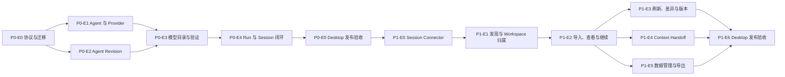

# RUX P0/P1 交付路线与验收矩阵

> 版本：v1.0  
> 状态：基于 [产品需求文档 v1.0](product-requirements.md) 的执行基线  
> 更新日期：2026-08-12  
> 范围：Desktop 优先，同时保持 Runtime Host、TUI 协议与 Web/Sites fallback 兼容

## 1. 文档目的

本文把已确认的产品需求拆成可以依序交付、独立验证和明确退出的 P0/P1 工作包。它回答四个问题：

1. 先做什么，后做什么，哪些工作可以并行。
2. 每个 Epic 的交付物和退出条件是什么。
3. 每条需求需要哪一层自动化测试和桌面证据。
4. 什么条件满足后，P0 或 P1 才能被称为完成。

本文不承诺日历日期。排期取决于团队人数、平台覆盖和发布签名准备；交付顺序由依赖关系决定。

## 2. 发布定义

### P0：本地 Agent 连接与 RUX 会话闭环

用户无需登录 RUX，可以打开 Workspace，显式检测并连接本机 Codex/Claude Code，选择固定版本的 Agent 与兼容模型，完成真实 Run，并在应用重启后继续同一个 Native Session。

P0 完成后，产品必须具备：

- 正确的“Agent 与 Provider”产品语义，不再制造 RUX 云账号前置。
- 官方 CLI 托管的认证与自定义 Provider 配置。
- 不可变 Agent Revision 与 Task 固定关系。
- Engine 优先的模型目录和手动模型运行验证。
- RUX 发起会话的持久化、恢复、权限和审计闭环。

### P1：工作区级外部会话接入

用户可以在授权 Workspace 内发现、预览、导入、查看并继续既有 Codex/Claude Code 会话；可以显式刷新、处理差异、保留版本、导出或清理本地副本，并通过可审查的 Context Handoff 分支到另一 Agent。

P1 明确不包含：

- CLI、RUX 与其他客户端之间的后台实时双向同步。
- 自动扫描并复制所有项目的全部历史。
- RUX 原生 API Provider；该能力属于 P2。
- 跨设备或云端会话同步。

### 范围控制原则

- 以完整用户路径交付纵向切片；不能把尚未接通 Runtime 的按钮描述为已支持。
- 未完成的 P1/P2 入口默认隐藏，或明确禁用并标注真实状态，不能成为装饰性控制。
- 新 Schema 先于 Renderer 上线，Migration 和回滚证据先于真实用户数据写入。
- Provider Fixture 与 Fake CLI 可以作为自动化证据，但文档和界面必须区分真实能力、Fixture 与 Showcase。
- P1 可以在开发 Feature Gate 后增量合并，但只有全部 P1 Release Gate 满足后才能对外称为“会话接入完成”。

## 3. 当前实现基线

| 能力 | 当前实现 | 路线图处理 |
| --- | --- | --- |
| Codex Run | 真实 CLI/App Server Adapter，支持事件、审批、模型目录和 Thread Resume | 复用并补齐统一 Connection、模型状态和恢复验收 |
| Claude Code Run | 真实 CLI Adapter，支持结构化流事件、权限 Broker 和 Session Resume | 复用并补齐连接 UI、模型降级和历史会话接口 |
| 认证 | Renderer 已提供用户显式的 Rux/Claude Code 检测、状态修复与官方 CLI 登录；启动和打开面板均不自动检测 | P0-E1 已完成，后续只扩展新的 Engine/Provider |
| Agent Profile | 本地非敏感 Profile Store；更新会覆盖同一 Profile | 升级为不可变 Agent Revision，Task 固定 Revision |
| 模型 | Codex 有结构化目录；Claude/自定义配置没有统一目录 | 增加 Engine 默认、已验证和未验证模型状态 |
| Task Store | Main 管理的 Workspace 级 SQLite，持久化 Task/Message/Run/Event | 版本化迁移，增加 Revision/Connection/Session Projection 数据 |
| RUX 会话延续 | Renderer 保存 `sessionId`，Codex/Claude Adapter 可恢复 | 收紧兼容条件、错误恢复和桌面证据 |
| 外部会话导入 | 未实现 | P1 新增官方 Session Connector 与本地 Projection |
| Context Handoff | 未实现 | P1 新增事实包、可选摘要、预览确认与来源关系 |
| Web/TUI | 共享 Runtime 能力已有基础 | 协议变更保持兼容；Desktop 为功能验收主客户端 |

### 初始状态追踪

| Epic | 当前状态 | 说明 |
| --- | --- | --- |
| P0-E0 | 已验证 | Runtime 协议 v3、Profile/Task Store v2、不可变 Revision、Connection 引用、原子迁移与 TUI 兼容已通过 P0-FND-001 至 008 自动化验收 |
| P0-E1 | 已验证 | 显式双 Engine 检测、官方登录委托、缺失/未登录/已连接/错误状态及非敏感 Connection 边界已通过自动化和打包桌面验收 |
| P0-E2 | 进行中（已有基础） | 不可变 Revision 与 Task 固定合同已完成，任务升级提示和完整桌面验收尚未退出 |
| P0-E3 | 进行中（已有基础） | Codex 已有目录，通用模型状态与 Claude 降级未完成 |
| P0-E4 | 进行中（已有基础） | 两个 Engine 均可恢复 Session，兼容规则与完整桌面验收未完成 |
| P0-E5 | 未开始 | 需等待 P0-E0 至 P0-E4 退出 |
| P1-E0 至 P1-E6 | 未开始 | 不应在 P0 数据合同稳定前提前接入 UI |

## 4. 依赖顺序



并行建议：

- P0-E1 与 P0-E2 可在 P0-E0 数据合同稳定后并行。
- P1-E3、P1-E4、P1-E5 可在 P1-E2 的导入身份与 Projection 合同稳定后并行。
- 视觉与交互工作应随每个 Epic 做纵向验收，不集中拖到发布末尾。

## 5. P0 交付路线

### P0-E0：协议、领域对象与安全迁移

目标：先建立 Connection、Agent Revision、模型状态和 Task 固定关系的数据合同，避免后续 UI 与 Runtime 各自发明结构。

交付物：

- 在共享协议中增加非敏感 `ProviderConnectionRef`、`AgentRevision`、`Task.agentRevisionId`、模型来源/验证状态。
- 升级 Runtime 协议版本，并同时更新 Desktop Runtime、stdio Runtime Host、Preload Client 和 Web fallback。
- 为 Agent Profile Store 增加不可变 Revision 存储及旧 v1 Profile 迁移。
- 为 Task Store 增加向新 Schema 的原子迁移；现有 Task/Message/Run/Event 不丢失。
- 旧 Task 能确定性绑定一个迁移 Revision；无法确定的字段使用明确的 Legacy 标记，不伪造 Provider。
- 增加跨 Store 引用校验，防止 Task 指向不存在或错误 Engine 的 Revision。
- 更新 `docs/desktop-architecture.md`，准确标注 Main、Runtime、Renderer 和凭据边界。
- Rust TUI 对新协议字段保持向前兼容；未使用的 P0/P1 UI 能力不能导致 Host 消息解析失败。

退出条件：P0-FND-001 至 P0-FND-008 全部通过。

### P0-E1：Agent 与 Provider 连接入口

目标：用户不需要 RUX 账号，可以显式检查并修复 Codex/Claude Code 的本机可用状态。

交付物：

- 侧栏底部保留“账户与登录”，打开后主标题和内容语义为“Agent 与 Provider”。
- 同时展示 Codex 与 Claude Code 的未检测、检测中、未安装、已安装未连接、已连接和错误状态。
- 只在用户点击后执行安装/认证状态检查；打开应用和打开面板均不自动检测。
- 分别通过官方 `codex login` 与 `claude auth login` 发起登录，支持取消、超时和失败恢复。
- 未安装状态提供官方安装说明和重新检测，不静默安装。
- 检测和登录过程中保留 Workspace、Task 草稿、上下文选择和 UI 偏好。
- Renderer 只接收安装状态、连接状态、认证方式、版本、可执行路径和非敏感说明。
- API Key、Base URL 与云 Provider 继续由 CLI 持有；RUX 只保存稳定、非敏感的 CLI Connection 引用，并通过该 CLI 发起 Run。

退出条件：P0-CONN-001 至 P0-CONN-012 全部通过。

实现记录（2026-08-12）：P0-E1 已退出。自动化覆盖干净启动不探测、双 CLI 状态、OAuth 命令隔离、取消/超时、CLI API Key 与 Base URL 透传边界，以及敏感值不进入 Profile/SQLite；打包应用使用隔离 Fake CLI 验证了未检测、API Key 已连接、Claude 未连接、CLI 缺失和检测错误可重试状态。例行验收未启动真实 OAuth，也未改变开发者登录态。

### P0-E2：不可变 Agent Revision 与 Task 固定

目标：Agent 配置可迭代，但历史任务永远能解释自己使用了什么配置。

交付物：

- Agent 由 Engine、Connection 引用、默认模型、指令、权限、Skills 和 Tools 组成。
- 创建 Agent 产生第一个 Revision；每次保存变更产生新 Revision，不覆盖旧版本。
- 新 Task 固定创建时 Revision；每个 Run 保存实际 Revision 快照。
- 编辑或删除当前 Agent Definition 不改变既有 Task 和历史 Run。
- 既有 Task 检测到新版时显示非阻塞提示；P0 允许新建使用最新版的 Task，完整 Handoff 在 P1 上线。
- Composer 先选 Agent，再显示该 Revision/Connection 的模型与运行选项。
- 所有 Profile 输入继续禁止密钥、任意可执行文件和凭据路径。

退出条件：P0-AGT-001 至 P0-AGT-010 全部通过。

### P0-E3：模型目录与运行验证

目标：统一模型选择体验，同时对无法可靠发现的模型保持诚实。

交付物：

- Codex 使用官方 App Server 模型目录，并显示来源和最后刷新时间。
- Engine 不提供目录时，提供 Engine 默认、该 Connection 下已验证模型和高级手动模型 ID。
- 手动模型初始状态为“未验证”；成功 Run 后才在同一 Engine/Connection 下标记“已验证”。
- 只有明确的模型不存在/不兼容错误才标记“不可用”。
- 网络、认证、配额和临时服务错误不改变模型有效性结论。
- 未声明的推理强度、上下文窗口或工具能力不做猜测；控件使用 Engine 默认或隐藏。
- 已保存模型从目录消失时提示，不静默替换。

退出条件：P0-MDL-001 至 P0-MDL-009 全部通过。

### P0-E4：RUX 发起的 Run 与 Native Session 闭环

目标：一次真实任务从创建、执行、权限、持久化到恢复全程可审查。

交付物：

- Run 启动时使用 Task 固定的 Engine、Connection 和 Agent Revision；模型覆盖只影响该 Run。
- Codex Thread ID 与 Claude Session ID 以规范化 Session Link 保存。
- 同 Task 后续输入只在 Engine、Connection 和 Revision 兼容时恢复原 Session。
- 应用重启后可继续正确 Native Session；运行中孤儿记录恢复为 stopped/interrupted。
- Workspace 切换会处置旧 Runtime、PTY、活跃 Run 和内存中的 Session 句柄。
- Terminal 不随应用重启自动恢复。
- 权限请求、决定、Run 事件、模型和 Revision 快照均可回看。
- 原生恢复失败时不静默新建 Session；用户看到原因并选择重试或创建新 Task。

退出条件：P0-RUN-001 至 P0-RUN-010 全部通过。

### P0-E5：Desktop 发布候选与体验验收

目标：在真实打包应用中完成从空白启动到重启续聊的完整路径。

交付物：

- 普通启动无 Showcase 数据、假账号、假连接或 Mock Agent。
- 重要入口使用可见文字和可访问名称；Workspace 与账户入口保持分离。
- 1433 × 812 桌面尺寸下，连接面板、Composer、错误态和 Task 历史无裁切或密度回退。
- 用假 CLI 完成所有登录边界自动化；例行验收不改变开发者真实登录态。
- 打包应用执行只读真实 CLI 状态检查；真实 OAuth 仅在产品负责人明确授权时执行。
- 形成稳定、非 Loading 状态的桌面证据与验收记录。

退出条件：全部 P0 验收项通过，且 P0 发布门禁满足。

## 6. P1 交付路线

### P1-E0：官方 Session Connector 合同

目标：为 Codex 与 Claude Code 建立相同的会话发现、读取和恢复语义，同时保留 Provider 差异。

交付物：

- 定义 Session Metadata、Session Message、Session Link、Projection 和 Projection Revision Schema。
- Runtime 增加分页发现、按 ID 读取、恢复能力检查和规范化错误。
- Codex 使用 App Server 的 Thread List/Read/Resume 接口。
- Claude Code 使用官方 Session/Agent SDK 或受支持结构化接口；不把内部 JSONL 作为长期合同。
- 所有接口支持取消、超时、分页上限、响应大小上限和敏感错误清洗。
- 使用完全隔离的假 Codex/Claude 会话 Fixture 做 Contract Test。

退出条件：P1-API-001 至 P1-API-008 全部通过。

### P1-E1：会话发现与 Workspace 归属

目标：只在用户授权范围内发现会话，并让同一会话拥有唯一、可解释的项目归属。

交付物：

- 用户从当前 Workspace 显式打开“导入 Agent 会话”并触发发现。
- 首轮只读取官方接口提供的非敏感元数据，不读取完整 Transcript。
- Main/Runtime 对 `cwd` 和 Workspace Root 做 realpath 与路径组件边界判断。
- 嵌套 Workspace 使用最长匹配；同一 Session 不同时出现在父子 Workspace。
- 符号链接和路径别名不会产生重复归属。
- 缺失/歧义 `cwd` 进入全局“待归属”；授权范围外路径要求先打开项目。
- Session 全局身份为 `engine + connectionReference + nativeSessionId`。
- 新授权子 Workspace 产生更具体归属时只提示迁移，不静默移动 Task。

退出条件：P1-DISC-001 至 P1-DISC-011 全部通过。

### P1-E2：导入、查看与继续

目标：用户明确选择后，把外部会话变成带来源、可继续或可只读的 RUX Task。

交付物：

- 会话列表展示 Engine、标题、更新时间、模型、目录、消息数和当前导入状态。
- 用户选择后预览内容范围和“复制到 RUX 本地存储”的提示。
- “仅导入查看”创建只读 Projection；“导入并继续”先检查 Engine、Connection、Workspace 和 Session 可恢复性。
- 来源标签为“Codex 导入”或“Claude Code 导入”，并显示可继续/仅查看/原会话不可用等状态。
- 重复导入更新同一 Task，不生成重复项。
- 原 Session 消失时本地 Projection 仍可查看，但不能伪装为可继续。
- 导入保持用户/Agent 消息顺序，并规范化官方接口提供的工具调用、工具结果和不支持内容类型；无法无损呈现的内容必须显式标记。
- 删除或归档 RUX Task 不修改 Native Session。
- 无法确认只有一个活跃写入方时提示并优先建议复制为新 Task。

退出条件：P1-IMP-001 至 P1-IMP-012 全部通过。

### P1-E3：手动刷新、差异与版本化重建

目标：允许用户更新导入内容，同时避免外部改删静默覆盖本地历史。

交付物：

- 只有用户点击“刷新原生会话”才读取最新 Transcript。
- 只有新增内容时按稳定 ID 或本地指纹去重追加。
- 修改、删除、重排或不确定匹配进入“有外部差异”，当前 Projection 保持不变。
- 差异视图显示新增/修改/删除数量、位置和内容预览。
- 用户可以保留当前版本，或明确确认“按原生会话重建”。
- 重建前保存不可变旧 Projection Revision；重建不删除 RUX 自有 Run、权限、Task 和 Handoff。
- 用户可以查看或恢复旧 Revision；本地恢复不反向修改 Native Session。
- 刷新/重建写入不含凭据的审计记录。

退出条件：P1-SYNC-001 至 P1-SYNC-010 全部通过。

### P1-E4：跨 Agent Context Handoff

目标：跨 Agent、Provider、Engine 或 Agent Revision 时创建新任务，不篡改原会话。

交付物：

- RUX 确定性生成事实包：来源 Task、Workspace、选中消息、最近 Run、文件变更、未完成状态和来源 Revision。
- 用户可选由当前 Agent 生成叙事摘要；摘要清楚标为“Agent 生成”。
- 当前 Agent 不可用时仍能只用事实包交接。
- 发送前可预览、编辑摘要、移除消息/文件、补充约束并确认目标 Agent/Provider。
- 用户确认前不调用目标 Agent、不创建目标 Native Session。
- 确认后创建新 Task、固定目标 Revision、保存不可变 Handoff 并建立双向来源关系。
- 来源 Task 后续变化不静默更新已确认 Handoff。
- 文件变更和 Run 结果只引用真实持久化证据；缺少真实证据时明确省略，不把 Showcase 数据写入事实包。

退出条件：P1-HOF-001 至 P1-HOF-011 全部通过。

### P1-E5：本地数据管理与导出

目标：用户能理解并控制导入内容占用，且任何本地操作都不影响原生会话。

交付物：

- Workspace 存储页展示本地占用、Task 数和 Projection Revision 数。
- 导入内容与旧 Revision 默认不自动过期，空间压力不触发静默清理。
- “解除关联”“删除导入内容”“删除 Task”具有不同且清楚的后果。
- Task/Workspace 批量清理前展示范围、预计释放空间和不受影响的 Native Session。
- Markdown 导出便于阅读；JSON 导出保留结构；可选择当前版本或包含旧 Revision。
- 导出不含凭据，并在写入前提示可能包含敏感会话、文件和命令内容。
- 删除后只要 Native Session 仍存在即可重新导入；不承诺恢复已删除本地数据。

退出条件：P1-DATA-001 至 P1-DATA-010 全部通过。

### P1-E6：Desktop 发布候选与体验验收

目标：在打包应用中完成发现、导入、刷新、分支、导出和删除的关键路径。

交付物：

- 导入入口、状态、差异和危险操作均有明确文字与可访问名称。
- 会话列表、差异视图、Handoff 预览和存储管理在桌面尺寸下可用。
- 失败、取消、原 Session 丢失和 Workspace 未授权均能恢复，不丢当前选择。
- 使用官方接口 Fixture 验证 Provider 合同；例行测试不读取真实用户完整历史。
- 真实本机验收只在用户明确选择的测试 Workspace 和会话上进行。
- `design-audit/` 中保留稳定截图、路径说明和验收结论。

退出条件：全部 P1 验收项通过，且 P1 发布门禁满足。

## 7. 验收证据等级

| 等级 | 含义 | 适用范围 |
| --- | --- | --- |
| U | 纯函数、Schema、解析、状态机和错误分类单元测试 | 所有领域规则 |
| C | Fake CLI/App Server/SDK 的 Adapter Contract Test | 认证、模型、Session 接口 |
| I | Main/Runtime/SQLite/IPC 集成测试 | 迁移、持久化、授权、跨 Store 引用 |
| R | Renderer 行为测试，覆盖可见文案、禁用态、草稿保留和可访问名称 | 所有用户操作入口 |
| D | 打包 Desktop 完整点击路径与稳定截图 | 每个 Release Gate |
| S | 安全负向测试，证明 Token、越权路径和未经确认的副作用被阻断 | 认证、Workspace、导出、删除、Handoff |

自动化证据列中的文件名为建议落点。实现时可以调整，但每个验收 ID 必须能映射到具体测试或明确的桌面证据。

## 8. P0 验收矩阵

### 8.1 基础与迁移

| ID | 验收行为 | 自动化证据 | 桌面证据 |
| --- | --- | --- | --- |
| P0-FND-001 | 旧 Profile Store 无损迁移，每个现有 Profile 产生确定性初始 Revision | U/I：`agent-profile-store.test.mjs` | 不适用 |
| P0-FND-002 | 更新 Agent 只新增 Revision，不修改旧 Revision 字节 | U/I：`agent-profile-store.test.mjs` | Agent 版本历史 |
| P0-FND-003 | 旧 Task Store 无损迁移，Task/Message/Run/Event 数量与 ID 保持 | I：`task-store.test.mjs` | 旧任务可打开 |
| P0-FND-004 | 迁移失败完整回滚，原数据库仍可被旧 Schema 读取 | I/S：`task-store.test.mjs` | 不适用 |
| P0-FND-005 | 未来版本 Store 被拒绝且不写入 | I/S：既有 Store future-version case | 不适用 |
| P0-FND-006 | Desktop Runtime、stdio Runtime 和 Renderer 使用同一协议 Schema | C/I：`stdio-runtime.test.mjs`、Typecheck | 不适用 |
| P0-FND-007 | Renderer 不能构造不存在 Revision、错误 Workspace 或错误 Engine 的引用 | I/S：Protocol/Task Store tests | 错误提示可恢复 |
| P0-FND-008 | Rust TUI 可解析升级后的 Runtime 消息，未使用字段不破坏现有 Run | C/I：Rust protocol tests、`test:tui` | TUI 基本 Run 冒烟 |

### 8.2 Agent 与 Provider 连接

| ID | 验收行为 | 自动化证据 | 桌面证据 |
| --- | --- | --- | --- |
| P0-CONN-001 | 空白启动无需 RUX 账号即可打开 Workspace 和编辑任务 | R：`release-boundary.test.mjs` | D-P0-01 空白启动 |
| P0-CONN-002 | 启动应用或打开面板不会自动执行 CLI 状态或登录命令 | C/R/S：假 CLI 调用日志 | D-P0-01 |
| P0-CONN-003 | 用户点击检测后同时返回 Codex 与 Claude 的安装/连接状态 | C：`auth-manager.test.mjs` | D-P0-02 检测结果 |
| P0-CONN-004 | 未安装与未登录为不同状态，并提供不同恢复动作 | U/R：Auth Schema + Renderer test | D-P0-03 缺失 CLI |
| P0-CONN-005 | ChatGPT 登录只调用官方 `codex login` | C/S：既有 Fake Codex case | D-P0-04 假 CLI 登录 |
| P0-CONN-006 | Claude 登录只调用官方 `claude auth login` | C/S：新增 Fake Claude case | D-P0-04 |
| P0-CONN-007 | 登录可取消、可超时；进程组被完整终止 | C/I：`auth-manager.test.mjs` | D-P0-05 取消登录 |
| P0-CONN-008 | 状态输出和错误经过规范化，不向 Renderer 暴露 Token 或账号载荷 | U/C/S：Parser + secret fixture | D-P0-02 |
| P0-CONN-009 | 检测、登录、取消或错误不会清空 Workspace、草稿和上下文选择 | R/I：Renderer state test | D-P0-05 |
| P0-CONN-010 | 未安装时只提供官方说明和重新检测，不静默安装 | R/S：Renderer action test | D-P0-03 |
| P0-CONN-011 | “账户与登录”入口可见，页面主语义为“Agent 与 Provider”，不出现 RUX 云登录前置 | R：可见文案与 accessible name | D-P0-02 |
| P0-CONN-012 | CLI 管理的 API Key/Base URL/云配置可用于 Run；RUX 只保存非敏感 Connection 引用且不读取原始凭据 | C/I/S：Fake CLI config + persistence scan | D-P0-19 自定义 CLI 配置 Run |

### 8.3 Agent Revision

| ID | 验收行为 | 自动化证据 | 桌面证据 |
| --- | --- | --- | --- |
| P0-AGT-001 | Agent 保存 Engine、Connection 引用、默认模型、指令、权限、Skills、Tools，不含密钥 | U/I/S：Profile Schema tests | D-P0-06 Agent 编辑 |
| P0-AGT-002 | 创建 Agent 产生不可变 Revision 1 | U/I：Profile Store test | D-P0-06 |
| P0-AGT-003 | 编辑 Agent 产生新 Revision，旧 Revision 可读取 | U/I：Profile Store test | D-P0-06 版本提示 |
| P0-AGT-004 | Task 创建后固定 Agent Revision ID | I：Task Store test | D-P0-07 新任务 |
| P0-AGT-005 | Agent 后续编辑不改变既有 Task 的 Engine、Connection、指令或权限 | I/R：Task/Renderer test | D-P0-08 旧任务保持 |
| P0-AGT-006 | 删除 Agent Definition 不删除已被 Task 引用的 Revision 或 Run 快照 | I/S：Profile/Task Store test | 旧任务仍可审查 |
| P0-AGT-007 | Run 保存实际 Revision 快照，历史不受未来编辑影响 | I：Task Store + Runtime test | Run 面板证据 |
| P0-AGT-008 | 有新版时显示非阻塞提示，不自动升级 | R：Renderer test | D-P0-08 |
| P0-AGT-009 | Composer 先选 Agent，再展示其可用模型和权限 | R：Renderer interaction test | D-P0-07 |
| P0-AGT-010 | 密钥、凭据路径和任意可执行配置仍被 Schema 拒绝 | U/S：Profile negative tests | 错误提示不回显输入密钥 |

### 8.4 模型目录

| ID | 验收行为 | 自动化证据 | 桌面证据 |
| --- | --- | --- | --- |
| P0-MDL-001 | Codex 目录使用官方 `model/list`，支持有界分页 | C：既有 App Server model test | D-P0-09 模型目录 |
| P0-MDL-002 | 目录显示来源和刷新时间，过期缓存不伪装实时 | U/R：Catalog state test | D-P0-09 |
| P0-MDL-003 | 无目录 Engine 提供 Engine 默认 | U/R：Model fallback test | D-P0-10 Claude 默认 |
| P0-MDL-004 | 用户可输入高级模型 ID，初始为未验证 | R/I：Model state test | D-P0-11 手动模型 |
| P0-MDL-005 | 成功 Run 后只在同一 Engine/Connection 下标记已验证 | I：Runtime + Model Store test | D-P0-11 |
| P0-MDL-006 | 明确模型不存在/不兼容才标记不可用 | U/C：Error classifier fixtures | 不可用错误态 |
| P0-MDL-007 | 网络、认证、配额和临时错误不误判模型无效 | U/C：Error classifier fixtures | 可重试错误态 |
| P0-MDL-008 | 未知推理/能力不被猜测，相关控件隐藏或使用默认 | U/R：Capability test | D-P0-10 |
| P0-MDL-009 | 模型从目录消失时提示且不静默替换历史或 Task 选择 | I/R：Catalog refresh test | 目录变化提示 |

### 8.5 Run 与 Session

| ID | 验收行为 | 自动化证据 | 桌面证据 |
| --- | --- | --- | --- |
| P0-RUN-001 | Run 使用 Task 固定 Revision、Connection 和所选模型 | I：Runtime start test | D-P0-12 Run 详情 |
| P0-RUN-002 | Codex 新建 Thread 后保存 Thread ID，后续使用 `thread/resume` | C/I：App Server Adapter + Task Store | D-P0-13 Codex 续聊 |
| P0-RUN-003 | Claude 新建 Session 后保存 Session ID，后续使用 `--resume` | C/I：Claude Adapter + Task Store | D-P0-14 Claude 续聊 |
| P0-RUN-004 | 应用重启后恢复正确 Session，不创建静默分叉 | I：Persistence/Runtime Host test | D-P0-15 重启续聊 |
| P0-RUN-005 | 不兼容 Engine/Connection/Revision 不复用旧 Session | U/I/S：Session compatibility test | 明确新任务提示 |
| P0-RUN-006 | Resume 失败时展示原因，不自动新建 Session | C/R：Provider failure fixture | D-P0-16 恢复失败 |
| P0-RUN-007 | 孤儿 Run 恢复为 stopped/interrupted，审批 Callback 不伪装可恢复 | I：既有 Task Store cases | D-P0-17 中断恢复 |
| P0-RUN-008 | Workspace 切换停止旧 Runtime、Run 和 PTY | I：Runtime lifecycle test | D-P0-18 切项目 |
| P0-RUN-009 | 应用重启不自动恢复 Terminal | R/I：startup preference test | D-P0-15 |
| P0-RUN-010 | Run 可回看 Agent Revision、模型、权限请求/决定和事件 | I/R：Store + Run surface | D-P0-12 |

## 9. P1 验收矩阵

### 9.1 Session Connector

| ID | 验收行为 | 自动化证据 | 桌面证据 |
| --- | --- | --- | --- |
| P1-API-001 | Codex 分页列出当前 Connection 的 Thread Metadata | C：新增 `codex-session-connector.test.mjs` | 不适用 |
| P1-API-002 | Codex 按 ID 读取完整 Turn 并可检查 Resume | C：Fake App Server | 不适用 |
| P1-API-003 | Claude 通过官方受支持接口列出 Session Metadata | C：新增 `claude-session-connector.test.mjs` | 不适用 |
| P1-API-004 | Claude 通过官方受支持接口读取消息并检查 Resume | C：Fake Claude/SDK | 不适用 |
| P1-API-005 | 实现不读取 CLI 凭据文件或 Keychain，不解析未文档化 Transcript 格式 | S：边界/静态测试 | 不适用 |
| P1-API-006 | 列表和读取支持取消、超时、分页与响应大小上限 | C/S：Connector limit tests | 取消发现状态 |
| P1-API-007 | Provider 错误被规范化并去除敏感内容 | U/C/S：Error fixtures | 安全错误提示 |
| P1-API-008 | Desktop Runtime 与 stdio Runtime 对 Session Schema 保持兼容 | I：Runtime Host contract | 不适用 |

### 9.2 发现与归属

| ID | 验收行为 | 自动化证据 | 桌面证据 |
| --- | --- | --- | --- |
| P1-DISC-001 | 只有用户点击后才发现会话，不在启动或面板打开时扫描 | C/R/S：调用日志 | D-P1-01 导入入口 |
| P1-DISC-002 | 首轮只获取元数据，不读取完整消息 | C/S：Connector call assertion | D-P1-02 元数据列表 |
| P1-DISC-003 | 当前 Workspace 默认只显示归属于它的会话 | I/R：Attribution test | D-P1-02 |
| P1-DISC-004 | realpath 与组件边界阻止字符串前缀越权 | U/I/S：Path attribution test | 不适用 |
| P1-DISC-005 | 嵌套 Workspace 选择最具体匹配且父项目不重复显示 | U/I/R：Nested workspace fixtures | D-P1-03 父子项目 |
| P1-DISC-006 | 符号链接/路径别名不会创建重复 Session | U/I/S：Symlink fixture | 不适用 |
| P1-DISC-007 | 缺失或歧义 cwd 只进入待归属元数据列表 | U/I/R：Unassigned fixture | D-P1-04 待归属 |
| P1-DISC-008 | 待归属确认前不读取完整 Transcript | C/S：Call assertion | D-P1-04 |
| P1-DISC-009 | 授权范围外路径要求先打开项目，不能手动绕过 | I/R/S：Workspace authorization test | D-P1-05 需要授权 |
| P1-DISC-010 | 全局身份键防止同一 Session 在多个 Workspace 重复导入 | I：Session Store test | D-P1-03 |
| P1-DISC-011 | 更具体 Workspace 出现时提示迁移，不静默移动 Task | I/R：Attribution migration test | 归属迁移提示 |

### 9.3 导入与继续

| ID | 验收行为 | 自动化证据 | 桌面证据 |
| --- | --- | --- | --- |
| P1-IMP-001 | 选择会话后才读取完整内容 | C/R/S：Connector call assertion | D-P1-06 导入确认 |
| P1-IMP-002 | 导入前提示内容将复制到本地及潜在敏感性 | R：Copy/accessibility test | D-P1-06 |
| P1-IMP-003 | 仅导入查看创建只读 Projection | I/R：Import Store test | D-P1-07 只读任务 |
| P1-IMP-004 | 导入并继续先校验 Engine、Connection、Workspace 和 Resume | I/C：Compatibility test | D-P1-08 继续导入 |
| P1-IMP-005 | 来源标签和关联状态准确显示 | R：Renderer state test | D-P1-07 |
| P1-IMP-006 | 重复导入更新同一 Task，不创建重复项 | I：Session identity test | D-P1-09 重复导入 |
| P1-IMP-007 | 原 Session 消失后 Projection 保留，只读状态准确 | I/C/R：Missing session fixture | D-P1-10 原会话丢失 |
| P1-IMP-008 | 删除/归档 RUX Task 不调用原生删除或归档 | C/I/S：Connector call assertion | 删除确认文案 |
| P1-IMP-009 | 同一 Session 的外部并发写入风险有明确提示 | U/R：Writer-risk state test | D-P1-11 并发提示 |
| P1-IMP-010 | 取消或失败不会留下半导入 Task/Projection | I/S：Transactional import test | D-P1-12 取消导入 |
| P1-IMP-011 | 导入 Task 重启后保留来源、身份和关联状态 | I：Task/Session Store reopen test | 重启后任务 |
| P1-IMP-012 | 消息顺序、角色、工具调用/结果被规范化保留；无法无损呈现的内容有明确占位说明 | U/C/I/R：Transcript normalization fixtures | D-P1-07 内容完整性 |

### 9.4 刷新与版本

| ID | 验收行为 | 自动化证据 | 桌面证据 |
| --- | --- | --- | --- |
| P1-SYNC-001 | 刷新只由用户动作触发，无后台轮询 | C/R/S：Connector call log | D-P1-13 刷新 |
| P1-SYNC-002 | 仅新增消息时按稳定 ID 去重追加 | U/I：Projection merge test | D-P1-13 |
| P1-SYNC-003 | 无稳定 ID 时使用指纹并标出不确定匹配 | U/I：Fingerprint fixtures | 差异状态 |
| P1-SYNC-004 | 修改、删除、重排不会自动覆盖当前 Projection | I/S：Projection diff test | D-P1-14 差异视图 |
| P1-SYNC-005 | 差异视图准确显示类型、数量、位置和预览 | U/R：Diff renderer test | D-P1-14 |
| P1-SYNC-006 | 用户确认重建前保存不可变旧 Revision | I：Projection Store test | D-P1-15 重建确认 |
| P1-SYNC-007 | 重建不删除 RUX Run、审批、Task 元数据或 Handoff | I/S：Projection rebuild test | 重建后 Run 可查 |
| P1-SYNC-008 | 旧 Revision 可查看和恢复，本地恢复不写回 Native Session | I/C/S：Revision restore test | D-P1-16 版本历史 |
| P1-SYNC-009 | 刷新/重建失败保持原当前版本 | I：Transactional refresh test | 可恢复错误态 |
| P1-SYNC-010 | 审计记录包含时间、Engine、Session、前后 Revision 和结果且无凭据 | U/I/S：Audit schema test | 版本详情 |

### 9.5 Context Handoff

| ID | 验收行为 | 自动化证据 | 桌面证据 |
| --- | --- | --- | --- |
| P1-HOF-001 | 跨 Agent/Engine/Connection/Revision 不改写原 Task | I：Handoff Store test | D-P1-17 复制为新任务 |
| P1-HOF-002 | 事实包只从选中本地记录确定性生成 | U/I：Fact bundle test | D-P1-18 Handoff 预览 |
| P1-HOF-003 | 事实包含来源、Workspace、消息、Run、变更、未完成事项和 Revision | U：Schema test | D-P1-18 |
| P1-HOF-004 | Agent 摘要为可选并明确标记 | R：Renderer test | D-P1-18 |
| P1-HOF-005 | 当前 Agent 不可用时仍能只用事实包 | I/R：Unavailable source test | 事实包降级态 |
| P1-HOF-006 | 用户可编辑摘要、移除消息/文件、补充约束 | R/I：Preview edit test | D-P1-19 编辑交接 |
| P1-HOF-007 | 确认前不会调用目标 Agent 或创建目标 Session | C/I/S：Target call assertion | D-P1-19 |
| P1-HOF-008 | 确认后新 Task 固定目标 Revision，并保存不可变 Handoff | I：Handoff transaction test | D-P1-20 新任务 |
| P1-HOF-009 | 来源/目标 Task 双向可追溯 | I/R：Relation test | D-P1-20 |
| P1-HOF-010 | 来源后续变化不改写已确认 Handoff | I：Immutability test | Handoff 版本详情 |
| P1-HOF-011 | 事实包只引用真实持久化 Run/Changes 证据，不混入 Showcase 或推测内容 | U/I/S：Evidence provenance test | D-P1-18 证据来源 |

### 9.6 数据管理与导出

| ID | 验收行为 | 自动化证据 | 桌面证据 |
| --- | --- | --- | --- |
| P1-DATA-001 | 导入内容和 Revision 默认不自动过期 | I：Retention test | D-P1-21 存储页 |
| P1-DATA-002 | 空间压力不会静默清理 | I/S：Storage pressure fixture | D-P1-21 |
| P1-DATA-003 | Workspace 页展示占用、Task 数和 Revision 数 | I/R：Usage calculation test | D-P1-21 |
| P1-DATA-004 | 解除关联保留本地内容但停止刷新/继续 | I/C/R：Unlink test | D-P1-22 解除关联 |
| P1-DATA-005 | 删除导入内容与删除整个 Task 的范围严格区分 | I/R/S：Delete scope test | D-P1-23 删除预览 |
| P1-DATA-006 | 批量清理显示范围、预计空间和不受影响的 Native Session | U/R：Impact preview test | D-P1-23 |
| P1-DATA-007 | 所有本地删除不调用 Provider 删除/归档 | C/S：Connector call assertion | D-P1-23 |
| P1-DATA-008 | Markdown/JSON 导出支持 Task/Workspace 和 Revision 范围 | U/I：Export test | D-P1-24 导出 |
| P1-DATA-009 | 导出不含凭据，并提示潜在敏感内容 | U/I/S：Secret fixture/export scan | D-P1-24 |
| P1-DATA-010 | 删除后可从仍存在的 Native Session 重新导入，不承诺本地恢复 | I/R：Delete/reimport test | D-P1-25 重新导入 |

## 10. 发布门禁

### 10.1 每个 Epic 的 Definition of Done

每个 Epic 只有同时满足以下条件才可关闭：

1. 共享协议、Runtime Handler、stdio Runtime、Renderer Client/Fallback 同步更新。
2. 新数据有 Schema、迁移、回滚和 future-version 拒绝测试。
3. Provider/CLI 行为使用 Fake CLI 或 Fake App Server 测试，不修改开发者真实认证与历史。
4. 所有新错误可恢复，且不会回显 Token、完整环境变量或敏感输出。
5. 重要控件同时通过可见文案和 accessibility name 验证。
6. 对应验收 ID 已链接到自动化测试或桌面证据。
7. `docs/product-requirements.md`、`docs/desktop-architecture.md` 与本路线图保持真实。

### 10.2 P0 Release Gate

| Gate | 必须满足 |
| --- | --- |
| 功能 | 所有 P0-FND、P0-CONN、P0-AGT、P0-MDL、P0-RUN 验收项通过 |
| 自动化 | 在 `app/` 执行 `npm test` 全通过 |
| 构建 | `npm run build:desktop` 与 `npm run build` 全通过 |
| 打包 | `npm run package` 成功生成当前平台应用 |
| Desktop | 启动实际打包应用，完成空白启动→检测→选 Agent/模型→Run→重启续聊 |
| 安全 | Fake CLI 证明不读取/复制凭据；Renderer Payload 与持久化文件不含 Token |
| 证据 | `design-audit/p0-agent-provider/` 保存稳定截图、路径、结果和已知限制 |
| 发布事实 | macOS 未签名时必须继续明确标注，不得描述为可公开分发正式包 |

### 10.3 P1 Release Gate

| Gate | 必须满足 |
| --- | --- |
| 功能 | 所有 P1-API、P1-DISC、P1-IMP、P1-SYNC、P1-HOF、P1-DATA 验收项通过 |
| 自动化 | `npm test` 全通过，并新增 Session Connector、Projection、Handoff、Export 测试组 |
| 构建 | `npm run build:desktop` 与 `npm run build` 全通过 |
| 打包 | `npm run package` 成功，真实打包应用完成 P1 关键路径 |
| Provider 合同 | Codex/Claude 官方接口 Fixture 通过；未依赖未文档化凭据或 Transcript 格式 |
| Workspace 安全 | 嵌套目录、符号链接、路径别名、未授权路径和待归属测试全部通过 |
| 数据安全 | 导出扫描、删除范围、Revision 恢复和 Native Session 无副作用测试通过 |
| 证据 | `design-audit/p1-session-ingestion/` 保存稳定截图、路径、结果和已知限制 |

## 11. Desktop 手动证据清单

截图必须来自稳定最终状态，不使用 Loading 状态作为通过证据。每个目录包含 `README.md`，记录应用版本、平台、Viewport、测试 Workspace、步骤、结果和限制。

### P0 最小证据集

- 空白启动与可编辑草稿。
- Agent 与 Provider：未安装、未连接、已连接、错误至少各一例。
- Codex 与 Claude 的官方登录委托/取消状态，优先使用 Fake CLI 打包验收环境。
- Agent Revision 新旧 Task 对比。
- Engine 目录、Engine 默认、手动模型未验证/已验证状态。
- Run 详情中的 Revision、模型、权限与 Session。
- 应用重启前后同一 Task/Session 对比。
- Workspace 切换后旧 Run/Terminal 已处置。

### P1 最小证据集

- 当前 Workspace 会话元数据列表与待归属列表。
- 父子 Workspace 归属对比。
- 导入前本地复制提示。
- 仅查看与可继续两种导入 Task。
- 外部差异视图、重建确认和 Revision 历史。
- Handoff 事实包、可选摘要、编辑确认和来源关系。
- Workspace 存储占用、解除关联、删除范围预览。
- Markdown/JSON 导出选择与敏感内容提示。

## 12. 实施时的测试结构建议

保留现有测试，并按能力增加以下测试组：

```text
app/tests/
  agent-profile-store.test.mjs       # 扩展：不可变 Revision 与迁移
  auth-manager.test.mjs              # 扩展：Claude 登录、手动检测与清洗
  model-catalog.test.mjs             # 新增：来源、验证状态、错误分类
  session-link.test.mjs              # 新增：P0 Session 兼容与恢复
  codex-session-connector.test.mjs   # 新增：P1 Thread list/read/resume
  claude-session-connector.test.mjs  # 新增：P1 Session list/read/resume
  session-attribution.test.mjs       # 新增：realpath、嵌套、symlink、待归属
  session-projection-store.test.mjs  # 新增：导入、去重、差异、Revision
  context-handoff.test.mjs           # 新增：事实包、确认事务、不可变关系
  session-data-management.test.mjs   # 新增：占用、解除关联、删除、导出
  release-boundary.test.mjs          # 扩展：启动副作用与 Renderer 边界
  stdio-runtime.test.mjs             # 扩展：新协议在 TUI Host 的兼容性
```

对应 `package.json` 应增加可单独运行的测试脚本，同时继续让 `npm test` 覆盖全部测试。不能用静态源码字符串断言替代关键 Runtime 行为测试。

## 13. PRD 追踪关系

| PRD 决策 | 主要 Epic | 验收范围 |
| --- | --- | --- |
| 5.1 RUX 不要求登录 | P0-E1、P0-E5 | P0-CONN |
| 5.2–5.6 官方 CLI、检测、自定义配置与 OAuth | P0-E1 | P0-CONN |
| 5.7 Agent 与模型选择 | P0-E2、P0-E3 | P0-AGT、P0-MDL |
| 5.8 RUX 会话自动留存 | P0-E4 | P0-RUN |
| 5.9 会话接入而非实时同步 | P1-E0 至 P1-E3 | P1-API、P1-DISC、P1-IMP、P1-SYNC |
| 5.10 同引擎继续、跨引擎分支 | P0-E4、P1-E4 | P0-RUN、P1-HOF |
| 5.11 Task 固定 Agent Revision | P0-E0、P0-E2 | P0-FND、P0-AGT |
| 5.12 混合式 Context Handoff | P1-E4 | P1-HOF |
| 5.13 增量刷新与版本化重建 | P1-E3 | P1-SYNC |
| 5.14 本地数据由用户控制 | P1-E5 | P1-DATA |
| 5.15 最具体 Workspace 归属 | P1-E1 | P1-DISC |
| 5.16 Engine 模型目录与运行验证 | P0-E3 | P0-MDL |
| 5.17 RUX 原生 API Provider | P2，不进入当前路线 | 不适用 |
| 10 隐私与安全 | 所有 Epic | 所有 S 级负向测试与 Release Gate |

## 14. 交付追踪规则

- 实现任务标题引用 Epic 和验收 ID，例如：`P0-E2 / P0-AGT-003 Agent Revision append-only store`。
- 一个 PR 可以覆盖多个相邻验收 ID，但描述中必须列出覆盖范围与未覆盖项。
- 验收失败时记录真实状态，不以 UI 存在、按钮可点击或 CLI 成功退出之外的推断代替结果。
- P0/P1 状态只使用：未开始、进行中、受阻、已验证。代码合并但未完成打包桌面路径时仍是“进行中”。
- 任何范围变化先更新 PRD，再更新本路线图与验收 ID，避免实现成为事实来源。
