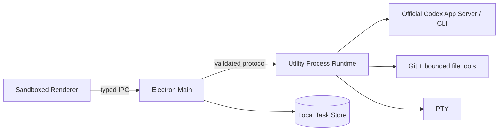

# Rux v1 Desktop Architecture

> Baseline: current ChatGPT desktop Codex parity contract
> Protocol: v18; product surface follows `docs/product-requirements.md`

## 1. Architecture goal

Rux v1 presents the current ChatGPT desktop Codex experience while retaining strict local privilege boundaries. The UI does not invent product concepts absent from the target client. A local Task maps to one authorized Workspace, one official Codex connection and, after the first Run, one native Codex Thread.

## 2. Process boundaries

### Renderer

- Renders the Codex-aligned project rail, one focused Task, Composer and on-demand panels.
- Holds transient drafts, selection and streaming presentation state.
- Has no Node integration and cannot read files, credentials, processes or PTYs directly.
- Sends only schema-valid product intents through Preload.

### Preload

- Exposes the smallest typed `window.rux` API.
- Does not expose generic IPC, filesystem primitives, secret reads or process execution.

### Main

- Owns BrowserWindow lifecycle, single-instance behavior, safe external-link policy and native dialogs.
- Canonicalizes and authorizes Workspace roots.
- Owns the SQLite Task/Run store and non-secret UI preferences.
- Routes validated requests to one Workspace-scoped Runtime.
- Disposes Runtime, active Runs and PTYs when the Workspace changes.

### Utility Process Runtime

- Owns Codex App Server/CLI interaction, native Thread start/resume, streaming and cancellation.
- Owns Git snapshots/diffs, Context validation, bounded file operations, command sandboxing and PTYs.
- Normalizes Codex events into the shared protocol and never sends credentials to Renderer.

## 3. V1 domain model

| Object | V1 meaning |
| --- | --- |
| Project | Navigation grouping derived from authorized Git common-dir metadata or one non-Git root. |
| Workspace | Exact authorized working directory used by a Task and Runtime. |
| Task | Persistent user-visible Codex conversation fixed to one Workspace. |
| Run | One Codex execution attempt with status, events, approvals, usage and immutable Git evidence; model data is internal/read-only unless the target surface shows it. |
| Native Session | Official Codex Thread id used to resume the same Task. |
| Context | Explicit validated Workspace files plus Runtime-authoritative repository context. |

Internal compatibility fields such as Agent Revision and Provider Connection remain in protocol/store rows during migration, but v1 always writes deterministic built-in Codex values. They are not product choices.

## 4. Codex execution path

1. Renderer persists the user message and requests a Run.
2. Runtime resolves the built-in Codex binding and fixed Workspace.
3. Runtime resumes the latest compatible Codex Thread or starts a new Thread.
4. Streaming text, plan, tool, approval, usage and terminal events are normalized and persisted.
5. Concrete permission requests pause only the affected action.
6. Mutation-capable Runs capture authoritative final Git evidence; message-only Runs persist a deterministic unchanged patch.
7. The terminal event completes the Run and the Task remains linked to the native Thread.

Rux does not perform a separate multi-Agent detection gate before every Run. Installation, authentication, network and quota failures come from the real Codex boundary and are shown as recoverable Run errors matching the target client.

## 5. Workspace and Git safety

- Every Workspace path is canonicalized and explicitly authorized in Main.
- Runtime method parameters are revalidated against the active root and reject traversal/symlink escape.
- Main cannot authorize a path merely because Renderer supplied it.
- Structured commands use executable + argv without a shell.
- Changes distinguish working tree state from immutable Run-owned patches.
- Workspace switching cancels active work before a new Runtime becomes authoritative.

## 6. Authentication

- ChatGPT/Codex login and logout are delegated to official `codex` commands.
- Rux never reads CLI credential files, scrapes Keychain, copies tokens or stores OAuth output.
- Renderer-visible state is limited to installation/connection status, auth method, version, executable path and sanitized detail.
- The account surface is Codex-only and user-triggered; it does not scan Claude or custom Providers.

## 7. Persistence and recovery

- Main-owned SQLite persists Workspace-scoped Task, Message, Run, approval and native Session linkage.
- Orphaned running records restore as stopped/interrupted.
- A native resume failure retains the attempted Thread id and error evidence; Rux never silently starts a fresh Thread and labels it resumed.
- UI, draft, sidebar and review preferences persist; PTY sessions do not.
- Historical non-Codex rows remain readable during the v1 migration but cannot be created through normal v1 flows.

## 8. UI composition

Renderer geometry follows the versioned target-client evidence rather than permanent hard-coded reference dimensions. Composer height participates in layout. Changes, Environment and Run surfaces layer or dock exactly as the verified target state does. Reference and comparison evidence live under `design-audit/`.

Showcase data is allowed only behind `?showcase=codex`. Normal startup must not fabricate projects, authentication, changes, tasks or account identities.

## 9. Compatibility code

The repository still contains protocol/store/runtime modules for historical Rux features. They are dormant compatibility infrastructure and not product requirements:

- no first-release navigation or creation entry points;
- no background provider contact or data migration;
- no destructive deletion during the UI reset;
- tests remain until a dedicated removal migration replaces their contracts.

New v1 work must not depend on those modules. A later cleanup can delete them only after exporting or migrating affected local data and updating protocol, Runtime, Preload, tests and docs together.

## 10. Verification contract

- Renderer/protocol/runtime behavior change: run `npm test`.
- Desktop change: run `npm run build:desktop`.
- Handoff bundle: run `npm run package` and launch the packaged app.
- Visible change: capture the actual packaged state and compare it with the matching Codex reference at the same viewport/state.
- Web/Sites compatibility remains supported but cannot substitute for packaged desktop acceptance.
