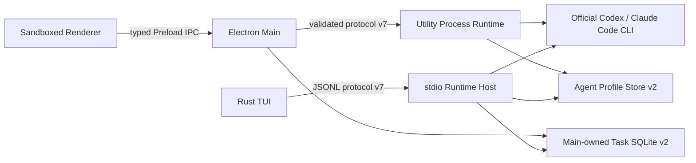
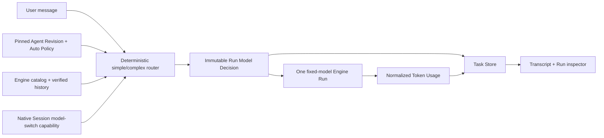

# Rux Desktop Architecture

> Runtime protocol: v7
> Agent Profile Store: v2  
> Task Store: SQLite schema v5 / Workspace snapshot v2
> Updated: 2026-08-14

## Process boundaries

- Renderer has no Node integration and receives no filesystem, process, PTY, or credential capability. It can submit only protocol-validated, non-secret object references.
- Main owns the native window, Workspace authorization, IPC routing, and Desktop Task Store access. A read-only Agent Revision resolver validates Task references without exposing the Profile Store to Renderer.
- Utility Process Runtime owns official CLI adapters, authentication delegation, PTY, Git, Context, permissions, and Agent execution.
- The standalone Runtime Host implements the same v7 protocol for the Rust TUI. Unused fields remain ordinary JSON fields so the TUI can evolve independently.

## External Session Connector boundary

Protocol v4 adds `session.list`, `session.read`, `session.resume.check`, and `session.cancel` to both the Desktop Utility Process Runtime and the stdio Runtime Host. The shared schemas normalize provider-native identity, metadata, messages, resume capability, links, projections, and immutable projection revisions. Requests are explicitly paginated, capped at 100 records and 2 MiB, cancellable, and bounded by timeouts; provider errors pass through the existing sensitive-text redaction boundary.

Protocol v5 adds the Main-only `handoff.summary.generate` request. Renderer cannot call this Runtime method directly; it reaches it only through fingerprint-checked Handoff IPC. Desktop and stdio Runtime Hosts share the isolated, non-persistent source-Agent implementation.

Codex discovery uses only App Server `thread/list` and `thread/read`; the resume check verifies that the Thread remains readable without starting a Turn. Claude Code discovery invokes the documented `claude_agent_sdk` session APIs (`list_sessions`, `get_session_info`, and `get_session_messages`) through a privileged Python bridge. Rux does not read Claude transcript files itself. If that optional SDK capability is absent, Runtime returns `SESSION_CAPABILITY_UNAVAILABLE` rather than falling back to undocumented JSONL parsing.

P1-E0 delivered the API foundation without enabling startup scan or background synchronization. P1-E1 adds explicit metadata discovery and Workspace attribution; P1-E2 adds user-selected preview and transactional local Projection import; P1-E3 adds explicit refresh, diff candidates, versioned rebuild, and local restore.

P1-E1 adds a filtered `session.discover` boundary. Main snapshots only the already-authorized, existing Recent Workspaces into the Utility Process environment when it starts. Runtime independently canonicalizes those roots and provider `cwd` values with `realpath`, uses path-component containment and longest matching for nested projects, and never accepts a Renderer-supplied root. The raw `session.list`, `session.read`, and resume-check methods remain available to the headless Runtime protocol but Main and the typed Preload block them from Renderer; Desktop can invoke only the attributed discovery method.

Discovery stores only the global identity key and current Workspace assignment in `rux-session-attribution.sqlite3`. Sessions matched to another authorized Workspace are omitted from the current result. Missing/unresolvable paths remain metadata-only and unassigned; existing paths outside every authorized root require the native “打开项目…” authorization flow. If a later authorization creates a more specific match, discovery returns a migration suggestion while preserving the previous assignment. It does not move a Task or read the Transcript.

P1-E2 exposes only the attributed `session.preview` method to Renderer. Runtime requires a prior assignment to the active authorized Workspace, reads bounded/paginated normalized content through the same supported Connector, then revalidates the global identity and canonical `cwd` before checking native resume availability. Codex `thread/read` is consumed once because its official response contains the complete Thread in one JSON-RPC record; App Server transport keeps a 32 MiB hard frame bound, while normalized preview remains capped at 8 MiB and 20,000 messages. Claude continues using official SDK pagination. Main owns the separate `rux:session:import` commit boundary and repeats that preview check so stale Renderer data cannot be persisted. Task Store schema v3 writes the Task snapshot, one globally deduplicated Session Projection, and an append-only Projection Revision in a single `BEGIN IMMEDIATE` transaction. Tool and unsupported provider content receive visible normalized placeholders rather than being dropped.

An imported Task stores a non-secret binding to its Projection Revision and Native Session Link. `view` imports are locally read-only. `continue` imports are accepted only while resume is available and recover that pinned Session under the same Engine, official CLI Connection, built-in Agent Revision, and Workspace. Import never calls a provider delete/archive/update API. Existing external writers may still change the native Session, so the UI labels the local-copy risk and does not call this synchronization.

P1-E3 keeps refresh behind Main-owned IPC. Renderer submits only the imported Task id and an operation id; Main resolves the persisted Engine, Connection, native Session id, and active Workspace before requesting a fresh attributed preview. Task Store schema v4 compares the current immutable Revision with the preview. Exact stable-ID prefix additions append safely and become a new current Revision. Modifications, deletions, moves, synthetic identifiers, or uncertain fingerprint matches create an immutable candidate Revision and a bounded typed diff without changing the current Task projection. Confirmed rebuild or restore replaces only provider-imported messages, preserves Rux-owned messages and all Run/approval/Task records, and appends an audit row containing time, Engine, native Session id, before/after Revision and result. Failed operations also append failure evidence and leave the current Revision unchanged. None of these paths invoke a provider write API.

P1-E4 adds a Main-mediated Context Handoff boundary and Task Store schema v5. Preview accepts only source Task id, target Agent id, selected message ids, and selected file paths. Main resolves the target built-in or custom Agent and immutable latest Revision; Task Store rejects messages outside the source Task and files absent from the latest persisted Run-owned Git patch. A SHA-256 fingerprint binds the reviewed target and fact bundle. Confirmed commit rechecks that fingerprint inside `BEGIN IMMEDIATE`, inserts an immutable `context_handoff_snapshot`, creates a target Task with no Run or Native Session, and records bidirectional relations. The target's first user message is the reviewed handoff payload. Source changes cannot update the snapshot. An explicit summary request is revalidated against that fingerprint in Main, then executed by the pinned source Revision in Utility Process. Codex sets `thread/start.ephemeral=true`; Claude Code sets `--no-session-persistence` and disables tools. The isolated result is not emitted into ordinary Task Run history. Main issues a short-lived generation id, validates it again at commit, and persists provenance separately from deterministic facts while allowing the user to edit or remove the text.

P1-E5 keeps local data lifecycle outside the Utility Process and every Provider Connector. Main-only IPC exposes Workspace usage summary, impact preview, confirmed execution, and native-file export. Task Store derives imported message ownership from immutable Projection Revisions, estimates serialized local bytes, and binds each preview to the active Workspace state with SHA-256. Execution recomputes the preview before entering a SQLite transaction. `unlink` retains the binding and all local data but changes it to a non-runnable/non-refreshable state; an explicit repeated import re-establishes the binding. `remove-imported` removes only provider-derived messages, Projection rows, Revisions, and refresh audit while preserving Rux-owned Run, approval, Task, and Handoff state. `delete-task` also removes the selected Task records and cleans Handoff relations. Workspace scope applies the same semantics in batch. Export selection is resolved again in Main, supports Markdown/JSON and current/all Revision ranges, recursively drops credential-shaped structural fields, warns before invocation, and writes the user-selected file with mode `0600`. None of these paths can issue a provider-native delete, archive, or transcript mutation.

## Provider and credential boundary

`ProviderConnectionRef` is deliberately non-secret. It contains only a stable id, kind, Engine, and display label. The P0 official CLI references are `cli:codex:default` and `cli:claude-code:default`.

Rux never reads CLI credential files, Keychain entries, OAuth tokens, API keys, Base URLs, or arbitrary executable paths. Codex and Claude Code retain ownership of OAuth, API-key, Base URL, cloud-provider configuration, token refresh, and logout. The Renderer runs `auth.status` only after the user clicks the detection action, then refreshes `agent.list` so installation state cannot remain stale. A direct login action delegates only to the selected official command (`codex login` or `claude auth login`); login success updates only that Provider. Renderer-visible status is limited to installation and connection state, normalized auth method, CLI version/path, non-sensitive detail, and the non-secret Connection reference.

Protocol v6 adds the independent `rux-native` Engine. Main validates and stores non-secret Connection metadata plus OS-encrypted API-key ciphertext; the encryption key remains owned by Electron `safeStorage`/the operating system. Preload exposes create/list/test/delete operations but never a secret read. On Runtime readiness or Connection mutation, Main decrypts the key and sends it through Renderer-inaccessible `provider.connection.sync`; Runtime keeps it only in memory. Provider access occurs only for an explicit test or Run. The first Adapter uses the Responses API with function tools for bounded file read/list/write, rejects sensitive paths/content and symlink escapes, records Provider response ids as `rux-response` Session Links, and emits normalized usage. It intentionally has no shell tool until a real cross-platform sandbox is available.

## Agent Definition and immutable Revision

The v2 Agent Profile Store separates two meanings that v1 had conflated:

- `storeRevision` serializes cross-process JSON mutations.
- `AgentRevision.revisionNumber` is an immutable product-domain version.

An Agent Definition is the mutable list entry and points to `latestRevisionId`. Create writes Revision 1; every update appends one Revision and moves only the Definition pointer. Deleting a Definition removes it from the selectable list but retains all Revisions for historical Tasks and Runs.

Every Revision captures Engine, `ProviderConnectionRef`, model source and verification state, instructions, permission policy, Skills, Tools, and enabled state. Neither Definition nor Revision accepts secrets, credential paths, or an executable.

### Profile Store v1 to v2 migration

Migration occurs under the sibling-file lock and is persisted with the existing atomic temporary-file, fsync, and rename path. Each v1 Profile maps deterministically to `agent-revision:<profileId>@1`; its original bytes remain represented in the first immutable snapshot. Invalid or future stores fail closed and are not replaced.

## Task and Run binding

Workspace snapshots are version 2. Every Task contains:

- `agentRevisionId`, with an optional immutable snapshot for legacy/custom evidence;
- a non-secret `providerConnection`;
- `modelSource` and `modelVerificationStatus`;
- an explicit adapter/Engine.

Every Run repeats the actual Revision, Connection, and model state and may persist the exact `AgentRevision` snapshot. Built-in Agents use deterministic ids such as `builtin:codex@1`. New custom-Agent Runs must supply the Profile Store's exact `latestRevisionId`; Runtime resolves that Revision rather than silently reading the latest mutable Definition.

Codex Thread 与 Claude Session 统一保存为非敏感 `NativeSessionLink`，包含 Engine、Connection 引用、Agent Revision、Workspace 与原生 Session 标识。Renderer 只会选取 Engine、Connection、Revision、Workspace 全部匹配的最新 Link 恢复同一 Task；Runtime 事件回写本次尝试恢复的标识，Task Store 再校验 Link 与 Run/Task 的绑定关系。

恢复失败会作为 Run 的 `resumeFrom` 与 `resumeFailure` 证据持久化。界面不会降级为新 Session，而是明确展示失败原因，让用户重试原 Session 或创建不携带消息、Run、Context 与 Session Link 的新 Task。Run 检查面板同时显示实际 Engine、Revision、Connection、模型状态、权限模式和 Native Session。

Renderer compares a custom Task's fixed `agentRevisionId` with its live Definition's `latestRevisionId`. A mismatch produces a non-blocking notice; the action creates a blank Task fixed to the latest Revision and deliberately copies no messages, Runs, selected Context, or native Session id. P1 Context Handoff will own any later, explicit transfer of work. If a Definition is deleted, it disappears from new-task selection while a synthetic historical choice keeps the existing Task bound to its retained Revision for review and compatible continuation.

## Auto model-routing boundary

Protocol v7 implements Auto routing by extending the immutable Agent/Run contract rather than creating an independent model gateway.

The shared contract adds:

- `AutoModelPolicy`: simple model, complex model, allowlist, strategy, and fallback policy, stored inside an immutable Agent Revision;
- `RunModelDecision`: routing mode, simple/complex classification, selected model, reason codes, allowlist snapshot, fallback evidence, and capability result;
- `TokenUsage`: optional input, cached-input, output, reasoning, and total counts plus source, aggregation, scope, estimate flag and report time.

Main/Renderer may request `auto`, but Runtime is the final enforcement boundary. Runtime resolves exactly one model before starting the Run, validates it against the pinned Revision's Engine/Connection-scoped allowlist, and rejects any cross-Agent, cross-Engine, cross-Connection, or unverified-manual candidate. The first release uses deterministic signals and makes no extra model call. Catalog/verified-history invalidation may cause one pre-execution fallback to the other allowlisted policy model; authentication, network, quota and transient errors do not. A future model-based router must be a separately evidenced invocation with its own model, usage, duration, and provenance.

Native Session continuation remains conservative. Auto may select another model only when the Engine explicitly reports that per-Run model selection is compatible with that Session. Unknown or unsupported capability keeps the pinned model or requires the existing new-Task/Handoff path. A Run never changes model after execution begins.

Provider/Engine usage is normalized after the Run and stored with the Assistant turn. Missing usage remains unknown; local estimates are labeled and cannot be used as billing truth. Reasoning token counts may be stored, but hidden reasoning content is never persisted merely to support usage display.

## Task Store v1 to v2 migration and validation

SQLite migration upgrades `PRAGMA user_version` and every Workspace JSON row in one `BEGIN IMMEDIATE` transaction. A failure parsing or migrating any row rolls back the version and all row writes.

Legacy binding is deterministic:

- A Task/Run with a historical custom-Agent snapshot receives a content-scope `legacy-agent-revision:<sha256>` and a `legacy` model state.
- A Task with no custom evidence binds to its deterministic built-in Revision.
- Provider identity is never guessed. Legacy custom evidence carries an explicit legacy Connection marker; built-in official CLI history uses only the deterministic built-in binding.

Before save/load, Task Store validation rejects:

- a Revision absent from the Agent Profile Store;
- an Engine or Connection that does not match the Revision;
- a custom Revision that does not belong to the referenced Profile;
- fabricated legacy Revision ids not already established by migration;
- a Run that changes Revision or Connection within a non-legacy Task.

## Current implementation truth

- Claude Code and Codex Runs use real local adapters; Rux Demo remains development/Web-preview only.
- Protocol v7, Agent Profile Store v2, Task Store v5, Desktop Runtime, stdio Runtime, Renderer fallback, and Rust TUI share the Revision/Connection, Session Connector, isolated Handoff-summary, Auto Policy, Model Decision and Token Usage contract.
- `账户与登录` is an explicit Agent/Provider surface for Rux Native, Codex, and Claude Code. Opening the app or panel performs no CLI inspection. Rux Native metadata loads locally without network access; only explicit test/Run actions contact its Provider. CLI credentials remain CLI-owned.
- Codex model discovery uses official App Server `model/list` with explicit catalog source and fetch time. Engines without a catalog expose Engine default plus advanced model IDs; successful Runs create verified history scoped to the same Engine and non-secret Connection reference. Only explicit model-not-found/incompatibility failures mark a model unavailable.
- Auto model routing is implemented. Revisions store policy and same-Connection candidates; Runtime and stdio Host use the deterministic simple/complex classifier, enforce session capability and persist immutable decisions/fallbacks. Codex, Claude Code and Rux Native usage are normalized; every Assistant turn shows the actual model and reported total or `未报告`, while Run exposes the sourced breakdown.
- RUX 发起的 Codex Thread 与 Claude Session 已使用规范化 Native Session Link 持久化并可在兼容 Task 中恢复。恢复失败保留原 Session 证据并要求用户显式重试或创建新 Task；不会静默回退为新会话。
- P0 Desktop Release Candidate 已在隔离打包环境完成干净启动、显式 Agent 检测、首次 Run、重启后同 Thread 恢复、Terminal 不恢复与 Workspace 切换。Workspace Starter Task 在第一次发送时采用规范化后的用户提示词标题，避免已运行历史继续显示为“开始新任务”。
- External Session discovery, selected-content preview, deduplicated local Projection persistence, read-only import, compatible native continuation, explicit refresh/diff, versioned rebuild, local Revision restore, Context Handoff, scoped cleanup, and export are user-triggered Desktop flows with canonical Workspace attribution. Explicit attribution migration remains later P1 work; this architecture does not claim background conversation synchronization.
- P1 Desktop Release Candidate 已在同一隔离打包环境贯通显式 Agent 检测、Workspace 归属发现、预览导入、刷新版本、Context Handoff、重启恢复与本地数据影响预览。验收中修复了 `解除关联` 误用删除后果文案的问题；unlink 现在明确保留 Task、消息和 Projection Revision。证据位于 `design-audit/p1-release-candidate/`。
- Parts of Changes and Context remain showcase-backed in the Renderer and must not be presented as fully repository-backed until that wiring is complete.
- macOS packages remain unsigned until Developer ID signing and notarization are configured.
