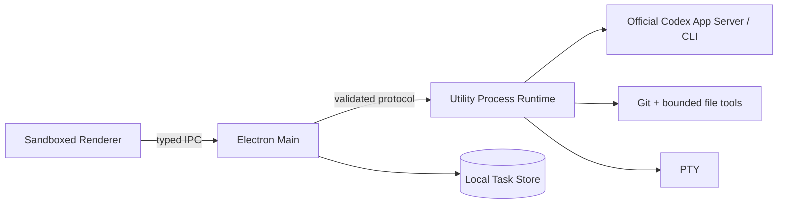

# Rux v1 Desktop Architecture

> Baseline: current ChatGPT desktop Codex parity contract
> Protocol: v25; product surface follows `docs/product-requirements.md`

## 1. Architecture goal

Rux v1 presents the current ChatGPT desktop Codex experience while retaining strict local privilege boundaries. The UI does not invent product concepts absent from the target client. A local Task maps to one authorized Workspace, one official Codex connection and, after the first Run, one native Codex Thread.

## 2. Process boundaries

### Renderer

- Renders the Codex-aligned project rail, one focused Task, Composer and on-demand panels.
- Renders the Composer model control as a nested settings menu backed by `model/list`, including per-model reasoning efforts and service tiers; the selected tier travels through protocol v25 to official App Server thread/turn settings.
- Opens the Plugins navigation as a real catalog backed by bounded `codex plugin list --available --json`; explicit install/remove actions run through the same official CLI boundary and return only sanitized plugin metadata to Renderer.
- Holds transient drafts, selection and streaming presentation state.
- Holds Task-scoped queued Composer inputs in memory, allows cancellation, and starts only the next queued input after the current Run reaches a terminal event; queued inputs never cross Workspace boundaries or auto-resume after an application restart.
- Uses platform speech recognition only after the user presses the Composer voice control. Main grants media permission only to the trusted main WebContents and only for audio; camera/video requests remain denied, capture tracks are released immediately, and unsupported platforms show a disabled control instead of simulated dictation.
- Keeps user-triggered ChatGPT account snapshots in memory only; `auth.chatgpt.sync` delegates only `account/read` and rate-limit reads to the official Codex App Server, does not chain into general CLI/Provider discovery, and never persists account email or tokens.
- Treats imported Agent history as a Rux-owned editable copy. Source Session identifiers remain provenance only; the first continued Run starts a new Rux-managed Session with a bounded transcript context, and subsequent Runs resume only that Rux-owned Session.
- Normal v1 hydration restores authorized Workspace and Task snapshots and keeps only the Codex adapter. It does not enumerate historical Agent Profiles, native Provider Connections, Board/Improvement data, hidden local metrics, or hidden updater state. Historical New Task, Board, Working Copies, Improvement, Handoff, custom Agent, and legacy Session-discovery dialogs are not mounted in the v1 React tree; their stores and privileged compatibility services remain intact for a separately reviewed migration.
- Main does not schedule historical Improvement evaluation or any other dormant Provider work. Compatibility stores and explicit privileged methods remain for retained data, but normal startup creates no Improvement timer and cannot contact a Provider on that feature's behalf.
- Uses a semantic primary navigation landmark, a named keyboard-focusable conversation scroll region with busy state, and an ARIA account menu whose initial focus, Arrow Up/Down, Home/End, Escape close, and trigger-focus restoration paths are verified in the packaged app.
- Composer More, permission, model, reasoning and speed overlays move focus into their first or selected enabled item, support Arrow Up/Down and Home/End, return Escape from a submenu to its exact parent item, and return a second Escape to the originating trigger. The application-level Escape handler yields whenever any menu/dialog/Composer overlay is mounted, so closing an overlay cannot also close Environment or Terminal.
- Inspector Changes/Context/Run and Terminal tabs use roving tabindex with Arrow Left/Right and Home/End. Activating a tab updates its panel and focus together; closing an active Terminal tab focuses the surviving selected tab, while a newly created Terminal activates its real shell input.
- Task actions, Open location, and Quick tools are mutually exclusive ARIA menus. Each opens on its first enabled item, supports Arrow Up/Down and Home/End, skips disabled entries, and restores its exact trigger on Escape; rename mode keeps dialog/form behavior instead of menu navigation.
- Visible buttons must either invoke a real handler, submit a real form, or be explicitly disabled with an evidence/capability reason. Reply/code copy uses the platform Clipboard; feedback, reply expansion and code application remain visible but gated until their target protocols and click results are known.
- Sidebar Search, Notifications and Account are mutually exclusive transient surfaces. Search moves focus into its input; Escape clears and unmounts it, while Notifications exposes a stable empty state. Both restore their exact trigger on Escape and are included in the global overlay-yield boundary.
- General Settings no longer treats persisted display values as implemented behavior. Bottom panel controls the title-bar Terminal entry; Speed maps to an official catalog `serviceTier`; Prevent sleep drives a minimal Main-owned `powerSaveBlocker` only while a Task is running or waiting for approval, with forced release on Workspace switch/quit. File-open default, language switching, menu-bar residency and right-side Terminal docking remain visibly disabled until real consumers exist.
- Has no Node integration and cannot read files, credentials, processes or PTYs directly.
- Sends only schema-valid product intents through Preload.

### Preload

- Exposes the smallest typed `window.rux` API.
- Does not expose generic IPC, filesystem primitives, secret reads or process execution.
- Exposes only current v1 Workspace/task/image/power intents plus the validated Runtime request/event bridge. Board, Working Copies, Improvement, old Session/Handoff, local-data, custom-Provider, hidden metrics and updater compatibility methods are not present on `window.rux`, even while their Main-owned stores/handlers remain during data retention.

### Main

- Owns BrowserWindow lifecycle, single-instance behavior, safe external-link policy and native dialogs.
- Canonicalizes and authorizes Workspace roots.
- Owns the SQLite Task/Run store and non-secret UI preferences.
- Routes validated requests to one Workspace-scoped Runtime.
- Disposes Runtime, active Runs and PTYs when the Workspace changes.

### Utility Process Runtime

- Owns Codex App Server/CLI interaction, native Thread start/resume, streaming and cancellation.
- Owns Git snapshots/diffs, Context validation, bounded file operations, command sandboxing and PTYs.
- Normalizes Codex events into the shared protocol and never sends credentials to Renderer.

## 3. V1 domain model

| Object | V1 meaning |
| --- | --- |
| Project | Navigation grouping derived from authorized Git common-dir metadata or one non-Git root. |
| Workspace | Exact authorized working directory used by a Task and Runtime. |
| Task | Persistent user-visible Codex conversation fixed to one Workspace. |
| Run | One Codex execution attempt with status, events, approvals, usage and immutable Git evidence; model data is internal/read-only unless the target surface shows it. |
| Native Session | Official Codex Thread id used to resume the same Task. |
| Context | Explicit validated Workspace files plus Runtime-authoritative repository context. |

Internal compatibility fields such as Agent Revision and Provider Connection remain in protocol/store rows during migration, but v1 always writes deterministic built-in Codex values. They are not product choices.

## 4. Codex execution path

1. Renderer persists the user message and requests a Run.
2. Runtime resolves the built-in Codex binding and fixed Workspace.
3. Runtime resumes the latest compatible Codex Thread or starts a new Thread.
4. Streaming text, plan, tool, approval, usage and terminal events are normalized and persisted.
5. Concrete permission requests pause only the affected action.
6. Mutation-capable Runs capture authoritative final Git evidence; message-only Runs persist a deterministic unchanged patch.
7. The terminal event completes the Run and the Task remains linked to the native Thread.

Rux does not perform a separate multi-Agent detection gate before every Run. Installation, authentication, network and quota failures come from the real Codex boundary and are shown as recoverable Run errors matching the target client.

## 5. Workspace and Git safety

- Every Workspace path is canonicalized and explicitly authorized in Main.
- Runtime method parameters are revalidated against the active root and reject traversal/symlink escape.
- Main cannot authorize a path merely because Renderer supplied it.
- Structured commands use executable + argv without a shell.
- Changes distinguish working tree state from immutable Run-owned patches.
- Workspace switching cancels active work before a new Runtime becomes authoritative.

## 6. Authentication

- ChatGPT/Codex login and logout are delegated to official `codex` commands.
- Rux never reads CLI credential files, scrapes Keychain, copies tokens or stores OAuth output.
- Renderer-visible state is limited to installation/connection status, auth method, version, executable path and sanitized detail.
- The account surface is Codex-only and user-triggered; it does not scan Claude or custom Providers.

## 7. Persistence and recovery

- Main-owned SQLite persists Workspace-scoped Task, Message, Run, approval and native Session linkage.
- Orphaned running records restore as stopped/interrupted.
- A native resume failure retains the attempted Thread id and error evidence; Rux never silently starts a fresh Thread and labels it resumed.
- UI, draft, sidebar and review preferences persist; PTY sessions do not.
- Historical non-Codex rows remain readable during the v1 migration but cannot be created through normal v1 flows.

## 8. UI composition

Renderer geometry follows the versioned target-client evidence rather than permanent hard-coded reference dimensions. Composer height participates in layout. Changes, Environment and Run surfaces layer or dock exactly as the verified target state does. Reference and comparison evidence live under `design-audit/`.

Showcase data is allowed only behind `?showcase=codex`. Normal startup must not fabricate projects, authentication, changes, tasks or account identities.

## 9. Compatibility code

The repository still contains protocol/store/runtime modules for historical Rux features. They are dormant compatibility infrastructure and not product requirements:

- no first-release navigation or creation entry points;
- no background provider contact or data migration;
- no destructive deletion during the UI reset;
- tests remain until a dedicated removal migration replaces their contracts.

New v1 work must not depend on those modules. A later cleanup can delete them only after exporting or migrating affected local data and updating protocol, Runtime, Preload, tests and docs together.

The active Renderer does not load Board/Improvement summaries during startup, pin Improvement assets on new Tasks, inject them into Runs, or offer historical Agent backends to the Composer. Those stores and methods remain compatibility-only and are not deleted by this boundary change.

## 10. Verification contract

- Renderer/protocol/runtime behavior change: run `npm test`.
- Desktop change: run `npm run build:desktop`.
- Handoff bundle: run `npm run package` and launch the packaged app.
- Visible change: capture the actual packaged state and compare it with the matching Codex reference at the same viewport/state.
- Web/Sites compatibility remains supported but cannot substitute for packaged desktop acceptance.
- Pull-request discovery is a user-triggered, read-only Runtime operation backed by the official `gh` CLI for the authorized Workspace. Output is size/time bounded and schema-normalized; credentials and raw CLI environment never cross into Renderer.
- Composer `/review` is carried as a validated `CodexReviewTarget` on `run.start`. The privileged Codex adapter creates or resumes the official Thread, calls App Server `review/start` with inline delivery, forces the review Run to the read-only permission profile, and returns findings through the ordinary persisted Run/Transcript event path.
- Settings Import calls App Server `externalAgentConfig/detect`, `externalAgentConfig/import`, and `externalAgentConfig/import/readHistories` only after a direct user action. Runtime fixes detection to the authorized Workspace plus the official user-level scope, caches raw migration objects behind an expiring opaque detection id, and accepts only selected item ids plus explicit confirmation from Renderer. Raw migration details, source session paths, and configuration payloads never cross the Renderer boundary.
