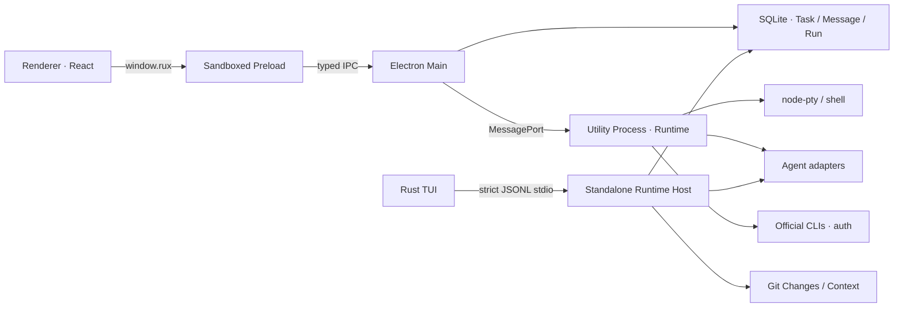

# RUX 桌面端架构

> 本文档记录当前架构与实现边界，不代表产品已达到发布门槛。分期需求、完成证据和 Desktop/TUI 发布 Gates 见 [`delivery-roadmap-and-acceptance.md`](./delivery-roadmap-and-acceptance.md)。

## 技术栈

- 桌面容器：Electron 43 + electron-vite
- Renderer：React 19 + Vite 6
- 终端：xterm.js + node-pty
- 边界校验：TypeScript + Zod
- 打包：electron-builder

第一版优先使用 Electron，是因为 Coding Agent 必须稳定处理 PTY、文件系统、Git、子进程和系统集成。Renderer 仍然是普通 React 应用，因此现有 Web 原型可以继续迭代，未来也可以复用到浏览器预览；Runtime 协议与界面解耦，后续 Grok Build 风格的 TUI 可以作为第二个客户端接入。

## 进程边界

- Renderer 不启用 Node.js，只能访问 Preload 暴露的最小 API。
- Preload 使用 `contextBridge`，不向页面泄露 `ipcRenderer`。
- Main 负责窗口生命周期、外链策略和 IPC 路由，不直接执行 Agent 工具。
- Main 使用 Electron 内置的 `node:sqlite` 持有 Task / Message / Run event store；Renderer 只能通过经过 Zod 校验的 `loadTaskState` / `saveTaskState` 最小接口读写 Workspace snapshot，无法接触数据库或文件系统。
- Runtime 在独立 Utility Process 中运行高权限能力；崩溃时不会直接带崩 UI。Run-scoped Permission gate、事件日志和恢复语义已位于这一边界；Codex 通过 app-server 使用 provider-native 逐工具审批，无法提供原生审批的底座才使用粗粒度 Run gate。
- 所有 Runtime 请求先在 Main 校验 envelope，再在 Runtime 中按方法校验参数。
- `app/src/electron/stdio-runtime.ts` 将同一组 Adapter、Git、Context、自定义 Agent 与 Task Store 服务暴露为严格单行 JSONL，供 Rust TUI 使用。生产 Host 不提供 mock adapter。

## 当前 Runtime 协议

| 方法 | 用途 |
| --- | --- |
| `runtime.ping` | 获取 Runtime 状态与工作区 |
| `runtime.shutdown` | Main/Host 发起 fail-closed 关闭；停止接收新请求，清理资源并在 ACK 后退出（Desktop Renderer 不暴露此方法） |
| `auth.status` | 兼容性诊断：按请求检测 Claude Code 与 Codex CLI 的非敏感登录状态；当前账户界面不调用 |
| `auth.login` | 用户主动触发后委托官方 CLI 登录；Codex 成功退出后直接返回本次单 provider 结果 |
| `terminal.create` | 在工作区内创建 PTY |
| `terminal.write` | 写入终端输入 |
| `terminal.resize` | 同步 xterm 尺寸 |
| `terminal.dispose` | 销毁 PTY |
| `agent.list` | 检测本机 Claude Code/Codex Adapter 与版本 |
| `agent.model.list` | 通过 Codex app-server 的只读 `model/list` 分页读取模型、默认 reasoning effort 与该模型支持的 effort；不读取或改写 Codex 配置文件 |
| `agent.profile.*` | 创建、读取、更新和删除组合受信任底座的自定义 Agent |
| `run.start` | 启动 Claude Code、Codex 或自定义 Agent Run；Runtime 权威捕获 Context 与 Git baseline；开发模式可显式启用 Demo |
| `run.cancel` | 终止 Run 及其子进程组 |
| `permission.decide` | 对 RUX Run gate 或 provider-native 单项请求做批准或拒绝；Stop 仍通过 `run.cancel` |
| `run.changes.previewRestore/restore` | 校验 Run baseline/patch、当前 synthetic tree 与真实 index 指纹后，只恢复该 Run 的 worktree 改动 |
| `changes.list/diff` | 读取活动 Workspace 的真实 Git 状态与分层 Diff |
| `changes.previewRestore/restore` | 以 snapshot ID 保护的预览/确认恢复 |
| `changes.accept` | 记录 review-only 审查决定，不修改 index/worktree |
| `git.branches.list` | 列出当前、本地、远端与可比较分支，不修改仓库 |
| `git.branch.switch` | 仅切换到已经存在的本地分支；仅允许 Git 顶层目录 Workspace |
| `git.commit` | 只提交调用前已经 staged 的内容，不自动 stage；仅允许 Git 顶层目录 Workspace |
| `git.push` | 经协议层 `confirmed: true` 二次确认后，只推送当前分支到已经配置的 upstream |
| `git.compare` | 返回指定本地/远端 base 的 `merge-base..HEAD` 文件统计、摘要与受限 patch |
| `context.snapshot` | 读取活动 Workspace 的真实 Instructions、选中文件与能力摘要 |
| `task.state.load/save` | Desktop/TUI 共用的 Workspace Task Snapshot |

Runtime 还会推送 Runtime、Terminal、Run、Activity 与 Assistant 事件。Claude Code/Codex 的原生事件会被 Adapter 归一化为 metadata、reasoning、plan、usage、log、activity、assistant message、Verification 和明确 Run 终态；Runtime 自身还发出 immutable `run.context-snapshot`、`run.git-baseline`、终态前的 `run.git-patch`，以及 blocking `permission.requested` / auditable `permission.decided`。协议当前为 v2，定义在 `app/src/shared/protocol.ts`；Main、Preload、Utility Runtime、Standalone Host 和 Renderer共用 TypeScript 类型，TUI 在 Rust 边界严格解码并拒绝版本不匹配。

Main 对只读请求保留有界等待；对 `run.start`、`permission.decide`、`run.changes.restore`、`git.branch.switch`、`git.commit`、`git.push` 等 mutation 使用更长的按方法预算。mutation 一旦超时，不会立即向 Renderer 报错并留下后台操作：Main 先触发完整 Runtime shutdown，等清理完成或强杀兜底收敛后才拒绝原请求。Runtime 在 shutdown 开始时停止接收新请求，取消待决权限，并用 active-request/active-child registry 收敛正在执行的 Git、OAuth 和 provider 操作。

Environment 的 repo-wide Git mutation 在 Runtime 与 Git service 两层串行化；存在 active/waiting-permission Run 时一律拒绝，Desktop 还会在打开 PTY 时拒绝，并在 mutation 已排队后阻止新 Run、权限批准或 PTY 创建。切分支只接受精确匹配的现有本地 ref，且不递归切换 submodule。Commit 先验证非空 message 和 staged 列表，使用 `--no-gpg-sign`，不执行 `git add`，并以有界超时回收 hook 进程组。Push 在 Zod/Runtime/service 三层要求 literal `confirmed: true`，只解析当前分支已经配置且 remote 仍存在的 upstream，显式推送 mutation 开始时捕获的当前 commit object 到该 ref，并覆盖 mirror/follow-tags/force/upstream 等可能扩大写入面的配置：不创建 remote/upstream、不推送其他 refs、不 force，并禁止终端、askpass 及 credential-manager 交互；失败信息不把凭据或 Git stderr 暴露给 Renderer。Branch switch、commit 与 push 是 repo-wide mutation，所以授权 Workspace 若只是 Git 仓库子目录会 fail closed。Compare 是只读能力，可在子目录 Workspace 使用，但文件、统计与 patch 都由 `-- .` 限于授权路径；patch 上限 1 MiB，并明确返回 `truncated`。

Context Snapshot 由 Runtime 在受权 Workspace 内重新读取，不信任 Renderer 提供的内容；每个来源保存 path、bytes、SHA-256、missing/binary/truncated 状态与预算内文本，并拒绝 traversal 和 symlink escape。同一个 Snapshot 文本会进入实际 Claude/Codex prompt，也进入 Run history。

Run-owned Git attribution 使用位于系统临时目录的独立 `GIT_INDEX_FILE`：从 HEAD（unborn repo 使用 empty tree）开始，只把受权 Workspace 当前可追踪内容写成 synthetic tree。终态前再次生成 tree 并比较，因此不会修改真实 index/worktree，ignored 文件不会进入归因。每个 baseline/patch 还记录真实 index 的 SHA-256 指纹。Run Restore 只反向应用 authoritative `baseline → after` patch 到 worktree，并要求当前 synthetic tree 等于 Run 结束 tree；若 Run 期间/结束后真实 index 漂移、同路径出现后续编辑、路径越界或 patch 不权威则拒绝，不猜测归属。当前为文件级安全 Restore，尚无 hunk merge；无关 worktree 漂移可保留。

Workspace 不通过通用 Runtime IPC 暴露。干净的开发版、Web fallback 和打包版都从未导入项目的 `welcome-workspace` 占位态开始；只有用户通过原生目录选择器授权、明确点击 Recent 中已授权的 Workspace，或显式测试环境持续设置 `RUX_WORKSPACE_ROOT` 时才激活真实路径。Main 持久化 Workspace state 版本与授权来源；旧开发版曾静默采用源码 Git 根，升级时若该无来源路径与旧默认完全匹配，会回到 placeholder 并把路径保留在 Recent，等待用户点击确认，不会启动其 Runtime，也不会删除对应任务历史。移除环境覆盖后，`environment` 来源同样不会静默恢复。Web 的 Codex 视觉验收数据只在显式 `?showcase=codex` 下出现；该模式固定所需面板、忽略普通 `localStorage` 偏好且不写回用户状态。Main Process 使用原生目录选择器授予路径权限，把最近项目持久化在 Electron `userData` 目录，并只允许 Renderer 重新激活已经授权的路径。`workspaceOpen` 是独立的受信 Renderer IPC：它不接收 Renderer 路径，只接受受校验的 `vscode` 或 `finder` 目标，并只打开 Main 当前持有的活动授权 Workspace；无参调用保持向后兼容并默认使用 VS Code，VS Code 失败时可回退到系统文件管理器，结果会在 `detail` 中明确说明回退，placeholder 始终拒绝。切换项目会串行等待旧 Runtime 的 `runtime.shutdown`：Runtime 先关闭待决权限、Run、PTY、OAuth、Git command 和 provider process group，宽限期后对整组执行强杀，再关闭 Store 并 ACK；只有旧 Utility Process 确认退出后才持久化新活动 Workspace 并启动新 Runtime。Main 对 handshake 和进程退出都设有限时强杀兜底。Renderer `render-process-gone`、窗口销毁与应用退出复用同一 fail-closed 路径；应用退出会阻止第一次 `before-quit`，完成清理后再真正退出。

## Task、Message 与 Run 持久化

- 数据库存放在 Electron `userData/rux-task-state.sqlite3`，使用内置 SQLite 的 WAL 与 `synchronous=FULL`；每个 Workspace snapshot 在单个事务中原子替换。
- Snapshot 以 Workspace ID 隔离，Desktop Main 只允许读取或写入原生选择器已经授权、仍在 Recent 列表中的 Workspace；Standalone Host 只接受启动参数指定 Workspace 的匹配 ID。
- Task 包含 Message、Plan、Activity 和 Run 历史；每个 Run 保存 adapter、模型、reasoning effort、权限模式、状态、元数据、immutable Agent/Context/Git Snapshot、Run Restore record、Permission Request/Decision、Verification evidence 及按顺序记录的标准化 Runtime events。
- Renderer 启动时 hydrate 所有 Recent Workspace 的任务历史；新增任务、用户/助手消息、Agent 事件、Run 终态和模型选择等状态变化会按顺序发送到 Main 落盘。界面偏好仍保留在 Renderer `localStorage`，终端会话不会恢复。
- 应用或 Runtime 进程消失后，数据库里遗留的 `running` Task 会在下次加载时归一为 `stopped`，对应 Run 归一为 `interrupted`，避免把不存在的进程显示成仍在运行。
- TUI 默认解析到 Electron `userData` 等价目录并使用同一数据库。它在第一条 live prompt 前 hydrate 历史，保存消息、Run、事件、活动、计划、用量、外部 session ID、Permission 和 Git review acceptance；因此顺序切换 Desktop/TUI 时可以继续同一历史。
- OAuth 凭据和 CLI 授权输出不属于该 store，仍完全由官方 CLI 管理。

当前 Store 使用 `PRAGMA user_version=1` 管理 schema：新库和既有无版本库都在 `BEGIN IMMEDIATE` 内升级，严格校验表结构，拒绝未来版本，失败时回滚且不改原数据。写事务会合并旧 Snapshot：Task 标量使用较新时间，Message、Run、Run Event、Verification、Permission、Run Restore 与 review acceptance 按身份并集，Event 重排为连续 sequence；immutable Agent/Context/Git evidence 不会因较新的陈旧客户端 Snapshot 缺字段而丢失。两个独立 `TaskStore` 连接保存陈旧快照的测试证明不会丢失双方追加历史。SQLite `busy_timeout` 处理短暂写竞争。仍未实现显式删除 tombstone、同字段冲突提示和真正双进程同步压测，因此不能把它描述为实时协作数据库。

## 认证边界

- RUX 不在启动或打开 `账户与登录` 时自动检测、恢复或同步 CLI 登录态。`auth.status` 仍保留为兼容性诊断接口，但当前账户界面不调用它。
- 当前账户界面只在用户明确点击 Rux 登录后调用底层 `codex login`。Renderer 将该 provider 的 Agent、账户、设置、模型和审批展示名统一映射为 Rux；协议 ID、真实模型 value、CLI 命令、事件和持久化值仍保持 `codex`。该官方 CLI 以退出码 0 结束时，Runtime 直接返回本次 provider 的 connected 结果，不再调用 `codex login status`，也不扫描 Claude Code。
- 浏览器授权、凭据落盘和 Token 刷新仍由官方 CLI 完成；RUX 对取消、非零退出与等待超时分别返回明确错误。
- RUX 不读取 Claude/Codex 的凭据文件，不复制 Token，也不把任何 Token 发送到 Renderer 或写入自身持久化状态。
- Claude 订阅 OAuth 仅作为用户本机 Claude Code CLI 的委托流程。若把 RUX 作为面向第三方用户的托管服务发布，应按 Anthropic 要求改用 Console API Key 或受支持的云提供商认证。

## 当前完成范围

- Codex 风格三栏工作台与 macOS 原生标题栏
- Workspace / Task / Run / Changes / Context 的交互原型
- 沙箱化桌面桥接和独立 Runtime Process
- 真实 zsh PTY、窗口尺寸同步、会话创建与销毁
- 原生 Workspace Picker、最近项目持久化与受控切换
- 只针对 Main 当前授权 Workspace、且目标受 `vscode | finder` 枚举校验的外部打开；默认 VS Code，失败回退会在结果中明示
- 基于 SQLite 的 Workspace 隔离 Task / Message / Run event store、启动 hydrate 与中断态恢复
- Claude Code CLI 自动发现、版本检测、stream-json 解析、外部 session resume 与取消
- Codex CLI provider-native `app-server` Adapter、模型目录分页、每 Turn 的 model/effort、事件归一化、逐项审批、process-group cancel 与外部 session resume
- 用户主动触发的 Codex 官方 CLI 登录、取消与超时收敛；兼容性 `auth.status` 不进入当前账户界面
- 真实 Git change/diff、stale-snapshot 防护、两步 Restore 与 review-only Accept
- 真实 Git 本地/远端分支枚举、现有本地分支切换、staged-only Commit、upstream-only 确认 Push，以及 Workspace-scoped branch Compare
- Runtime 权威生成并注入真实 prompt 的 immutable Context Snapshot
- 不污染用户 index 的 Run Git baseline/file-level patch，以及与 Workspace Changes 分离的 Desktop/TUI 展示
- 受 synthetic tree、真实 index 指纹和两步确认保护的 Run-owned worktree Restore；冲突时保守拒绝
- 无原生审批底座的 blocking Workspace-write RUX preflight，以及 Codex provider-native command/file/permissions 审批、批准/拒绝/Stop 与 Permission history
- SQLite `user_version` migration、未来版本拒绝与失败回滚验证
- 带 command/cwd/time/exit/log/redaction 的 Verification Evidence；无确切 exit 时保持 unknown
- 自定义 Agent 创建/编辑/复制/删除、严格校验、持久化、真实底座执行，以及每个 Run 的不可变完整 Profile Snapshot
- 独立 JSONL Runtime Host、Desktop/TUI 共享 Task Store 与顺序交叉恢复；TUI 提供 Task history、Evidence inspector 与 blocking Permission modal
- 协议化 graceful Runtime shutdown、mutation timeout fail-closed、Renderer/窗口失联清理，以及 provider/Git/PTy 进程树的 TERM→KILL 有界回收
- 生产包移除 Demo Agent；Demo 仅在开发环境显式启用
- Web fallback，保证浏览器预览和 Sites 构建仍可运行
- macOS arm64 `.app` 打包，内含原生 TUI 与 Runtime Host

## 下一阶段

1. 继续收敛不同底座的审批语义与恢复 UX；Codex 已使用 app-server 原生逐项审批且不再叠加 Workspace preflight，其他底座只有在没有稳定原生回调时才保留粗粒度 gate。
2. 在安全文件级 Run Restore 上补 hunk review/merge 与可解释的同路径并发冲突 UX；真实 index 漂移继续默认拒绝。
3. Task 已支持重命名、置顶、归档/恢复、Run 历史切换、Blocked 与重启恢复；下一步补手动重排、独立 Failed/Interrupted 用户态，以及 Checkpoint/Artifact Snapshot。
4. 在现有事务内 history merge 上补 task tombstone、同字段 conflict UI、revision telemetry 与真正同时写 E2E。
5. 补齐 Renderer/PTY/provider-native Permission/安全/跨平台自动化，以及长 Run、大 Diff、SSH/resize 压测。
6. 配置 Apple Developer ID、Hardened Runtime、公证、Stapling、Gatekeeper 和干净机安装；当前构建只有 ad-hoc 签名，不能作为公开发布包。
