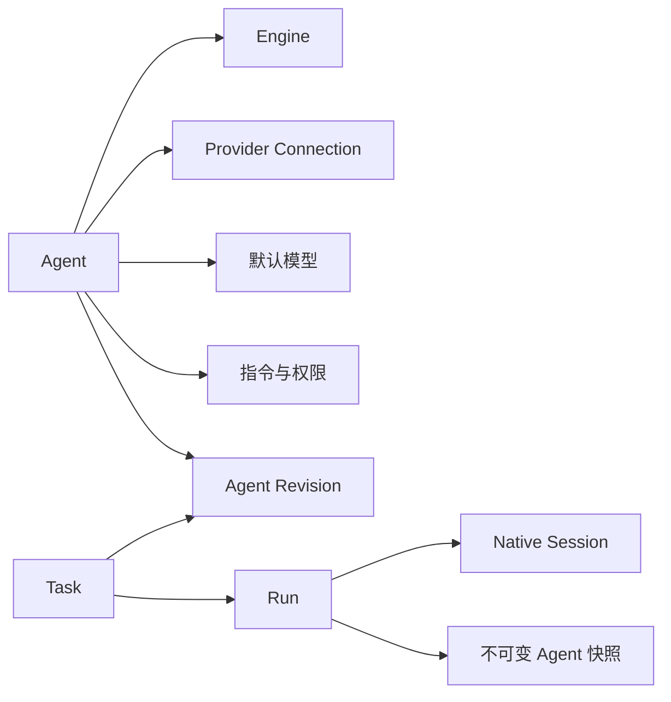
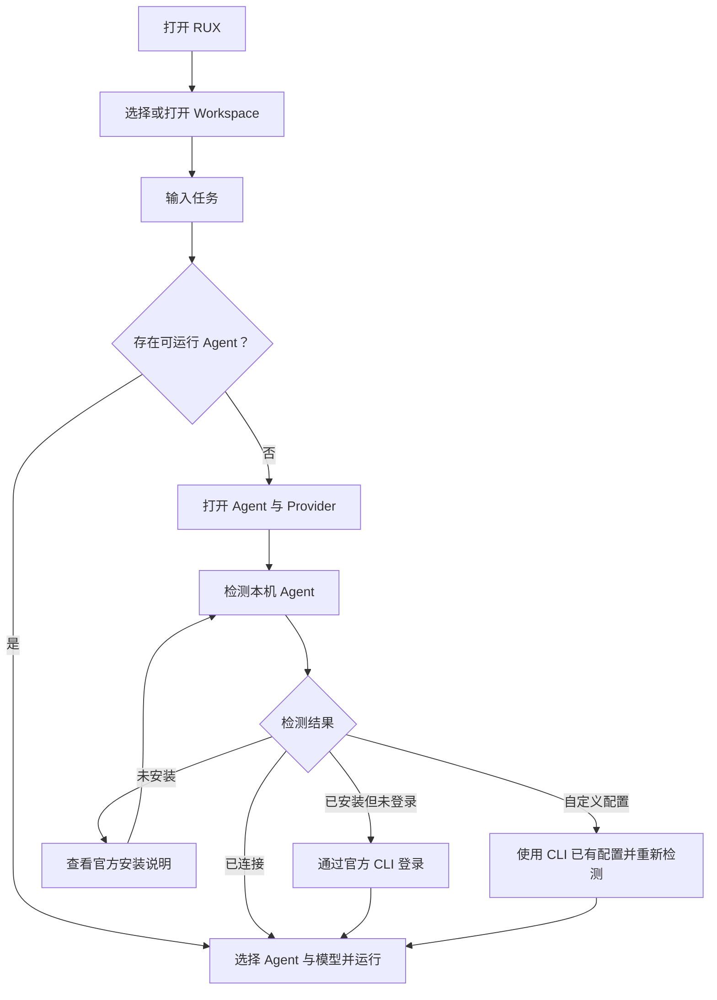

# RUX 产品需求文档

> 版本：v1.1
> 状态：需求基线已确认；实现与验收仍按阶段推进  
> 更新日期：2026-08-14
> 当前范围：Desktop MVP 的 Agent、Provider、模型、认证与会话接入，以及已确认的 P2 Auto 模型路由
> 配套执行文档：[P0/P1 交付路线与 P2 规划验收矩阵](delivery-roadmap-and-acceptance.md)

## 1. 产品背景

Coding Agent 的能力越来越强，但用户仍需要在多个 CLI、账号、模型和项目之间切换。一次 Agent Run 的执行过程、权限请求、上下文、文件变更与恢复路径也往往分散且不透明。

RUX 是一个面向 Coding Agent 的本地桌面工作台。它不替代 Codex、Claude Code 等执行引擎，而是在这些引擎之上提供统一的 Workspace、Task、Run、权限、上下文、变更审查和会话恢复体验。

RUX 的核心目标是把黑盒式 Agent Run 转化为可见、可控、可审查、可恢复的开发过程。

## 2. 产品定位

- 产品形态：本地优先的 Coding Agent Desktop Workbench。
- 首要用户：已经使用 Codex、Claude Code 或自定义模型配置进行开发的个人开发者。
- 核心对象：Workspace、Task、Run、Agent、Provider Connection、Native Session。
- 交付重点：桌面应用优先；未来 TUI 使用同一 Runtime 协议。
- 产品边界：近期不是通用聊天应用，也不是托管模型网关。

暂定口号：

> One workspace. Every coding agent.

## 3. 目标与非目标

### 3.1 MVP 目标

1. 用户无需注册或登录 RUX，即可打开本地项目并开始工作。
2. 用户可以发现并复用本机已经安装、配置和登录的官方 Agent CLI。
3. 用户可以用统一方式选择 Agent、模型与运行权限。
4. RUX 可以持续记录从 RUX 发起的对话、运行事件和 Native Session，并在重启后恢复。
5. 认证凭据始终由官方 CLI 或其受支持的配置方式持有，RUX 不复制 Token。
6. 用户能够理解当前为何不可运行，并获得明确、可恢复的下一步。

### 3.2 后续目标

1. 用户可以按 Workspace 发现、预览并手动导入 Codex、Claude Code 的既有会话。
2. 用户可以在满足兼容性条件时继续导入的 Native Session。
3. 用户可以把当前任务复制为使用另一 Agent 或 Provider 的新任务，并保留可审查的上下文交接。

### 3.3 非目标

- 不在 MVP 中提供 RUX 云账号或跨设备会话同步。
- 不复制第三方 OAuth 客户端，不代管 ChatGPT 或 Claude 凭据。
- 不在启动时自动扫描、复制用户全部 Agent 历史。
- 不提供 CLI、RUX 与其他客户端之间的实时双向会话同步。
- 不静默安装 Codex、Claude Code 或其他本机工具。
- 不在 MVP 中实现 RUX 原生 API Key/Base URL 模型网关。
- 不把 Agent 原生会话的删除、归档或改名操作反向同步到第三方工具。

## 4. 核心概念

| 概念 | 定义 |
| --- | --- |
| Workspace | 用户明确授权给 RUX 的本地项目目录，也是任务、会话发现和数据持久化的安全边界。 |
| Task | 围绕一个用户目标展开的持续工作单元，包含消息、Run 和会话关联。 |
| Run | Agent 对一次用户输入的执行记录，包含状态、事件、权限、模型和不可变 Agent 快照。 |
| Engine | 实际执行任务的官方 Agent Runtime，例如 Codex CLI/App Server 或 Claude Code CLI。 |
| Provider Connection | 由 Engine 管理的登录或模型访问配置，例如 ChatGPT 登录、Claude 登录、API Key、云 Provider 或自定义 Base URL 配置。 |
| Agent | 一个命名执行配置，由 Engine、Provider Connection、默认模型、指令、权限、Skills 与 Tools 组成。 |
| Agent Revision | Agent 每次保存后形成的不可变版本。Task 固定使用创建时选中的 Revision。 |
| Model | Agent 的默认模型、固定 Run 模型或 Auto 路由允许选择的兼容模型。 |
| Auto Model Policy | Agent Revision 中不可变的模型路由策略，包含简单任务模型、复杂任务模型、模型白名单、路由偏好与回退规则。 |
| Model Decision | Run 启动前形成的不可变路由结果，记录模式、复杂度、实际模型、选择原因和回退证据。 |
| Token Usage | Engine/Provider 对一次 Run 报告的输入、缓存输入、输出、推理和总 Token；无法精确获得时必须标记未报告或估算。 |
| Native Session | Codex Thread 或 Claude Code Session 等由官方 Engine 持有的原生对话。 |
| RUX Projection | RUX 对消息、事件和会话关联进行规范化后的本地记录，不包含认证凭据。 |
| Projection Revision | 一次完整的外部会话投影快照；重建时保留旧版本，保证历史可审查和可恢复。 |
| Context Handoff | 从来源 Task 中生成、由用户确认后交给新 Agent 的结构化上下文包。 |

关系如下：



## 5. 已确认的产品决策

### 5.1 RUX 本身不要求登录

- MVP 为本地优先模式，不设置 RUX 账号门槛。
- 用户只需授权 Workspace，并在真正发起 Run 时拥有至少一个可用 Agent。
- UI 不再把“登录 RUX”描述为产品前置条件。
- 为保持桌面导航稳定，侧栏底部仍可保留“账户与登录”入口；页面主体应以“Agent 与 Provider”为核心，不制造存在 RUX 云账号的误解。

### 5.2 Agent 登录和配置委托官方 CLI

- Codex/ChatGPT 登录由官方 `codex login/status` 处理。
- Claude Code 登录由官方 `claude auth login/status` 处理。
- RUX 只展示非敏感状态：是否安装、是否连接、认证方式、CLI 版本、可执行文件路径和非敏感说明。
- RUX 不读取 CLI 凭据文件、不抓取 Keychain、不复制 Token、不保存 OAuth 回调输出。
- 登录、登出和凭据替换必须由用户明确触发。

### 5.3 本机状态检测是显式动作

- 当没有可运行 Agent 时，用户可以点击“检测本机 Agent”或“检查已有登录状态”。
- 检测范围包括 Codex、Claude Code 等受支持官方 CLI 的安装状态和只读登录状态。
- RUX 可以缓存最近一次非敏感检测结果，但不能把缓存结果表述为实时有效凭据。
- 不因打开应用而触发登录、登出、Token 刷新或凭据替换。

### 5.4 未安装 Agent 的处理

- 状态显示为“未安装”，而不是泛化为“登录失败”。
- 提供官方安装说明和重新检测入口。
- 不静默安装，不要求 RUX 获得不必要的系统级权限。
- 用户完成安装后，RUX 应可以在不丢失当前草稿的情况下重新检测。

### 5.5 API Key、Base URL 和自定义模型

- MVP 复用 Codex/Claude Code 或受支持 Engine 已有的配置能力。
- API Key 仍由官方 CLI、环境变量或受支持云 Provider 配置持有。
- RUX 可保存非敏感的 Connection 引用、显示名称和 Agent 绑定关系，但不保存原始密钥。
- 自定义模型可以出现在兼容模型选择器中；模型列表无法自动发现时，可引用 CLI 中已有的模型标识。
- RUX 原生编辑 API Key/Base URL 并直接调用 Provider 的能力延后。

### 5.6 OAuth 登录

- ChatGPT OAuth 只通过用户本机的官方 Codex CLI 发起。
- Claude 订阅登录只通过用户本机的官方 Claude Code CLI 发起。
- RUX 不复制官方 OAuth Client，也不把个人订阅凭据路由到 RUX 托管服务。
- 对托管服务或未来云同步能力，Claude 应使用 Anthropic Console API Key 或受支持的云 Provider，而不是复用用户 Claude.ai 订阅凭据。

### 5.7 Agent 与模型选择

- 用户先选择 Agent，再选择该 Agent/Connection 可用的兼容模型。
- Provider Connection 由 Agent 决定，不要求用户每次 Run 重复选择。
- Agent 提供默认模型；Composer 可以为当前 Run 覆盖兼容模型。
- 模型模式包括“固定模型”“Engine 默认”和规划中的“Auto”。Auto 在每个 Run 开始前选择一个实际模型，不在执行中途换模。
- 每个 Run 保存实际使用的 Engine、Connection 引用、模型和不可变 Agent 快照，确保历史可审查。

### 5.8 RUX 发起的会话自动留存

实现状态（2026-08-12）：Desktop 已将 Codex Thread 与 Claude Session 统一为规范化 Session Link，并按 Engine、Connection、Agent Revision、Workspace 四个维度判断恢复兼容性。恢复失败会持久化原 Session 与错误原因，用户只能显式重试或创建不继承 Session 的新 Task；Run 面板可回看实际执行配置与 Session 证据。

- RUX 自动记录从 RUX 发起的用户消息、Agent 消息、Run 事件、权限决策与 Native Session ID。
- 后续输入在兼容条件下恢复同一个 Codex Thread 或 Claude Code Session。
- 应用重启后，Task 与已完成历史仍然可见；运行中的孤儿记录恢复为已停止或已中断。
- RUX 不自动恢复 Terminal Session。

### 5.9 外部历史采用“会话接入”而非实时双向同步

实现状态（2026-08-17）：当前 Runtime protocol 为 v17。v4–v16 依次提供 Session Connector、隔离摘要、Rux Native、Auto/Token、Workspace invalidation、归属迁移、Provider 目录、加密 Headers、CLI logout、Anthropic/Chat transports、凭据诊断与 TUI 管理合同；v17 增加确认门控、结构化 argv、仓库根限定的 Git worktree 创建。Codex 使用 App Server Thread List/Read，Claude Code 使用官方 Agent SDK 会话接口；两端支持分页、取消、超时、大小限制和敏感错误清洗。

实现状态（2026-08-13）：P1-E1 已开放显式的“导入 Agent 会话”元数据发现入口。打开入口不会访问 Provider；点击查找后，Runtime 才按规范化真实路径和最具体已授权 Workspace 归属结果返回当前项目、待归属、需要授权和迁移建议。属于其他项目的会话被隐藏，迁移建议不会静默改变旧归属。

实现状态（2026-08-13）：P1-E2 已支持用户点选当前 Workspace 会话后读取规范化内容并预览本地复制风险，再选择“仅导入查看”或“导入并继续”。Main 在提交前重新读取并校验身份、Workspace 归属与恢复状态，然后用一个 SQLite 事务创建或更新 Task、Projection、不可变 Projection Revision 与 Native Session Link。重复导入按 `engine + connectionReference + nativeSessionId` 去重，不覆盖 RUX 自有消息；仅查看 Task 禁止启动 Run，继续模式固定原 Engine、官方 CLI Connection、内置 Agent Revision、Workspace 与原生 Session。

实现状态（2026-08-13）：P1-E3 已实现 Task 内显式刷新、稳定 ID 安全追加、外部修改/删除/重排/不确定匹配差异、候选 Revision、确认重建、旧 Revision 恢复与非敏感审计。差异出现时当前 Projection 保持不变；重建和恢复只切换 RUX 本地 Projection，保留 RUX 自有消息、Run、审批和 Task 数据，不调用 Provider 写接口。该能力仍是用户触发的本地投影，不是实时双向同步。

- 外部历史默认只发现当前 Workspace 关联的会话。
- 首次发现只读取会话元数据；读取完整内容必须由用户选择会话后触发。
- 用户可以选择“仅导入查看”或“导入并继续”。
- Native Session 是执行来源，RUX 保存本地规范化投影和关联信息。
- 不在启动时自动导入全部历史，不在后台上传会话内容。
- Codex 应优先使用 App Server 的会话列表、读取和恢复接口。
- Claude Code 应优先使用官方会话或 Agent SDK 接口，不依赖内部 JSONL 格式。

### 5.10 同引擎继续，跨引擎分支

- 继续原会话时，Task 绑定原 Agent、Engine 和 Provider Connection。
- 用户可以为后续 Run 切换同一 Connection 下的兼容模型；历史消息不被改写。
- 更换 Agent、Provider Connection 或 Engine 时，不直接改写原会话。
- RUX 提供“复制为新任务”，生成可审查的上下文交接，并创建新的 Native Session。
- 原 Task 和原 Native Session 保持不变。

### 5.11 Task 固定 Agent Revision

- Agent 每次保存后生成新的不可变 Revision，而不是覆盖已被 Task 使用的配置。
- Task 在创建时固定选中的 Agent Revision，之后编辑 Agent 不改变既有 Task 的指令、权限、Skills、Tools、Engine 或 Provider Connection。
- Agent 更新后，既有 Task 显示“有新版可用”，但不会自动应用。
- 用户要在既有工作基础上采用新版 Agent 时，使用“复制为新任务”；新 Task 固定最新 Revision，并创建新的 Native Session。
- 原 Task、原 Revision、历史 Run 快照和原 Native Session 保持可回溯。
- 仅切换同一 Revision 和 Connection 支持的兼容模型不视为升级 Agent；变化仍只影响后续 Run。

### 5.12 跨 Agent 使用可审查的混合式 Context Handoff

实现状态（2026-08-13）：P1-E4 已完成。用户从已有 Task 选择消息和真实 Run-owned 文件证据、选择目标 Agent 后生成预览；Main 解析目标 Connection 与最新不可变 Revision，确认前不创建目标 Task、Run 或 Native Session。用户可显式要求固定的来源 Agent 生成可选叙事摘要；该调用禁用工具且不持久化原生会话，结果带有经 Main 验证的来源标记，并可编辑或移除。确认事务创建新 Task、保存不可变快照并建立双向来源关系，来源后续变化不会改写快照。

- RUX 首先从已有本地记录中确定性组装事实包，不依赖模型推断。
- 事实包至少包含来源 Task、Workspace、用户选中的消息、最近 Run 结果、文件变更、未完成状态和来源 Agent Revision。
- 用户可以选择由当前 Agent 生成一段叙事摘要；摘要必须明确标记为“Agent 生成”，不能替代事实包。
- 当前 Agent 或 Native Session 不可用时，用户仍可只使用确定性事实包完成分支。
- 发送前必须提供预览，允许用户编辑摘要、移除消息或文件、补充约束，并查看目标 Agent 与 Provider。
- 未经用户明确确认，Context Handoff 不得发送给目标 Agent，也不得创建目标 Native Session。

实现状态（2026-08-17）：大任务 Handoff 选择器最多加载最近 500 条持久化消息，默认选择最近 20 条，并支持文本搜索、角色筛选、当前结果全选与清空。Run-owned 文件显示状态和增删统计；确定性预览显示来源/目标 Revision、目标 Engine/Connection、模型/权限、事实指纹、最新 Run 和未完成项。筛选变化会使旧预览与可选摘要失效，必须重新生成指纹绑定的预览。
- 确认后，RUX 创建新 Task、固定目标 Agent Revision、保存最终 Handoff 快照，并建立来源与目标 Task 的可回溯关系。
- 后续修改来源 Task 不会静默改写已经确认的 Handoff 或目标 Task。

### 5.13 外部会话采用增量刷新与版本化重建

- 外部会话默认只在用户触发“刷新”时读取，不在后台持续轮询。
- 当 Native Session 只增加新内容时，RUX 按稳定原生标识去重并增量追加；刷新不得生成重复消息。
- 当官方接口没有稳定消息标识时，可使用内容、角色、时间和顺序生成本地指纹，但必须把无法确定的匹配标记为潜在差异。
- 检测到原有内容被修改、删除或重排时，RUX 不自动覆盖当前 Projection，而是进入“有外部差异”状态。
- 差异视图至少展示新增、修改、删除的数量、位置和内容预览，允许用户选择“保留当前版本”或“按原生会话重建”。
- “按原生会话重建”必须由用户明确确认；RUX 先把当前 Projection 保存为不可变 Revision，再生成新的当前 Revision。
- 重建只替换来自 Native Session 的投影层，不删除 RUX 自己持有的 Run 事件、权限记录、Task 元数据、Context Handoff 和来源关系。
- 每次刷新或重建记录时间、Engine、Native Session ID、前后 Revision 和结果；不记录凭据。
- 用户可以查看旧 Projection Revision，并将其恢复为当前可见版本；恢复本地版本不会反向修改 Native Session。

### 5.14 本地数据由用户控制，不自动过期

- 导入内容、RUX Projection 和旧 Projection Revision 默认随 Task 保留在本地，不设置自动过期时间。
- RUX 应展示各 Workspace 的本地占用、Task 数量和 Projection Revision 数量，但不因空间压力自动删除数据。
- “解除关联”保留 Task、Projection、Revision 和 RUX 自有记录，但停止刷新和继续 Native Session；重新关联必须由用户明确触发。
- “删除导入内容”删除来自 Native Session 的本地消息与 Projection Revision；RUX 自有的 Run、权限、Task 元数据和 Context Handoff 由用户在确认界面单独选择是否一并删除。
- “删除 Task”删除该 Task 在 RUX 中的全部本地记录，包括 Projection、Run、权限记录、Handoff 和版本历史。
- 用户可以按 Task 或 Workspace 批量清理；执行前必须预览影响范围、预计释放空间和不会被影响的 Native Session。
- 删除是 RUX 本地操作，不反向删除、归档或修改 Codex、Claude Code 等原生会话。
- 删除后 RUX 不承诺本地恢复；只要原 Native Session 仍存在，用户可以重新导入。
- 导出支持 Task 或 Workspace 范围，并至少提供便于阅读的 Markdown 与保留结构的 JSON；用户可选择当前版本或包含旧 Revision。
- 导出文件不得包含凭据，并在写入前提示其中可能含有提示词、文件内容、命令输出和其他敏感信息。

实现状态（2026-08-13）：P1-E5 已完成。设置页和导入 Task 均可打开 Workspace 本地数据页，查看估算占用、Task、导入 Task、Projection Revision 与 Handoff 数量。解除关联、删除导入内容和删除 Task/Workspace Tasks 使用不同范围，并在执行前展示影响、预计释放空间和不会被修改的 Native Session；Main 在事务中复核预览指纹。Markdown/JSON 导出支持 Task/Workspace 和当前/全部 Revision，使用原生保存对话框，排除结构化凭据字段并在写入前提示潜在敏感内容。删除后只承诺可从仍存在的原生会话重新导入，不承诺恢复本地数据。

P1 发布状态（2026-08-14）：P1-E6 已在同一隔离打包应用中完成发现、预览、导入并继续、刷新版本、Context Handoff、重启恢复和本地数据影响预览。验收修复了 `解除关联` 错误暗示会删除本地内容的问题；现在 unlink 明确保留 Task、消息和投影版本，而删除导入内容与删除 Task 分别显示自己的不可恢复边界。完整证据见 `design-audit/p1-release-candidate/`。

### 5.15 嵌套 Workspace 采用最具体归属

- 会话归属判断必须在 Main/Runtime 的授权边界内完成，Renderer 不直接解析或探测本地路径。
- RUX 对 Native Session 的 `cwd` 和已授权 Workspace Root 做规范化与真实路径解析，并按路径组件边界判断包含关系，不能使用简单字符串前缀。
- 当多个已授权 Workspace 都包含该 `cwd` 时，会话归属到匹配路径最长、最具体的 Workspace。
- 同一会话不同时展示在父子 Workspace；父 Workspace 默认看不到已经归属子 Workspace 的会话。
- 符号链接或路径别名解析到同一真实目录时视为同一 Workspace 边界，不得因此重复导入。
- `cwd` 缺失、不可解析或存在无法消除的歧义时，会话进入全局“待归属”列表，不自动出现在任何 Workspace。
- “待归属”阶段只展示官方接口返回的非敏感元数据；用户选择一个已授权 Workspace 并明确确认后，RUX 才读取完整内容。
- 已知 `cwd` 位于所有授权 Workspace 之外时，不允许直接归属；用户必须先打开并授权对应项目。
- 同一 Native Session 在 RUX 中只有一个当前 Workspace 归属。会话身份键为 `engine + connectionReference + nativeSessionId`，Workspace 是可审计的归属字段，不参与身份去重。
- 新授权的子 Workspace 比现有归属更具体时，RUX 提示迁移归属，但不静默移动既有 Task；用户确认后移动关联且不复制 Task。

### 5.16 模型目录由 Engine 驱动并支持运行验证

实现状态（2026-08-15）：Desktop 已完成官方 Codex 目录，以及 Rux Native 在用户显式测试时读取的 Provider `/models` 目录；两者都提供来源/刷新时间、Engine 默认、同 Connection 验证历史、高级手动模型 ID、成功 Run 验证和错误分类。Rux Native 只采用 Provider 明确报告的逐 Run 换模能力，未报告时保持保守阻断。

- 模型目录以官方 Engine 提供的结构化列表或受支持 CLI 输出为最高优先级；RUX 不抓取配置文件、终端文本或凭据存储来推断模型。
- Engine 无法提供目录时，选择器至少提供“使用 Engine 默认”，并显示该 Engine、Provider Connection 下曾成功运行的模型。
- 高级用户可以输入自定义模型 ID；模型 ID 是非敏感配置，但必须按 `engine + connectionReference + modelId` 隔离，不能跨 Connection 推定可用。
- 手动输入且尚未成功运行的模型显示为“未验证”，首次 Run 仍由官方 CLI 执行和验证；RUX 不为验证模型而绕过 Engine 直接请求 Provider。
- 只有 Run 明确成功使用该模型后，RUX 才将其标记为“已验证”。网络、认证、配额或服务错误不得把模型误标记为无效。
- 只有 Engine 返回明确的模型不存在、不兼容或不支持错误时，RUX 才标记“不可用”，并保留非敏感错误说明和重新验证入口。
- 推理强度、上下文窗口、工具能力等只采用 Engine 明确声明的元数据；未知能力不做猜测，相应控件使用 Engine 默认或隐藏。
- 动态目录带有来源和最后刷新时间；实际 Run 始终以 Engine 的执行结果为准。
- 已保存模型从最新目录消失时，RUX 显示警告并允许重新验证或选择 Engine 默认，不静默替换模型。

### 5.17 RUX 原生 API Provider（P2-E1 编码闭环已实现）

实现状态（2026-08-17）：已实现 OpenAI Responses、OpenAI Chat Completions 与 Anthropic Messages 原生 Connection、Main `safeStorage` 加密、Renderer 隔离、显式测试/目录刷新、Connection 元数据编辑、Key/Custom Headers 替换和凭据删除的指纹化 Agent/Task 影响预览，以及无需外部 Agent CLI 的完整编码循环。Custom Header 值与 API Key 一同由 OS 加密，Renderer-visible 状态只含 Header 名称；保留的 Authorization、x-api-key、anthropic-version、Accept、Content-Type、Content-Length、Host 和 Connection 不能被覆盖。Chat Completions 支持 SSE/JSON、增量 Tool Calls、Tool Result、Token 和有界同 Task 历史；Anthropic 支持官方 Messages streaming/tool_use/tool_result、模型目录和 Token 字段。两种无原生可恢复 Session 的协议都只重建有界的同 Task 用户/Assistant 历史并明确保留本地 Projection 语义。Provider 返回的模型目录与明示能力按 Connection 保存并进入 Agent、Composer 和 Auto 白名单；未知能力不推断。macOS 命令工具保持结构化无 Shell 与 `sandbox-exec` 边界。其他平台在提供等价沙箱前不暴露命令工具。原生 OAuth 的 PKCE、Token 保管、端点、撤销和迁移合同已在 `rux-native-oauth-contract.md` 定义；在取得 Provider 官方桌面 OAuth 合同与 RUX Client 注册前不暴露伪登录入口。

凭据诊断与迁移状态（2026-08-17）：账户面板提供用户触发的 Main-owned safeStorage 诊断，只显示后端、可用性、Connection/可解密计数、失败 Connection 标签和清洗后的详情。确认后的重新封装先预检全部密文，再保留仅含密文的本地备份并原子写入；Renderer 不接触 API Key 或 Header 值。macOS 空 Store 路径已在隔离打包应用完成点击验收；Windows Credential Manager 与 Linux Secret Service 仍需目标平台验收。

- 官方 CLI Connection 继续复用对应 Engine 管理的 OAuth、API Key、Base URL 和云 Provider 配置；RUX 不读取或迁移这些凭据。
- RUX Native 作为独立 `rux-native` Engine 和 Provider Adapter 实现，不要求用户安装 Codex 或 Claude Code。
- Rux Native Agent Revision 必须固定实际可用 Tool IDs；Runtime 启动与权限恢复时都从该不可变 Revision 重新解析工具集合，不能让 Renderer 或恢复快照扩大工具权限。
- API Key 等密钥只保存到操作系统凭据库，例如 macOS Keychain、Windows Credential Manager 或 Linux Secret Service；凭据库不可用时不得回退为明文文件或普通应用状态。
- 密钥录入、替换和删除通过 Main/Runtime 所有的受控凭据流程完成。普通 Renderer 只获得不透明 `credentialRef`、连接状态和非敏感说明，不获得、回显或持久化密钥。
- Base URL、Provider 类型、模型 ID 和显示名称可以作为非敏感配置保存，但不得把密钥嵌入 URL、日志、错误文本或导出文件。
- Runtime 使用 `credentialRef` 在特权边界内按需读取密钥；Preload/IPC 不提供读取原始密钥的方法。
- 创建或修改 Connection 后，只有用户明确点击“测试连接”或发起 Run 才允许访问 Provider；不得后台探测。
- RUX 原生 Connection 与 CLI Connection 相互独立。RUX 不导入、复制或迁移已有 CLI/OAuth 凭据，也不把自己的密钥写回 CLI。
- 删除 RUX 原生 Connection 必须预览影响的 Agent 和 Task，并明确确认是否删除系统凭据；删除本地凭据不等同于在 Provider 侧吊销密钥。
- ChatGPT 与 Claude 订阅 OAuth 仍委托官方 CLI。为 RUX 原生 Provider 增加 OAuth 必须另行完成合规与安全设计，不包含在本决策中。

### 5.18 Auto 模型路由与 Token 证据（P2）

实现状态（2026-08-14）：P2-E0 已实现并完成隔离打包桌面验收。能力同时覆盖 Codex/Claude Code Engine 合同与 Rux Native；不依赖用户安装任一 Agent CLI。

- Composer 增加 `Auto` 模式，与“固定模型”和“Engine 默认”并列。Auto 只负责为当前 Run 选择模型，不改变 Agent、Engine、Provider Connection、权限或 Workspace。
- 第一版只分“简单任务”和“复杂任务”两级。默认使用可解释的确定性信号，例如用户意图、上下文规模、文件/工具需求、跨文件范围、失败记录和是否需要多步骤计划；不额外调用模型做分类。
- 用户可以在 Agent 配置中分别指定简单任务模型、复杂任务模型、路由策略（保守、均衡、质量优先）、是否允许回退，以及 Auto 模型白名单。
- Auto Policy 属于不可变 Agent Revision。修改模型、白名单、策略或回退规则会追加新 Revision；已有 Task 继续使用其固定 Revision，新策略只影响使用新 Revision 创建的 Task。
- 白名单按 `engine + connectionReference + modelId` 隔离，只接受当前 Engine 目录模型或同一 Connection 下已成功运行的模型。手动、未验证模型必须先由用户显式成功运行，才能进入 Auto 白名单。
- Auto 只能在同一 Agent Revision、Engine 和 Provider Connection 内切换模型。跨 Agent、Engine 或 Connection 继续使用 Context Handoff 新建 Task，不得把自动路由伪装成原会话延续。
- Runtime 必须先读取 Engine 对“同一 Native Session 按 Run 切换模型”的明确能力。支持时下一 Run 可以选择不同白名单模型；不支持或未知时保持 Session 固定模型，或提示创建新 Task，不得试探性静默切换。
- 每个 Run 启动前生成不可变 Model Decision，至少记录模式、简单/复杂分类、实际模型、策略、选择原因、白名单快照、是否回退和非敏感失败证据。执行开始后本 Run 不再换模。
- 回退只能发生在白名单内，且必须显示。模型明确不存在或不兼容时可以尝试下一个允许模型；认证、网络、配额或临时服务错误不能触发无限换模，也不能把模型永久标记为无效。
- 每个 Assistant turn/Run 在 Transcript 中展示实际模型；展开后展示 Auto 分类、选择原因、Engine、Connection、Agent Revision、回退和 Token 明细。
- Token Usage 优先采用 Engine/Provider 返回的结构化数据，区分输入、缓存输入、输出、推理和总 Token。未返回时显示“未报告”；本地估算必须明确标记“估算”，不能作为账单事实。
- 如果未来使用模型型路由器，其调用必须与任务 Run 分开记录模型、Token、耗时和来源，且路由模型也受显式允许范围约束。

## 6. 信息架构

### 6.1 侧栏

- “当前项目”只负责 Workspace 展示与切换。
- “打开项目…”是独立、带文字标签的操作。
- 项目标题只展开或收起 Task 历史；打开 Task 时激活其 Workspace。
- 侧栏底部的“账户与登录”打开连接管理入口，与 Workspace 切换保持分离。

### 6.2 账户与登录

页面主区命名为“Agent 与 Provider”，包含：

1. 本机 Agent 检测。
2. Codex、Claude Code 等 Engine 的安装与连接状态。
3. 用户显式触发的登录、取消登录、重新检测。
4. Agent 列表、默认模型和 Connection 绑定。
5. 模型目录来源、刷新时间、已验证模型和手动模型管理。
6. “导入 Agent 会话”入口；该入口在会话接入阶段上线。

### 6.3 Composer

- 主选择器：Agent。
- 次选择器：固定模型、Engine 默认或 Auto；Auto 展示本次可能使用的简单/复杂模型与白名单范围。
- Run 级选项：推理强度、权限模式等 Engine 支持的能力。
- 没有可用 Agent 时保留用户草稿，并将用户引导到“Agent 与 Provider”。
- 运行中的 Task 不允许无提示切换 Agent；跨 Agent 使用“复制为新任务”。
- Task 使用的 Agent 有新 Revision 时显示非阻塞提示，并提供“使用新版创建新任务”。
- 模型选择器区分 Engine 默认、目录模型、已验证模型与未验证的手动模型。
- Auto 模式下，Composer 展示当前策略摘要；Assistant 消息展示实际使用模型、Token 和可展开的路由原因，不以 `Auto` 替代真实模型名。

### 6.4 Task 历史

Task 显示来源标签：

- RUX 创建
- Codex 导入
- Claude Code 导入

导入会话还应显示关联状态，例如“可继续”“仅查看”“原会话不可用”。

## 7. 核心用户流程

### 7.1 首次运行



关键要求：检测或登录流程不能清空 Workspace、Task 草稿或已选择的上下文。

### 7.2 使用自定义 Provider 配置

1. 用户在官方 CLI、环境变量或受支持云 Provider 中完成 API Key/Base URL 配置。
2. 用户回到 RUX 点击重新检测。
3. RUX 显示已连接的非敏感配置类型和可用模型。
4. 用户创建或编辑 Agent，将其绑定到该 Connection 和默认模型。
5. RUX 发起 Run，但不读取或保存原始 Key。

### 7.3 导入已有会话

1. 用户在当前 Workspace 中选择“导入 Agent 会话”。
2. RUX 按 Engine 展示会话元数据：标题、更新时间、模型、目录、消息数量和来源。
3. RUX 默认隐藏其他 Workspace 的会话。
4. 用户选择一个或多个会话并预览内容范围与本地复制提示。
5. 用户选择“仅导入查看”或“导入并继续”。
6. RUX 创建或刷新对应 Task，并显示来源和关联状态。

同一会话重复导入时应更新同一 Task，不生成重复项。建议去重键为：

```text
engine + connectionReference + nativeSessionId
```

Workspace 归属单独保存；嵌套 Workspace 使用规范化真实路径的最长边界匹配。无法判断的会话进入“待归属”，不会混入当前 Workspace 的结果。

### 7.4 继续或迁移会话

1. 用户在原 Agent 和 Connection 下继续时，RUX 恢复 Native Session。
2. 用户可以选择同一 Connection 下兼容模型，变化只影响后续 Run。
3. 用户选择其他 Agent、Provider 或 Engine 时，RUX 提示“复制为新任务”。
4. 当前 Agent 存在新 Revision，且用户选择采用新版时，同样进入“复制为新任务”。
5. RUX 生成确定性事实包；用户可选择让当前 Agent 补充一段明确标记的摘要。
6. 用户预览、编辑、移除敏感或无关内容，并确认目标 Agent 与 Provider。
7. RUX 保存最终 Handoff 快照，新任务固定目标 Agent Revision 并建立新的 Native Session。
8. 原任务、原 Revision、原 Native Session 和原始记录保持不变。

### 7.5 刷新外部会话

1. 用户在已关联 Task 中点击“刷新原生会话”。
2. RUX 读取最新 Native Session，并与当前 Projection Revision 比较。
3. 只有新增内容时，RUX 去重后追加并更新刷新时间。
4. 存在修改、删除、重排或无法确定的匹配时，RUX 展示差异，不改变当前可见内容。
5. 用户可以保留当前版本，或确认“按原生会话重建”。
6. 重建前保存旧 Projection Revision，重建后保留版本历史和审计记录。

### 7.6 管理本地会话数据

1. 用户从 Task 菜单或 Workspace 存储管理页进入数据管理。
2. RUX 展示本地占用、内容来源、Revision 数量和原生会话是否仍关联。
3. 用户选择导出、解除关联、删除导入内容或删除整个 Task。
4. 清理前，RUX 展示将删除与保留的数据、预计释放空间，并明确原生会话不受影响。
5. 用户确认后执行本地操作并记录不含会话内容的审计结果。

### 7.7 使用自定义模型

1. RUX 请求 Engine 模型目录；可用时展示目录来源和刷新时间。
2. Engine 不提供目录时，用户选择 Engine 默认、既有已验证模型，或输入自定义模型 ID。
3. 新输入的模型显示“未验证”，未知能力使用 Engine 默认。
4. 用户发起首次 Run，RUX 把模型 ID 交给官方 Engine，不直接请求 Provider。
5. Run 明确成功使用该模型后标记“已验证”；明确的模型不兼容错误标记“不可用”。
6. 网络、认证、配额或临时服务错误保留“未验证”状态，并提供重试或修复 Connection 的动作。

### 7.8 创建 RUX 原生 API Connection（P2）

1. 用户选择受支持 Provider Adapter，并填写非敏感的显示名称、Base URL 和默认模型。
2. RUX 通过受控凭据流程把 API Key 直接写入操作系统凭据库，返回不透明 `credentialRef`。
3. 用户明确选择“测试连接”；Runtime 在特权边界内读取密钥并返回规范化、无密钥的结果。
4. 测试成功后，用户创建 Agent 并绑定该 Connection。
5. 替换或删除密钥时，RUX 展示受影响 Agent/Task，并要求再次确认。

### 7.9 使用 Auto 模型路由（P2）

1. 用户编辑 Agent，在同一 Engine/Connection 下选择简单任务模型与复杂任务模型。
2. 用户从目录模型和已验证模型中配置 Auto 白名单，并选择保守、均衡或质量优先策略。
3. 保存产生新的不可变 Agent Revision；新 Task 固定该 Revision 与 Auto Policy。
4. 用户发送消息后，RUX 在 Run 启动前用确定性规则判断简单或复杂，并检查 Native Session 是否允许按 Run 换模。
5. RUX 在白名单内选择实际模型，保存 Model Decision，然后启动一次固定模型的 Run。
6. Assistant 消息显示 `Auto → 实际模型`、复杂度、Token 和耗时；用户可展开查看选择原因与回退证据。
7. 如果目标模型明确不兼容，RUX 仅在策略允许时回退到白名单内模型；无法安全回退时停止并给出可恢复操作。

## 8. 状态模型

### 8.1 Agent/Connection 状态

| 状态 | 用户含义 | 主要动作 |
| --- | --- | --- |
| 未检测 | 尚未检查本机环境 | 检测本机 Agent |
| 未安装 | 未找到受支持 CLI | 查看官方安装说明 |
| 已安装，未连接 | CLI 可用但没有可运行认证 | 登录或完成 CLI 配置 |
| 检测中 | 正在执行只读状态检查 | 等待或取消 |
| 已连接 | 可以尝试发起 Run | 选择 Agent 并运行 |
| 已过期/不可用 | 最近状态已失效或 Run 鉴权失败 | 重新检测或重新登录 |
| 错误 | CLI 返回异常或版本不兼容 | 查看非敏感错误和修复建议 |

“已连接”仅表示状态检查成功，不保证模型配额、网络或 Provider 服务一定可用。

### 8.2 会话关联状态

| 状态 | 含义 |
| --- | --- |
| RUX 创建 | 会话由 RUX 发起并持续记录。 |
| 已关联，可继续 | 原 Native Session 可读取且当前配置兼容。 |
| 已导入，仅查看 | 已保存本地投影，但未选择或无法继续原会话。 |
| 可能过期 | 原会话可能在外部发生变化，需要手动刷新。 |
| 有外部差异 | 检测到修改、删除、重排或不确定匹配，等待用户处理。 |
| 待归属 | 无法可靠确定 Workspace；确认归属前不读取完整内容。 |
| 已解除关联 | 本地内容保留，但不会刷新或继续 Native Session。 |
| 原会话不可用 | Native Session 已删除、移动或无法读取；RUX 投影仍可查看。 |
| 已分支 | 已复制为新的 Task 和 Native Session。 |

### 8.3 模型状态

| 状态 | 含义 |
| --- | --- |
| Engine 默认 | 不指定具体模型，由官方 Engine 和其配置决定。 |
| 目录可用 | 当前模型来自 Engine 明确返回的目录。 |
| 已验证 | 该模型已在同一 Engine 与 Connection 下成功运行。 |
| 未验证 | 手动输入或历史模型尚未在当前 Connection 下成功运行。 |
| 不可用 | Engine 明确返回模型不存在、不兼容或不支持。 |
| 目录过期 | 缓存目录可能陈旧，可以刷新；不代表模型一定不可用。 |

### 8.4 Auto 路由状态（P2）

| 状态 | 含义 |
| --- | --- |
| Auto 就绪 | 简单/复杂模型均在当前白名单中，且 Engine/Session 能力允许路由。 |
| Auto 受限 | 当前 Native Session 不允许安全换模；后续 Run 保持固定模型或需要新 Task。 |
| 已选简单模型 | 本 Run 被分类为简单任务并固定了实际模型。 |
| 已选复杂模型 | 本 Run 被分类为复杂任务并固定了实际模型。 |
| 已回退 | 目标模型明确不兼容或不可用，且按策略切换到白名单内另一模型。 |
| 配置失效 | 模型离开目录、验证状态改变或白名单不完整，需要用户修复 Agent Revision。 |

## 9. 会话一致性规则

- P0 只保证 RUX 自己发起的消息和 Run 被实时写入 RUX Projection。
- P1 导入得到的是用户明确选择时的快照，不承诺持续追踪外部客户端的变化。
- 用户触发刷新且只发现新增内容时，RUX 可以增量追加；修改、删除、重排和不确定匹配只展示差异。
- 用户确认重建前必须保留当前 Projection Revision；重建不得删除 RUX 自有的 Run、审批、Task 和 Handoff 数据。
- 同一 Native Session 应只有一个活跃写入方；检测到风险时优先建议复制为新任务。
- 无法可靠判断外部客户端是否仍在写入时，RUX 必须说明风险，不宣称“已完全同步”。
- 删除 RUX Task 只删除或解除 RUX 本地关联，不删除第三方 Native Session。
- 第三方会话消失后，RUX 本地投影保留为只读历史。
- RUX 不把第三方未文档化的原始事件结构作为长期数据合同。

## 10. 隐私与安全要求

1. Renderer 不得直接访问文件系统、进程、PTY、CLI 凭据或 Keychain。
2. CLI 检测、认证、会话读取和执行必须位于受控的特权进程边界。
3. Main/Runtime 必须验证 Workspace 授权、请求 Envelope 和方法参数。
4. Workspace 包含判断必须使用规范化路径组件边界；不得用字符串前缀推断授权范围。
5. Renderer 只能获得规范化的非敏感状态和用户明确请求的会话内容。
6. 不记录 Token、API Key、OAuth 回调、完整环境变量或 CLI 凭据文件内容。
7. P2 原生 Provider 密钥只能存在操作系统凭据库；普通 Renderer、应用状态、日志和导出均不得包含原始密钥。
8. 操作系统凭据库不可用时，不得以明文文件、SQLite 字段或环境变量持久化作为降级方案。
9. 模型目录只能通过 Engine 的受支持接口获取；RUX 不读取 CLI 配置文件，也不使用用户凭据直接探测 Provider。
10. 会话导入前说明完整内容会被复制到 RUX 本地数据存储；默认只发现元数据。
11. “待归属”或“需要授权”的会话在确认 Workspace 前不得读取完整内容。
12. 导出前提示导出文件可能包含敏感内容；导出数据不得包含凭据。
13. 删除和批量清理必须明确展示作用范围，不得影响 Native Session。
14. 不默认上传遥测、对话内容、文件内容或命令输出。
15. 如果未来增加云能力，必须独立设计用户同意、加密、保留与删除策略。
16. Auto 路由只能读取执行所需的非敏感 Task/Run 元数据和用户已授权的上下文，不得为分类额外上传内容；未来模型型路由必须单独披露调用与 Token。
17. Token Usage 只保存结构化计数和来源，不保存隐藏推理内容；不得把估算值描述为 Provider 账单或精确费用。

## 11. 分阶段范围

### P0：连接与 RUX 会话闭环

- 无 RUX 账号即可使用。
- 显式检测 Codex/Claude Code 安装和登录状态。
- 通过官方 CLI 发起登录。
- 未安装状态和官方安装引导。
- 复用 CLI 管理的 API Key/Base URL/云 Provider 配置。
- Agent、模型与权限选择。
- Engine 模型目录、Engine 默认、已验证模型和手动模型运行验证。
- Agent Revision 不可变，Task 固定创建时的 Revision。
- RUX 发起的消息、Run、事件和 Session ID 持久化。
- 重启后继续同一 Native Session。
- 凭据安全边界和对应自动化测试。

### P1：工作区级会话接入

- Codex 会话元数据发现、读取、导入和恢复。
- Claude Code 会话元数据发现、读取、导入和恢复。
- 当前 Workspace 默认范围、显式选择和导入预览。
- 规范化路径归属、最具体 Workspace 匹配、待归属处理和父子 Workspace 去重。
- 来源标签、关联状态、去重与手动刷新。
- 增量追加、外部差异视图、版本化重建与 Projection Revision 恢复。
- Task/Workspace 级占用查看、导出、解除关联和本地清理。
- “仅导入查看”与“导入并继续”。
- 同 Agent 继续和跨 Agent“复制为新任务”。
- 确定性事实包、可选 Agent 摘要、用户预览编辑与显式确认。

### P2：增强连接与协调

- Auto 模型路由：简单/复杂模型、策略、同 Connection 白名单和显式回退。
- 每个 Run 的实际模型、路由原因以及输入/缓存输入/输出/推理/总 Token 证据。
- Engine/Native Session 的按 Run 模型切换能力协商；不支持时保持固定或显式分支。
- 扩展已落地的 RUX 原生 API Provider Adapter 与 Connection，增加更多协议、模型目录和能力协商。
- 完善已落地的 Main/Runtime 受控凭据流程，补齐连接编辑、影响预览与平台凭据诊断。
- 用户显式连接测试、密钥替换/删除影响预览和无明文降级保证。
- RUX 原生 Provider 的模型目录和能力协商。
- 外部会话变更检测与冲突协调。
- 用户明确开启的跨设备或云同步。

实时双向同步是否进入 P2，需要在官方接口稳定性、冲突模型和隐私方案明确后重新评估。

## 12. MVP 验收标准

### 12.1 连接与认证

- 未安装 Codex/Claude Code 时，界面分别显示“未安装”并提供官方引导。
- 已安装但未登录时，用户可以显式检查状态并通过官方 CLI 登录。
- 已登录时，RUX 不要求再次登录 RUX，也不复制认证凭据。
- API Key/Base URL 配置由 CLI 持有；RUX 完成 Run 后，本地状态中不存在原始 Key。
- 登录取消、CLI 无响应、版本不兼容和认证过期均有可恢复状态。

### 12.2 Agent 与 Run

- 用户能清楚看到当前 Agent、模型和权限模式。
- 模型选择仅显示或接受当前 Agent/Connection 的兼容值。
- Engine 提供目录时以其结构化结果为准；没有目录时仍可使用 Engine 默认和手动模型 ID。
- 手动模型在成功 Run 前显示“未验证”，成功后只在同一 Engine/Connection 下标记“已验证”。
- 网络、认证、配额和临时服务错误不会把手动模型误标为“不可用”。
- 模型能力未知时不展示臆测的能力选项；模型消失时不静默替换。
- 每个 Run 都能回看实际 Agent 快照、模型、状态和权限决策。
- 编辑 Agent 后，既有 Task 仍使用原 Revision；用户可以通过复制为新任务采用新版。
- 应用重启后 Task、消息、Run 和 Session ID 仍存在。
- 相同 Task 的后续输入能恢复正确的 Native Session。

### 12.3 会话接入

- 默认发现范围不会越过当前授权 Workspace。
- 嵌套 Workspace 中的会话只出现在最具体匹配的 Workspace，不同时出现在父子项目。
- 符号链接和路径别名不会造成重复归属；包含判断使用真实路径和组件边界。
- `cwd` 缺失或有歧义时只进入“待归属”元数据列表，用户确认前不读取完整会话。
- 已知 `cwd` 位于授权范围之外时必须先授权对应项目，不能手动绕过 Workspace 边界。
- 未经用户选择，不读取并保存完整外部会话内容。
- 重复导入同一 Native Session 不会生成重复 Task。
- 只新增消息的刷新会去重追加，不会覆盖当前投影或生成重复消息。
- 检测到修改、删除、重排或不确定匹配时，只显示差异，用户确认前当前 Projection 不变。
- 重建前保留旧 Projection Revision；重建和版本恢复均不会反向修改 Native Session。
- 重建不会删除 RUX 自有的 Run、权限记录、Task 元数据和 Context Handoff。
- 导入内容和旧 Revision 不会自动过期；RUX 不会因空间压力静默清理。
- 用户可以按 Task 或 Workspace 预览并执行解除关联、导出或本地删除。
- 删除确认界面清楚区分导入内容、RUX 自有记录和 Native Session；Native Session 始终不受影响。
- Markdown/JSON 导出不包含凭据，并允许选择当前版本或包含旧 Revision。
- 原会话可用且配置兼容时，可以继续；否则只能查看或分支。
- 更换 Agent、Provider 或 Engine 时会创建新 Task 和 Native Session。
- Context Handoff 先展示确定性事实包；Agent 摘要为可选且有明确标记。
- 用户确认前，不会把 Handoff 发送给目标 Agent 或创建目标 Native Session。
- 确认后的 Handoff 保存为不可变快照，并能从新 Task 返回来源 Task。
- 删除导入 Task 不会删除 Codex/Claude Code 的原生会话。

### 12.4 Auto 模型路由验收（P2）

- 用户能为 Agent Revision 配置简单模型、复杂模型、路由策略、回退规则和模型白名单。
- Auto 不会选择白名单外、跨 Engine、跨 Connection 或未验证的手动模型。
- 每次 Run 开始前只生成一个实际模型决定，执行中途不换模；历史 Run 不因策略更新而改变。
- Engine 未声明当前 Native Session 支持换模时，RUX 不进行试探性切换，并提供固定模型或新建 Task 的明确路径。
- Transcript 中每个 Assistant turn 显示实际模型；Auto 模式同时显示分类，展开后能查看选择原因和回退证据。
- Token 明细区分输入、缓存输入、输出、推理和总量，并标明 Provider/Engine 报告、估算或未报告。
- 明确模型不兼容可以按策略在白名单内回退；认证、网络、配额和临时错误不会造成无限自动重试或永久无效结论。

### 12.5 Rux Native Provider 验收（P2-E1）

- 未安装 Codex 与 Claude Code 时，用户仍能通过显式配置的 Responses-compatible Connection 创建并运行 Rux Native Agent。
- API Key 不出现在 Renderer 状态、普通 Runtime IPC、日志、Task Store 或导出中；OS 加密不可用时拒绝保存，不回退明文。
- 打开账户面板和应用启动不访问 Provider；只有用户点击测试或发起 Run 才产生网络请求。
- Base URL 禁止携带用户名、密码或嵌入式 Key，公网地址必须使用 HTTPS；localhost 可用于显式本地开发。
- Agent 文件工具不能越过授权 Workspace、跟随外部符号链接或读取/写入 `.env`、私钥、凭据文件和明显 Secret 内容。
- 每个 Run 记录实际模型、Connection、Provider response id、Token Usage、工具活动、Git baseline/patch 与终态。
- macOS 命令工具必须保持无 Shell、结构化 argv、Workspace cwd、独立临时目录、清洗环境、超时、输出上限、进程树取消、验证证据和 OS 沙箱边界。其他平台没有等价沙箱时必须省略该工具，不能降级为未隔离 Shell。

## 13. 当前实现与目标差距

P0 实现状态（2026-08-12）：Desktop 本地 Release Candidate 已通过隔离 Fake CLI 的干净启动、显式连接检测、首次 Run、重启续聊、同 Native Session 恢复、Terminal 不恢复与 Workspace 切换验收。自动化、Web/Desktop/TUI 构建和当前平台打包均通过。macOS 包仍未签名和公证，不是可公开分发的正式版本。

| 能力 | 当前事实 | 目标 |
| --- | --- | --- |
| Claude Code 执行 | 已接入真实本机 CLI 和规范化流事件 | 保持并完善连接状态与恢复体验 |
| Codex 执行 | 已接入真实 CLI/App Server 路径 | 保持并用于会话列表、读取与恢复 |
| Task/Message/Run | 已按授权 Workspace 持久化到 Main 管理的 SQLite | 继续作为 RUX Projection |
| Native Session 延续 | 已保存规范化 Session Link，按 Engine/Connection/Revision/Workspace 恢复，并提供可见失败恢复分支 | P1 扩展到外部会话发现、导入与 Projection 版本 |
| 账户界面 | 管理 Rux Native、Codex 与 Claude Code；Native Connection 支持编辑、Key 替换、删除与指纹化影响确认 | 后续扩展更多原生协议 |
| 登录状态同步 | 已提供用户显式触发的统一检测；仅缓存规范化非敏感结果，启动和打开面板均不自动读取 CLI 状态，发送前重新校验 | 保持用户主动与 CLI 凭据边界 |
| 模型目录 | Codex 使用 App Server；Rux Native 在显式测试时保存 Provider `/models` 目录和明示能力；其余 Engine 使用默认/验证历史/手动 ID | 后续扩展更多 Provider 原生目录协议 |
| Auto 模型路由 | 已实现 Revision-owned Policy、确定性简单/复杂分类、同 Connection 白名单、显式回退、Run Model Decision 与逐 Turn Token 证据 | 后续若引入模型型路由器，必须独立记录其用量与来源 |
| RUX 原生 API Provider | 无需外部 Agent CLI，支持编码闭环、Connection 生命周期影响预览、加密 Custom Headers、模型目录/明示能力、流式回复、文件工具与 macOS 受限命令 | 后续增加跨平台等价沙箱和更多协议 |
| 自定义 Agent | 已有不可变 Revision、Task/Run 固定、版本提示与“使用新版创建新任务”分支 | P1 增加可预览确认的跨 Agent Context Handoff |
| Context Handoff | 已实现确定性事实包、来源 Agent 隔离摘要、可编辑预览、确认事务和双向来源追踪 | P1-E4 已完成；后续仅做体验优化 |
| 外部会话导入 | 已实现显式发现、选择后预览、去重导入、只读查看、兼容继续、归属迁移、Context Handoff 与本地数据生命周期 | 保持用户触发、非双向同步语义 |
| 会话 Workspace 归属 | 已实现 realpath 边界、最长匹配、待归属/需授权，以及确认后移动同一 Task/Projection 的审计迁移 | 后续只扩展诊断体验 |
| 外部会话刷新 | 已实现显式刷新、安全追加、差异候选、版本化重建和本地恢复 | 保持非后台、非双向同步语义 |
| 本地会话数据管理 | 已实现 Task/Workspace 占用、影响预览、解除关联、分层删除及 Markdown/JSON 导出 | 后续只扩展诊断与迁移工具 |
| RUX Agent | `rux-native` 已是真实 Responses-compatible Adapter；开发 Mock 仍单独存在 | 不把尚未实现的跨平台命令沙箱、模型目录或原生 OAuth 描述为已完成 |
| Changes/Context | 普通 Desktop 路径使用 Runtime Git/Context 与 Run-owned patch；Composer 可通过 Main 原生选择器添加 Workspace 内文件并移除，Native 工具执行后会增量重读 | Showcase 仅保留在显式 `?showcase=codex` Web 预览，不进入普通状态 |

## 14. 成功指标

指标默认本地计算；若未来上传，必须单独征得用户同意。

实现状态（2026-08-17）：Rux 设置已提供首版本机指标卡，只从当前加载且已持久化的 Task/Run 事实计算 Run 数、终态完成率、至少完成一次的 Task、完成 Run 中位耗时、失败/停止和权限批准计数，并按 Engine 汇总。Main-owned 本地事件 Store 还跨启动记录下面列出的漏斗事件，并只向 Renderer 提供聚合计数；实现中不存在上传、Beacon、WebSocket 或遥测端点。当前 UI 对尚无样本的比率保持“未报告”，不会从缺失证据反推成功率。

- 从打开 Workspace 到首次成功 Run 的中位时间。
- 检测到已安装 CLI 后成功建立可运行 Agent 的比例。
- RUX 发起会话在重启后的恢复成功率。
- 会话导入成功率与重复导入率。
- “继续原会话”成功率和因不兼容而转为分支的比例。
- 因认证、CLI 缺失或模型不可用造成的 Run 启动失败率。
- 用户从错误状态恢复并成功运行的比例。

跨设备/云同步仍不在当前实现范围。其可选、默认关闭的隐私、端侧加密、设备密钥、不可变版本、分支冲突、删除与备份时限、独立同意和交付门槛已固定在 `optional-cloud-sync-contract.md`；该设计文档本身不启用网络传输，也不改变本地优先模式。

## 15. 需求基线状态

当前 v1.0 范围内没有阻塞性的产品开放问题。P0/P1 可以据此拆分交付计划和验收矩阵。

首批 Provider Adapter 支持矩阵、网络安全策略和跨版本迁移合同已在 `provider-adapter-support-and-security.md` 落地，覆盖 Codex、Claude Code、OpenAI Responses、OpenAI Chat Completions 与 Anthropic Messages。该合同不得改变本 PRD 已确认的凭据隔离与用户显式授权边界，也不得反向扩大 P0/P1；各平台凭据库与等价命令沙箱仍须分别完成打包验收。

发布状态（2026-08-17）：仓库已包含 tag/手动触发的跨平台 Release Workflow、DMG/ZIP/NSIS/AppImage/DEB 目标、跨平台 TUI 资源准备、SHA-256/JSON Manifest、Release Notes 与升级/回滚 Playbook。macOS Job 在签名输入缺失时 fail closed，并在产出后强制 codesign、Gatekeeper 和 stapled notarization 验证；最终发布由 `production-release` 环境审批。真实 Developer ID/App Store Connect 凭据、Windows/Linux 目标机安全验收和签名应用内更新 Feed 尚未完成，因此当前产物不能宣称正式公开发布。

本机指标状态（2026-08-17）：除从持久化 Task/Run 推导的成功指标外，Main 还以独立、有界、跨启动 Event Store 记录 CLI 检测、Run 成功/失败、重启恢复、会话导入/去重/继续、Handoff 分支和错误恢复。事件仅含固定 Kind、时间、计数、Engine/Mode 与单向 Subject Hash；不含 Prompt、消息、路径、原生 Session ID 或凭据。Renderer 只读取聚合计数，当前没有任何上传通道。

## 16. 官方能力参考

- [Codex App Server](https://learn.chatgpt.com/docs/app-server)：认证、会话列表、读取、恢复与流式事件接口。
- [Codex CLI Developer Commands](https://learn.chatgpt.com/docs/developer-commands?surface=cli)：CLI 登录和会话恢复能力。
- [Claude Code Sessions](https://code.claude.com/docs/en/sessions)：本地 Session、恢复、结构化输出和内部记录格式边界。
- [Claude Agent SDK Sessions](https://code.claude.com/docs/en/agent-sdk/sessions)：会话列表与消息读取能力。
- [Claude Code Legal and Compliance](https://code.claude.com/docs/en/legal-and-compliance)：第三方产品使用订阅登录与 API 凭据的边界。
