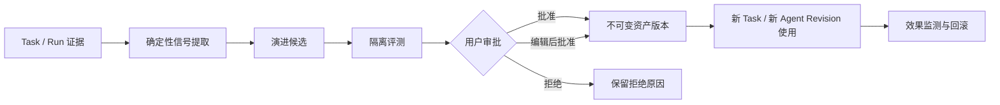

# RUX 看板、经验沉淀与受控自进化需求讨论稿

> 版本：v0.2  
> 状态：需求讨论，未进入开发基线  
> 更新日期：2026-08-15  
> 关联产品基线：[产品需求文档](product-requirements.md)  
> 目标：在不削弱 Workspace 授权、Agent Revision、Native Session 和人工审批边界的前提下，让 RUX 能组织工作、积累经验并持续改进。

## 1. 背景与结论摘要

本讨论包含三个彼此关联但必须解耦的能力：

1. **项目看板**：回答“当前逻辑项目有哪些需求和任务、分别推进到哪里”，并统一展示该项目不同 worktree 中的工作。
2. **经验沉淀**：回答“哪些重复经验值得变成 Skill、Workflow 或使用优化，保存在哪里，由谁批准”。
3. **受控自进化**：回答“如何基于真实 Run 证据提出、验证、发布和回滚改进，而不是让 Agent 静默改写自身”。

建议产品形态：

- 三项能力均默认启用，并可在设置中分别关闭。
- “启用”只表示展示入口、采集本地证据和生成候选；不等于候选可自动生效。
- 看板与逻辑 Project 一对一绑定；一个 Project 可以包含主工作目录和多个 Git worktree。
- 左侧栏在当前项目下增加有文字标签的“看板”入口；关闭功能后隐藏入口但保留数据。
- 同一 Git 仓库的多个 worktree 不应要求用户重复“打开项目”并形成多个侧栏项目；Task/对话留在同一 Project 下，通过 worktree 名称和分支标签区分。
- 左侧栏全局功能区增加“改进中心”，用数字徽标展示待审批数量；工作区内可自动过滤为当前项目。
- Skill、Workflow、使用优化统一进入候选与审批流程，支持用户级、项目级和 Agent 级作用域。
- 自进化首期只演进上下文层资产，不修改模型权重、不自改 RUX 程序、不扩大权限、不静默发布。
- 所有已发布资产均不可变版本化；现有 Task 继续固定原 Agent Revision，新版本只影响新 Task，采用新版仍走显式新 Task/Context Handoff。

## 2. 产品原则

### 2.1 三套状态不能混用

| 状态域 | 回答的问题 | 示例 | 权威来源 |
| --- | --- | --- | --- |
| 看板状态 | 人的工作推进到哪里 | 待处理、进行中、待验收、已完成 | Board Store + 用户操作 |
| Run 状态 | Agent 此刻执行得怎样 | running、blocked、completed、failed | Runtime/Task Store |
| 演进状态 | 一个改进建议治理到哪里 | 待审批、试验中、已发布、已回滚 | Evolution Store |

Run 成功不代表需求完成。默认只能把卡片推进到“待验收”，最终“已完成”由用户确认。

### 2.2 默认开启不等于静默改变

- 默认开启：本地采集可用证据、识别重复模式、生成候选、显示待审批入口。
- 必须审批：写入 Skill/Workflow 文件、改变 Agent 指令或工具策略、发布为用户级资产、扩大适用范围。
- 永不自动：提升权限、加入新工具、改变 Engine/Provider Connection、读取未授权路径、复制凭据、修改 RUX 自身代码或模型权重。
- 后台模型调用若会产生 Token/费用，必须有独立的后台演进预算、可见记录和 Connection 策略；没有可用策略时只积累证据，不静默调用 Provider。

### 2.3 证据、候选、发布物分层



任何候选都必须能追溯到来源 Task、Run、验证结果和用户反馈；发布物不能反向改写来源历史。

## 3. 项目看板

### 3.1 用户目标

- 在逻辑项目内查看主工作目录及全部已关联 worktree 的需求和 RUX Task 当前所处阶段。
- 从需求拆分或关联多个执行 Task，并能从卡片打开对应 Task。
- 在不进入每个 Task 的情况下看到运行中、阻塞、失败、待审批等即时信号。
- 用看板组织人的推进状态，同时保留 Agent Run 的真实执行状态。

### 3.2 信息架构与入口

- 当前 Project 标题下增加 `看板` 行，位于 Task 历史之前，必须有文字标签和可访问名称。
- `看板` 默认显示；`设置 > 功能 > 项目看板` 可关闭。
- 关闭后：隐藏入口、停止自动创建新卡片，但保留已有看板数据；重新开启后恢复。
- 看板页顶部展示项目名称、卡片总数、进行中、阻塞、待验收，并提供“新建需求”。
- 看板可以汇总同一 Project 内已授权 worktree 的 Task，但首期不做跨 Project 汇总看板。

### 3.3 首期列与状态规则

默认列：

1. `待处理`
2. `进行中`
3. `待验收`
4. `已完成`

允许用户改名、排序和增加自定义列，但系统保留稳定 `stateId`，不能用显示名称驱动业务逻辑。

自动规则：

- 新建 RUX Task 时创建唯一关联卡片，初始为“待处理”，并显示其 worktree 与当前分支。
- 首个 Run 启动时，仍在“待处理”的卡片自动进入“进行中”。
- Run 成功完成时，卡片可自动进入“待验收”，不能自动进入“已完成”。
- Run 阻塞、失败或中断时不强行改变看板列，而是在卡片上显示执行徽标和最近 Run 摘要。
- 用户手动移动后记录操作人、时间和来源；后续自动规则不得覆盖用户设定的状态，除非用户重新启用该卡片的自动推进。
- “已完成”卡片重新启动 Run 时提示是否移回“进行中”，不静默移动。

### 3.4 卡片类型与关系

| 类型 | 用途 | Task 关系 |
| --- | --- | --- |
| Task 卡片 | 对应一个 RUX Task | `linkedTaskId` 必填且在 Project 内唯一 |
| 需求卡片 | 描述尚未执行或包含多个 Task 的需求 | 可关联 0..N 个同 Project Task；Task 可以位于不同 worktree |

需求卡片至少包含：标题、描述、看板状态、优先级、标签、验收条件、关联 Task、创建/更新时间。Task 卡片展示 Agent、实际模型、Task 状态、worktree、分支、最近 Run、阻塞/审批数量和 Changes 摘要。

需求卡片进度由关联 Task 汇总展示，但默认不自动完成：全部关联 Task 进入“已完成”时，只提示“可完成”。

### 3.5 关键交互

- 拖拽卡片改变状态，同时提供键盘可操作的“移动到…”菜单。
- 从需求卡片“创建执行任务”时，新 Task 固定当时选择的 Agent Revision，并建立不可变来源关系。
- 从 Task 菜单可“查看看板卡片”或“关联到需求”。
- 删除卡片与删除 Task 是不同动作；删除 Task 前展示关联影响，删除需求不级联删除 Task。
- 切换 Project 后只加载目标 Project 的 Board；同一 Project 内切换 Task 时，Changes、Context、Terminal 和 Run 必须切换到该 Task 固定的 worktree 执行根。
- 不同 worktree 的未提交 Changes 不合并展示为一份补丁；项目看板只做状态聚合，文件与终端操作始终保持 worktree 隔离。

### 3.6 概念数据模型

```text
Board {
  id, projectId, revision, enabled, createdAt, updatedAt
}

BoardState {
  id, boardId, name, order, semanticRole
}

WorkItem {
  id, boardId, projectId, type: requirement | task,
  title, description, stateId, priority, labels,
  acceptanceCriteria, linkedTaskId?, automationMode,
  createdAt, updatedAt
}

RequirementTaskLink {
  requirementItemId, taskId, createdAt, createdBy
}

BoardTransition {
  id, workItemId, fromStateId, toStateId,
  source: user | run-rule, runId?, createdAt
}
```

约束：`projectId` 与 `worktreeId` 必须由 Main 根据已授权 Git 元数据解析，Renderer 不得提供任意路径；`linkedTaskId` 必须属于同一 Project。文件、PTY、Run 和 Native Session 仍以具体 worktree 的规范化真实路径作为安全边界。

### 3.7 同一项目聚合多个 worktree

#### 当前痛点

Git 不允许同一个分支同时被两个 worktree 检出。当前桌面工具如果把“项目”直接等同于一个目录，用户在创建 worktree 后往往还要把新目录再次“打开/导入”为另一个项目，才能进入对应分支的对话。结果是：

- 同一个仓库在侧栏出现多个项目，任务历史被人为拆散。
- 用户容易在主工作目录里尝试切换到已被其他 worktree 占用的分支，并收到难以理解的 Git 报错。
- 需求、看板、对话和分支之间缺少稳定关系，无法直观看出每个 Task 正在哪个工作副本执行。
- worktree 删除或迁移后，历史对话容易变成一个看似消失的“项目”，而不是原项目中待重新关联的工作副本。

#### 目标模型

RUX 需要把导航层的 **Project** 与执行层的 **Worktree** 分开：

```text
Project（逻辑项目 / 同一 Git common dir）
├── WorkingCopy：主工作目录 · main
├── Worktree：requirements-kanban-evolution · codex/requirements-kanban-evolution
│   ├── Task / 对话 A
│   └── Task / 对话 B
└── Worktree：feature-x · codex/feature-x
    └── Task / 对话 C
```

- `Project` 是侧栏、看板、需求和任务历史的聚合单位。
- `Worktree` 是文件、Changes、Context、Terminal、Run 和 Native Session 的执行与授权单位。
- 一个 Task 在创建时固定一个 `worktreeId`，并记录创建时分支；不得因用户切换侧栏筛选而静默改变执行根。
- 分支名是可变显示信息，不作为 worktree 或 Task 的唯一身份；身份应使用规范化 realpath、Git common dir、worktree 元数据和稳定本地 ID。
- 非 Git 目录退化为一个 Project + 一个 WorkingCopy，不要求使用者理解 worktree 概念。

#### 发现、关联与授权

- 用户首次打开 Git 仓库时，Main/Runtime 通过受支持的 Git 命令读取 `git worktree list --porcelain` 和 common-dir 信息，列出属于同一仓库的工作副本。
- 位于当前授权根之外的外部 worktree 不能仅凭 Git 输出获得文件权限。首次启用“管理此项目的 worktree”时，RUX 展示路径和影响范围，用户一次确认项目级 worktree 管理授权。
- 用户确认后，已验证属于同一 common dir 的 worktree 自动归入现有 Project，不再要求逐个创建侧栏项目。
- 由 RUX 显式创建的新 worktree 可在创建流程中同时完成授权和 Project 关联。
- 由外部工具新建的 worktree 被发现后显示“待关联”；用户可一键确认，不需要走完整的“打开新项目”流程。
- 路径不存在、common-dir 不匹配、符号链接逃逸或 Git 元数据歧义时拒绝自动关联。

#### 侧栏与任务交互

- 同一仓库只显示一个 Project 标题，下面统一展示看板和 Task/对话。
- 每个 Task 行展示简洁分支标签；同名分支或 detached HEAD 时同时展示 worktree 名称/短提交号。
- Project 标题可展开 `工作副本` 列表，用于筛选任务、打开目录、新建/关联 worktree 和查看占用状态，而不是创建第二个项目。
- 新建 Task 时默认使用当前或最近使用的 worktree，并允许在 Composer 中选择同 Project 的其他已授权 worktree。
- 当目标分支已被某 worktree 使用时，RUX 直接打开/切换到该 worktree 下的 Task 视图，不在错误目录执行 `git switch`。
- 从一个 Task 切到另一个 worktree 的 Task 时，RUX 必须先处理当前 Run/PTY 生命周期，再激活目标 Runtime；不能让终端命令落到上一个工作目录。

#### 生命周期与恢复

- worktree 被外部删除时，历史 Task 留在原 Project 中并标记“工作副本不可用”；消息、Run、补丁证据和分支信息仍可审查。
- 用户可把不可用 Task 重新关联到经验证的同仓库 worktree，但不能静默改写 Native Session、Agent Revision 或历史 Run 的原始执行路径。
- 移除 worktree 前展示未提交 Changes、运行中 Task、Terminal、关联需求和未发布演进候选；默认不级联删除对话或看板卡片。
- 同一分支只能被一个 Git worktree 检出；RUX 在创建或切换前预检，并提供“打开现有 worktree”，而不是把 Git fatal 原样抛给用户。

#### 概念数据模型补充

```text
Project {
  id, displayName, repositoryIdentity, gitCommonDir?, createdAt, updatedAt
}

WorkingCopy {
  id, projectId, canonicalPath, kind: main | worktree,
  branchName?, headOid?, availability, authorizationState,
  discoveredAt, lastVerifiedAt
}

TaskWorktreeBinding {
  taskId, projectId, workingCopyId,
  branchAtCreation?, headAtCreation?, canonicalPathAtCreation
}
```

`repositoryIdentity` 不应只依赖 remote URL，因为本地仓库可能没有 remote，remote 也可能变化。Main 应优先使用经 realpath 解析的 Git common dir 和本地稳定 ID，并把 remote 仅作为辅助显示/迁移证据。

## 4. 自动经验沉淀

### 4.1 沉淀对象

| 类型 | 定义 | 示例 |
| --- | --- | --- |
| Skill | 可复用、可触发的能力包，包含说明、资源与可选脚本 | 发布前的桌面打包验收 |
| Workflow | 多步骤流程、门禁、角色和工具编排 | 需求 → 实现 → 测试 → 打包 → 审批 |
| 使用优化 | 对提示、工具顺序、模型/推理强度或上下文选择的建议 | 先读取局部 AGENTS.md 再修改文件 |
| 经验规则 | 轻量的语义/情景记忆，不直接改变 Agent | 某项目测试必须从 `app/` 运行 |

首期发布物建议只支持 Skill、Workflow 和经验规则；模型路由或 Agent 指令优化先生成建议，不自动改写 Auto Policy 或 Agent Revision。

### 4.2 候选生成信号

- 用户明确说“以后都这样做”“记住这个流程”。
- 同类步骤在多个成功 Run 中重复出现。
- 用户多次纠正相同问题，或多次拒绝同类权限/变更。
- Run 失败后采用某个修复路径并通过确定性验证。
- 某 Skill/Workflow 被频繁手动组合使用。
- 验证、构建、测试、回滚等轨迹存在可复用且不含任务特有值的模式。

默认不作为沉淀证据：模型隐藏推理、凭据、`.env` 内容、私钥、OAuth 输出、未授权 Workspace 内容、一次性临时路径、大段源代码或第三方受限内容。

### 4.3 作用域与存储位置

逻辑作用域和物理位置分开建模：

| 作用域 | 可见范围 | 默认物理位置 | 发布要求 |
| --- | --- | --- | --- |
| 用户级 | 本机当前用户的兼容 Agent | RUX Main 管理的用户资产库 | 用户审批 |
| 项目级 | 单一已授权 Workspace | RUX 管理的 Workspace 侧车存储，不改仓库 | 用户审批 |
| Agent 级 | 一个 Agent Definition 的后续 Revision | RUX Agent Profile Store | 用户审批并追加 Revision |

用户可在 `设置 > 改进与演进 > 存储位置` 指定物理位置：

- `由 RUX 管理`：默认，避免污染仓库或依赖某一 Engine 的私有目录。
- `项目目录`：用户选择 Workspace 内目录；发布前预览文件 diff，这些文件成为普通项目变更。
- `用户自定义目录`：通过原生目录选择器单独授权；只允许显式选择的根目录。

RUX 内部使用规范化、Engine 中立的资产格式，再由 Adapter 导出为目标 Engine 支持的 Skill/Workflow 形式。不得假设不同 Engine 的目录结构和能力完全一致；不支持的目标显示“仅在 RUX 中可用”。

### 4.4 改进中心

左侧栏全局功能区增加 `改进中心`，待审批时显示数字徽标。页面默认按当前 Workspace 过滤，并可切换“全部 / 当前项目 / 用户级 / Agent”。

候选卡片必须展示：

- 类型、建议名称、目标作用域和物理位置。
- 来源 Task/Run、触发信号、支持与反例证据。
- 建议内容或结构化 diff；将被创建/修改的文件。
- 预期收益、适用条件、已知风险、权限和工具变化。
- 隔离评测结果、Token/费用、候选生成所用模型和时间。
- 影响的 Agent、新 Task 和已有资产；现有 Task 默认不受影响。

操作：`批准`、`编辑后批准`、`试用`、`拒绝`、`稍后处理`。拒绝可填写原因，系统用其抑制同类重复建议，但拒绝本身不能被解释为永久偏好，除非用户明确选择“以后不再建议此类内容”。

### 4.5 候选状态

`发现中 → 待审批 → 试验中 → 已批准 → 已发布 → 已回滚`

旁路状态：`已拒绝`、`已过期`、`评测失败`、`发布失败`。

候选与发布物均不可变保存；编辑后批准会产生新候选 Revision，原候选保留用于审计。

## 5. 受控自进化

### 5.1 定义与首期边界

RUX 自进化定义为：基于可审查的真实工作证据，对 Agent 的外部行为资产进行版本化改进，并用隔离评测、人工审批、灰度使用和回滚形成闭环。

首期可演进：

- Skill 的触发描述、步骤、模板和非特权脚本。
- Workflow 的步骤、门禁、验证与失败恢复路径。
- 项目经验规则和用户偏好。
- Agent 指令优化候选，但发布时必须形成新的 Agent Revision。

首期不可演进：

- 模型权重、Provider 凭据、Base URL、Connection 归属。
- RUX 应用代码、Runtime 安全策略、协议校验、权限上限。
- 自动安装插件、工具、MCP Server 或外部依赖。
- 自动跨 Workspace、跨 Agent、跨 Engine 或跨用户传播资产。
- 自动修改已有 Task 固定的 Agent Revision 或 Native Session 身份。

### 5.2 演进循环

1. **Observe**：收集 Task、Run、工具调用、权限决策、验证结果和明确反馈的非敏感证据。
2. **Attribute**：区分模型问题、指令问题、工具问题、环境问题和瞬时故障，避免把网络/配额失败沉淀成错误规则。
3. **Propose**：产生最小改进候选，写明适用条件、非目标与来源证据。
4. **Evaluate**：在隔离环境对代表性成功样本、失败样本和保留集做对照评测。
5. **Approve**：用户查看 diff、证据、成本与风险后批准、编辑或拒绝。
6. **Publish**：产生不可变资产版本或新的 Agent Revision，不覆盖旧版本。
7. **Monitor**：记录后续采用率、成功率、回退率、成本和用户纠正。
8. **Rollback**：一键停用新版本并恢复选择旧版本；历史 Task 和证据不被删除。

### 5.3 评测与发布门禁

候选至少满足：

- 来源证据不少于设定阈值；单次成功不能默认泛化为用户级 Skill。
- 在可验证任务上不降低通过率；没有确定性验证时明确标记低置信度。
- 安全、权限和 Workspace 边界不得放宽。
- Token、延迟和工具调用增量在用户预算内。
- 在保留样本上通过回归评测，避免只记住生成候选的轨迹。
- 评测者与提议者的模型、提示和版本均有来源记录；同一模型自评只能作为证据之一。

首期发布策略：全部人工审批。后续如引入“自动发布低风险项目规则”，必须单独立项，并限定在可回滚、无脚本、无权限变化、通过确定性门禁的项目级资产。

### 5.4 默认开关与预算

`设置 > 改进与演进`：

- `自动发现可复用经验`：默认开。
- `生成 Skill / Workflow 候选`：默认开。
- `受控自进化`：默认开。
- `允许后台模型评审`：默认开，但仅在用户已选择 Connection、确认后台使用策略和预算后实际调用；否则显示“等待配置”，不阻塞普通 Run。
- `自动发布`：首期不存在，不能用总开关暗示已授权自动发布。

预算至少支持：每日 Token 上限、每日费用上限、只在空闲/接电时运行、每个 Workspace 上限、立即暂停。后台演进 Run 与普通 Task Run 分开计量和展示。

## 6. 方案调研与 RUX 取舍

调研截至 2026-08-15。以下只采用论文或项目官方资料，不把市场宣传等同于已验证能力。

| 方案 | 可借鉴点 | 主要不足或不适配点 | RUX 的补足 |
| --- | --- | --- | --- |
| [Reflexion](https://arxiv.org/abs/2303.11366) | 把环境反馈转成语言反思并存入 episodic memory，无需改权重 | 反思质量依赖模型；缺少桌面产品级审批、作用域和发布治理 | 反思只形成候选，绑定真实 Run/验证证据，经评测和审批后发布 |
| [Self-Refine](https://arxiv.org/abs/2303.17651) | 生成、反馈、迭代改进简单通用 | 同一模型自评可能放大偏差，更偏单次输出优化 | 引入确定性验证、保留集、独立评测证据和停止条件 |
| [Voyager](https://arxiv.org/abs/2305.16291) | 可执行技能库、环境反馈、自验证和组合复用 | 面向封闭环境；自主增长技能库缺少企业/本地项目治理 | 采用版本化 Skill Bank，但增加 Workspace 授权、人工审批、文件 diff 和回滚 |
| [LangMem](https://langchain-ai.github.io/langmem/concepts/conceptual_guide/) | 区分 semantic、episodic、procedural memory，支持后台提取和 Prompt 优化 | 通用库把治理交给应用；热路径写记忆会增加延迟，错误记忆可能直接影响行为 | 默认后台生成候选；作用域、来源、批准、过期、冲突和撤销是一等对象 |
| [Letta Memory Blocks](https://docs.letta.com/guides/core-concepts/memory/memory-blocks) | 持久、可共享、可读写的结构化上下文块 | 常驻上下文有 Token 成本；Agent 可写和 last-write-wins 容易产生冲突 | 资产按需检索，更新使用不可变 Revision 与合并审批，不允许 Agent 直接覆盖共享资产 |
| [DSPy / GEPA](https://arxiv.org/abs/2507.19457) | 用轨迹和自然语言反思搜索 Prompt 改进，强调少量 rollout 和 Pareto 选择 | 需要明确 metric 与代表性数据；离线优化结果不等于生产安全 | 在真实 RUX Run 上建立多指标门禁，质量、成本、安全和回归共同决定是否可发布 |
| [Automated Design of Agentic Systems](https://arxiv.org/abs/2408.08435) | Meta Agent 可搜索 Prompt、工具流和控制结构 | 自动生成 Agent 代码的搜索空间和风险过大，不适合首期桌面工作台 | 首期只演进声明式资产；程序、权限和 Runtime 边界不可自改 |
| [CODESKILL](https://arxiv.org/abs/2605.25430) | 从 coding trajectory 提取多粒度程序性技能并维护紧凑 Skill Bank | 研究方案依赖训练/奖励设计，真实用户数据治理和可解释发布仍需产品层解决 | 引入去重、合并、适用域、证据链、容量治理、用户审批与使用后监测 |
| [OpenAI Codex Skills / Automations](https://openai.com/index/introducing-the-codex-app/) | Skill 复用团队流程，Automation 结果进入 review queue | 官方描述强调创建、管理和复用，未覆盖基于个人 Run 证据的完整演进治理闭环 | 把“从运行发现候选—评测—审批—版本发布—回滚”做成可见的本地工作台能力 |

综合取舍：RUX 不追求“完全自治”作为卖点，而以 **可见、可控、可审查、可恢复的演进** 作为差异化。产品优势应来自跨 Engine 的统一证据模型、Workspace 安全边界、不可变 Revision、待审批队列和可回滚发布，而不是更激进的自改权限。

## 7. 技术方案草案

### 7.1 进程与存储边界

- **Renderer**：展示 Board、改进中心、diff、评测和设置；不直接访问文件、数据库或凭据。
- **Main**：授权 Workspace/自定义目录，拥有 Board Store、Evolution Store、审批事务、资产版本和物理发布。
- **Utility Process Runtime**：从已授权 Run 证据生成候选、执行隔离评测；不能绕过 Main 发布资产。
- **Engine Adapter**：把规范化 Skill/Workflow 只读注入兼容 Engine，或在明确批准后导出到用户选择的位置。

建议新增 Main-owned SQLite 数据：

- `boards`, `board_states`, `work_items`, `requirement_task_links`, `board_transitions`
- `learning_evidence`, `evolution_candidates`, `candidate_revisions`
- `evolution_evaluations`, `asset_definitions`, `asset_revisions`
- `asset_bindings`, `publication_records`, `evolution_audit`

用户级数据保存在应用数据目录；项目级逻辑资产可仍由 Main 集中存储并用 `workspaceId` 隔离。只有用户选择“项目目录”时才写入 Workspace 文件，并进入正常 Changes 审查。

### 7.2 协议能力草案

开发时必须同步更新 shared protocol、Runtime/Main handler、Preload、Renderer fallback、测试和架构文档。建议能力边界：

```text
board.get / board.item.create / board.item.update / board.item.move
board.requirement.link-task / board.settings.update

evolution.candidate.list / evolution.candidate.read
evolution.candidate.evaluate / evolution.candidate.reject
evolution.candidate.approve / evolution.candidate.publish
evolution.asset.list / evolution.asset.rollback
evolution.settings.get / evolution.settings.update
```

Renderer 只能传稳定 ID、编辑内容和经过预览的 fingerprint。Main 必须在批准、发布和回滚事务中重新解析目标作用域、路径、Agent Revision、影响范围和 fingerprint。

### 7.3 后台任务模型

- 普通 Run 结束后只写入轻量 `learning_evidence`，不在用户热路径中增加模型延迟。
- 空闲调度器按 Workspace、预算和去重键聚合证据。
- 候选生成使用独立的 `Evolution Run`，固定模型、提示、输入证据 hash、Token 和费用。
- 评测在临时副本或沙箱中进行；禁止网络和外部写入，除非测试用例明确需要且用户批准。
- 切换 Workspace 时取消该 Workspace 未完成的发现/评测作业；已写证据和候选保持可恢复。
- 任意失败不得阻塞普通 Task Run，也不得产生半发布资产。

### 7.4 版本、冲突与回滚

- Asset Definition 是可变列表入口，Asset Revision 是不可变发布物，沿用 Agent Revision 的产品语义。
- 项目级和用户级存在同名资产时不静默覆盖：显示来源，默认更具体的项目级优先，但用户可禁用或固定版本。
- 一个 Task/Run 必须记录实际注入的资产 Revision 列表，才能解释行为变化。
- 回滚创建新的 publication record 并恢复选择旧 Revision，不删除问题版本及其证据。
- 修改 Agent Skills/Workflow 绑定会创建新 Agent Revision；已有 Task 不受影响。

### 7.5 隐私与安全

- Evidence 默认保留结构化摘要和引用，不复制整段 transcript/文件；需要正文时保存最小片段并标明来源。
- 生成候选前进行凭据形状、敏感路径和高熵文本过滤；导出继续沿用现有敏感字段排除规则。
- 用户级候选不得从单个 Workspace 自动吸收项目专有代码、客户名或私有路径。
- 项目级资产不得注入其他 Workspace；跨作用域提升必须重新审批并重新评测。
- Skill 脚本发布前展示完整 diff、声明运行环境与权限；首次执行仍走普通工具权限体系。
- 关闭功能后停止新证据采集和后台任务；用户可单独清理证据、候选、发布资产与评测记录，并先查看影响预览。

## 8. 分期建议

### Phase K1：项目看板基础

- 先引入 Project / WorkingCopy 分层和现有单 Workspace 数据的兼容迁移。
- 同一 Git common dir 的多个 worktree 聚合到一个侧栏 Project，Task 显示分支/worktree 标签。
- Project 默认 Board、四个系统列、Task 唯一卡片、需求卡片和关联关系。
- 侧栏入口、设置开关、拖拽/键盘移动、Run 徽标。
- Main-owned 持久化、跨 worktree Task 切换和执行根数据边界测试。

### Phase L1：证据与审批中心

- 默认开启的轻量证据采集、候选对象、改进中心和审批状态机。
- 先支持确定性“项目经验规则”候选，验证治理链路。
- 用户级/项目级作用域、RUX 管理位置、清理与导出。

### Phase L2：Skill 与 Workflow 沉淀

- 模型辅助候选生成、后台预算、去重/合并、规范化资产格式。
- 隔离试用、文件 diff、项目目录和用户自定义目录发布。
- Engine Adapter 能力声明；不支持的 Engine 明确降级。

### Phase E1：受控自进化闭环

- 对照评测、保留集、多指标门禁、发布监测和一键回滚。
- Skill/Workflow Revision 注入 Run 证据。
- Agent 指令候选发布为新 Agent Revision，并接入新 Task/Handoff 流程。

### Phase E2：高级演进（需重新评审）

- 多候选搜索、Pareto 选择、跨任务迁移评测。
- 低风险资产灰度、团队/共享作用域、可移植资产市场。
- 不包含模型权重训练和 RUX 自改代码；这些如需开展必须另立安全与基础设施项目。

## 9. 验收标准

### 9.1 看板

- 新 Project 默认可见“看板”，设置关闭后入口隐藏但数据不丢失。
- 同一仓库的主工作目录和多个 worktree 只显示为一个 Project，不要求重复导入为多个侧栏项目。
- 每个 Task 行能识别其 worktree 和分支；点击后 Changes、Context、Terminal 和 Run 使用正确的执行根。
- 分支已被现有 worktree 检出时，RUX 提供“打开现有 worktree”，不要求用户在主目录再次切换该分支。
- 每个 RUX Task 最多有一个 Task 卡片，且不能跨 Project 关联。
- Run 开始可把未手工控制的卡片推进到“进行中”；Run 成功最多推进到“待验收”。
- Run 失败、阻塞和审批状态在卡片可见，但不冒充看板列状态。
- 删除需求不删除 Task；删除 Task 前准确预览卡片和需求关系影响。
- worktree 被外部删除后历史 Task 与卡片仍可审查，并明确标记执行根不可用。
- 拖拽和键盘菜单均可移动卡片，重要控制同时具有可见文案和 accessibility name。

### 9.2 沉淀与审批

- 默认开启后能从明确用户反馈或重复验证轨迹生成候选，且普通 Run 不因后台失败而失败。
- 待审批数量在侧栏可见；用户可查看证据、diff、作用域、位置、成本和风险。
- 未批准候选不会写 Skill/Workflow 文件、改变 Agent Revision 或注入新 Task。
- 项目级、用户级和 Agent 级作用域不可混淆；跨作用域发布必须再次确认。
- 拒绝、编辑后批准、发布失败和回滚均保留不可变审计记录。

### 9.3 自进化

- 每次发布都有基线/候选评测、输入证据 hash、模型、Token、费用和门禁结果。
- 同一模型自评不能单独通过高风险候选；确定性验证失败时禁止发布。
- 新资产只影响显式采用它的新 Task/Agent Revision，既有 Task 不被静默改变。
- 用户能立即暂停后台演进、停用资产和回滚版本。
- 任何路径都不能扩大权限、读取未授权路径、暴露凭据或绕过 Main-owned 发布事务。

## 10. 指标与反指标

核心指标：

- 看板中活跃 Task 的覆盖率、从“进行中”到“待验收”的周期。
- 候选批准率、编辑后批准率、重复建议率、平均审批时间。
- 发布资产的采用率、可验证成功率变化、用户纠正率、回滚率。
- 每个有效发布物的 Token/费用和净节省时间。

反指标：

- 为提高批准率而降低候选数量或隐藏低置信度。
- 用模型自评分数替代真实验证或用户验收。
- 把 Run completed 计为需求 done。
- 以自动写入数量作为自进化成功指标。

## 11. 开发前待确认决策

1. 首期看板是否允许自定义列；建议允许改名/排序和新增，但固定四个 `semanticRole` 用于自动规则。
2. 新建 Task 是否无条件自动创建卡片；建议功能开启时创建，用户可隐藏卡片但不能生成第二张 Task 卡片。
3. 项目级资产默认保存在 RUX 侧车存储还是仓库内；建议侧车存储，仓库发布必须显式选择并审查 diff。
4. 背景候选生成默认使用哪个 Agent/模型和预算；建议设置独立“演进 Agent”，未配置时只做确定性提取。
5. 多少独立证据允许提出用户级候选；建议初始阈值为三个 Task 或一次明确用户指令，并允许按类型调整。
6. Workflow 首期是声明式步骤模板还是可执行 DAG；建议先做声明式、有门禁的线性/分支流程，暂不提供任意代码编排。
7. 是否允许项目级候选提升为用户级；建议只提供带脱敏预览和重新评测的显式“提升作用域”。
8. Evolution Evidence 默认保留多久；建议跟随 Workspace 本地数据永久保留，直到用户清理，不设置静默过期。
9. 项目级 worktree 授权是一次性覆盖后续同仓库新 worktree，还是每个外部路径都需确认；建议 RUX 创建的 worktree 自动关联，外部创建的 worktree 一键确认后关联。
10. 一个 Project 是否允许同时保持多个 Utility Process Runtime；建议首期只激活当前 Task 的 worktree Runtime，但保留按 `workingCopyId` 扩展并行 Runtime 的协议空间。

在以上决策确认前，本文件是讨论稿，不应被描述为已实现功能或既定交付承诺。
