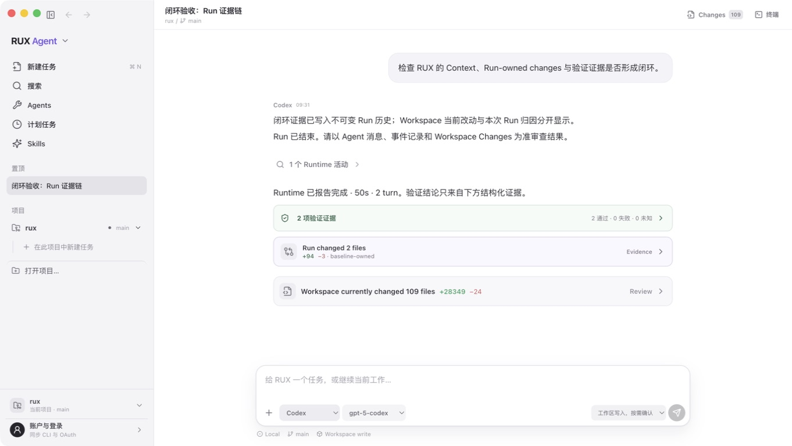
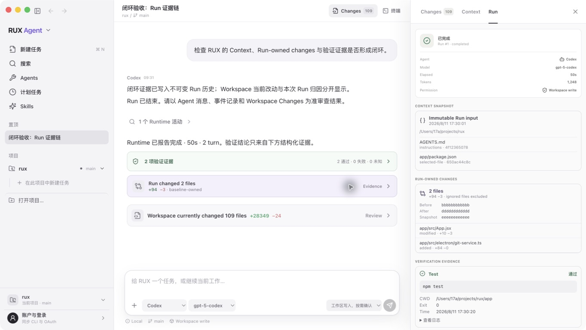
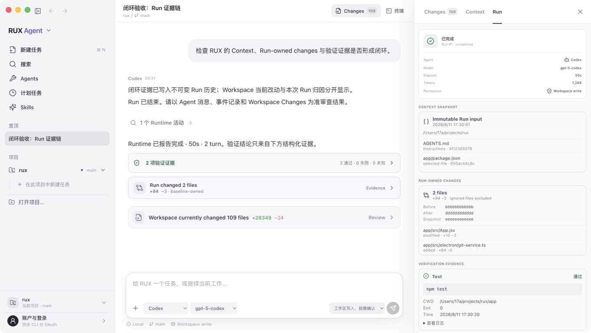

# RUX 全功能闭环审计 · 2026-08-11

> 总结：**没有全部闭环**。当前版本已经形成 Desktop + TUI 的本机开发内测主干，Run 的 Context、Git 归因和 Verification 不再是展示文案；但阻塞式 Permission、Run-owned hunk/Restore、Migration、完整 Task 状态、Renderer/Packaged 自动化、Apple 签名公证和 Handoff 仍是明确缺口。不得把当前构建宣传成公开发布版或完整 v1。

本审计以 [`delivery-roadmap-and-acceptance.md`](../../delivery-roadmap-and-acceptance.md) 的 Requirement ID 为判定口径。只有代码、自动化和当前打包应用证据同时覆盖 Acceptance Criteria 时才记为“已验证”；入口可见或局部可用只记为“部分”。

## 1. Workspace 与 Task — 部分闭环

- 原生项目选择、Recent Workspace、项目标题仅展开、Task 点击激活所属 Workspace、Runtime 切换、Task 新建/重命名/置顶/归档/恢复和 SQLite 重启恢复已经连通。
- 最后一个未归档 Task 与 running Task 有保护；旧 `running` 在重启后归一为 `stopped/interrupted`。
- 未闭环：手动重排、Blocked/Failed/Interrupted 的完整用户级状态、历史 Run 切换审查、搜索收起项目、删除 tombstone 和同字段冲突 UI。
- 证据：[`task-lifecycle-audit.md`](./task-lifecycle-audit.md)。

## 2. CLI 登录与 OAuth — 边界闭环，真实重授权未执行

- Claude Code 与 ChatGPT/Codex 都通过官方 CLI 查询登录态并委托官方 CLI OAuth；RUX 不读取凭据文件、不复制 Token、Renderer 只得到非敏感状态。
- Fake CLI 覆盖 signed-in/signed-out/API-key/ChatGPT 与 login delegation。
- 本轮验收没有触发真实 OAuth grant，因为那会改变用户账号授权状态；因此结论只覆盖产品边界和委托流程，不覆盖每个真实账号/网络环境的浏览器回调。

## 3. Agent 与 Run — 部分闭环

- Claude Code、Codex 与基于两者的自定义 Agent 使用真实进程；Codex fake contract、真实 smoke、session resume、process-group cancel 和明确终态已有证据。
- Custom Agent CRUD、复制、严格 schema、持久化与 immutable Profile Snapshot 已连通。
- 未闭环：Claude 的成功/失败/retry/crash/resume 全矩阵、Desktop packaged 真点击的 Claude/Custom Run、统一 Capability Descriptor、Skills/Tools 实际执行策略。

## 4. Immutable Context — 核心执行链闭环，产品范围仍部分

- Runtime 不信任 Renderer 内容，而是在受权 Workspace 内重新读取 AGENTS 与 selected files，流式计算 SHA-256，记录 missing/binary/truncated，并拒绝 traversal/symlink escape。
- 同一个 Snapshot 被发到客户端、写入 SQLite/TUI，并与 Custom Agent Instructions 一起注入实际 Claude/Codex prompt；历史 Run 不随文件后续变化。
- 未闭环：Conversation、Git State、Pinned Material、实际 Skill/Tool 集合，以及完整的添加/移除/固定 Context UX。

## 5. Git Changes、Review 与 Restore — Workspace 闭环，Run-owned 部分

- Workspace staged/unstaged/untracked/deleted/binary/rename、分层 Diff、stale snapshot、review-only Accept、两步 Restore 和路径边界都有真实 Git fixture。
- Run 启动使用临时 `GIT_INDEX_FILE` 生成 tree baseline，终态前生成 file-level patch。测试证明真实 index/cached diff 不变、运行前用户 staged/untracked 改动不归给 Agent、ignored 文件排除、子目录 Workspace 不越界。
- UI 明确分开显示 Run-owned 与 Workspace 当前改动：

- 未闭环：Run-owned hunk inspector、binary detail、只撤销该 Run 的 Restore/Reject、Run 期间用户与 Agent 并发修改同一文件时的归属/冲突策略。

## 6. Verification Evidence — 已验证

- Test/Lint/Typecheck/Build/Command 证据模型包含 command、cwd、start/finish、exit code、passed/failed/unknown、log、redacted 和 truncated。
- Codex command execution 能提供确切 exit；无法得到确切 exit 的 Claude Bash 保持 `unknown`，不会伪造通过。Secret redaction、长日志截断、Host wire、SQLite、TUI 与 UI 均有覆盖。
- 时间线只有收到结构化 evidence 才出现“验证证据”；没有 evidence 时明确说未收到，不显示“测试通过”。

## 7. 持久化与双客户端 — 顺序切换闭环，并发协作部分

- SQLite 保存 Task/Message/Run/ordered Event、Agent/Context/Git/Verification evidence、session ID 与 review acceptance；重启保留，孤立 Run 明确 interrupted。
- Desktop/TUI 的陈旧 Snapshot 会按 identity 合并 Message/Event/Verification/review，immutable evidence 不因缺字段的较新 Snapshot 丢失；重复保存保持幂等。
- 最新打包应用退出并重启后，Context、Run-owned patch 与 Verification 仍存在：

- 未闭环：删除 tombstone、同字段 conflict UI/revision、真正同时双进程压力测试、数据库 schema migration/rollback。

## 8. Grok Build 取向 TUI — 可运行主干，完整 v1 部分

- Rust `ratatui/crossterm` 客户端通过严格 JSONL 连接同一个 Standalone Runtime Host；支持 Composer、Agent/Model/Permission/Profile、Run/Resume/Stop、Context、Git review、Accept、两步 Restore、Verification/Run-owned summary 和 Task persistence。
- Protocol v1 missing/mismatch 会可见报错并阻止 Run；80×24 PTY、真实 child transport、退出终端恢复与 restart 已验收。
- 未闭环：Workspace/Task picker、blocking Permission、完整 Diff/Verification inspector、SSH/resize/load/long-output/reconnect 矩阵和完整双向 Handoff。

## 9. 发布与安全 — 未闭环

- Renderer sandbox、最小 Preload、Main/Runtime Zod 边界、Workspace path guard 与 production mock 禁用已经存在。
- 当前 macOS arm64 `.app` 可打包，内含 Runtime Host 与原生 TUI；`npm test` 56 项、`npm run build` 与 `npm run package` 均通过。
- 当前签名仍是 ad-hoc `Identifier=Electron`、无 Team ID；没有 Hardened Runtime 审计、Notarization、Stapling、Gatekeeper、干净机安装、升级/回滚或 Windows/Linux 发布证据。

## 闭环状态索引

| 结论 | Requirement / 功能 |
| --- | --- |
| 已验证 | `AGENT-04` production 无 mock；`AUTH-01` 官方 CLI 鉴权边界；`CHANGES-03` Verification Evidence |
| 主干可用但部分 | Workspace/Task、Desktop 主流、Run history、Persistence/Recovery、Claude/Codex/Custom Agent、Run-owned Changes、Context、TUI、Security boundary、Packaging |
| 未实现或未验收 | blocking `PERM-01`、`MIGRATE-01`、`CHECKPOINT-01`、Skills/Tools execution、Handoff、完整 Accessibility/Renderer/Packaged E2E、Developer ID/Notary/Gatekeeper |

## 最高优先级收口顺序

1. 把 Permission Request/Decision 做成阻塞、可取消、可持久化、可恢复的一等事件。
2. 在已有 Run tree patch 上增加 hunk review、并发编辑冲突策略和 Run-owned Restore/Reject fixture。
3. 建立 schema migration/rollback fixtures，并补 Renderer + packaged destructive E2E。
4. 补 Task 完整状态/历史 Run 审查、TUI task picker 和双向 Handoff。
5. 最后完成 Accessibility、长 Run/大 Diff/SSH 压测、Developer ID、Hardened Runtime、公证与干净机安装。

## 审计限制

- `08`–`10` 使用隔离 `userData` 的 schema-valid UI fixture 验证打包 Renderer 与 SQLite 重启链路；它没有被用来冒充 Runtime 生成事实。Runtime Context/Git/Verification 的生成与顺序由独立 Host/Git/Adapter tests 证明。
- 没有同版本 Codex App 的官方截图/可运行 reference，因此这里只能判定 RUX 自身层级与交互健康，不能声称逐像素对齐 Codex App。
- 截图不能证明完整 Tab 顺序、Focus trap、VoiceOver、性能或并发安全；这些仍按未验证处理。
