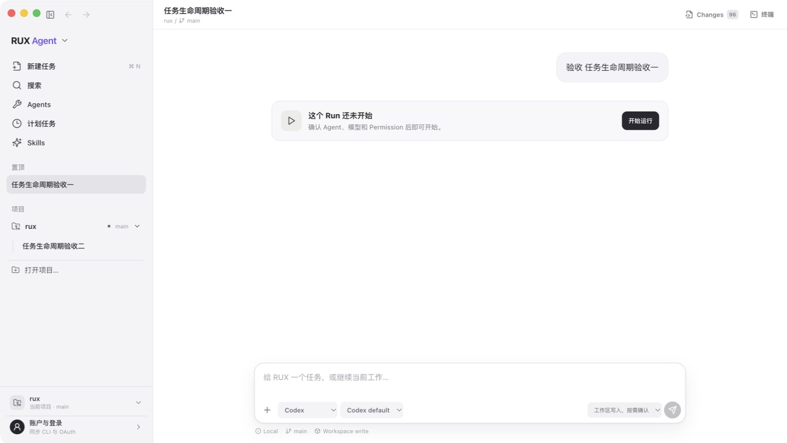
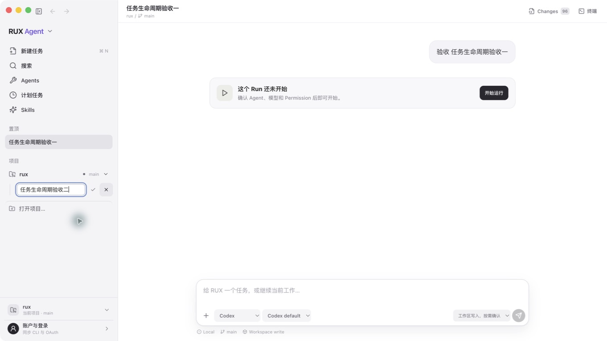
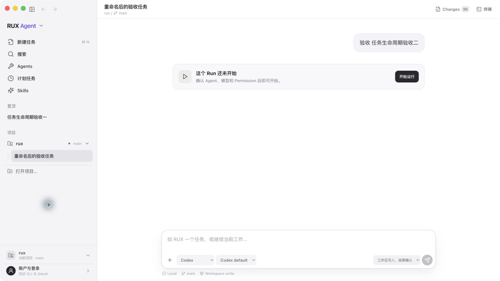

# RUX Desktop Task 生命周期体验审计 · 2026-08-11

> 结论：最新打包版的重命名、置顶、归档、恢复和重启持久化主路径健康，可进入内部测试；完整键盘/VoiceOver、手动排序和 Renderer 自动化仍未验收。验收使用隔离 `userData` 与两个等待状态 Task，不触发真实 Agent Run。

## 1. 初始任务层级 — 健康

- 置顶 Task 与项目内普通 Task 分区明确，点击项目标题只展开/收起，点击 Task 才改变当前 Task。
- 当前 Task、当前项目和账户入口没有混在同一控件中。
- 可见限制：截图不能证明完整 Tab 顺序、Focus trap 或 VoiceOver 朗读质量。

## 2. 任务操作菜单 — 健康，截图受限

- 点击每行独立的“任务操作”按钮后，可访问性树出现 `置顶任务 / 重命名 / 归档任务` 三项；Escape 与点击外部都能关闭菜单。
- 当每个项目只剩一个未归档 Task 时，`归档任务` 为 disabled，Help 为“每个项目至少保留一个未归档任务”。
- 捕获限制：Computer Use 在原生弹出菜单打开期间返回完整菜单可访问性树，但 `screenshot=null`，因此该步只保留结构证据，不伪造截图。

## 3. 行内重命名 — 健康

- 原行原位切换为输入框，提供独立保存和取消按钮；空名称被禁用，Escape 可取消。
- 输入框与按钮均有中文可访问名称，焦点边框清楚，没有挤压项目标题。
- 风险：还未以纯键盘从任务行完整走到菜单、输入、保存并返回原焦点。

## 4. 归档与保护 — 健康

- 归档后 Task 从置顶/项目列表移出，置顶标记被清除，并出现带数量的“已归档”折叠区。
- 正在运行的 Task 和最后一个未归档 Task 均不能归档，避免用户失去当前可用工作单元。
- 风险：归档区点击 Task 会立即重新打开，当前只有分区语义与 tooltip 提示，尚无独立只读预览模式。

## 5. 重新打开 — 健康

- 展开归档区并点击 Task 后，它回到所属项目、成为当前 Task，原消息和配置仍在。
- 重新打开不会自动恢复旧的置顶状态，避免一次归档动作产生隐性排序副作用。

## 6. 退出并重启 — 健康

- 用相同隔离 state 退出并重启打包应用后，重命名结果、置顶/项目位置和选中 Task 均从 SQLite 恢复。
- Store 自动化另外验证：较新的归档状态不会被陈旧客户端 Snapshot 意外重新打开。

## 最高影响的后续项

1. 为 Task 排序建立明确语义（手动拖动、键盘移动或只按更新时间自动排序三选一），并持久化顺序。
2. 补 Renderer 交互测试与打包 E2E，让 rename/pin/archive/reopen/restart 不再依赖人工验收。
3. 用键盘与 VoiceOver 复测菜单焦点返回、归档折叠区和行内重命名错误反馈；截图只能证明可见布局，不能证明辅助技术合规。

Run Context、Run-owned Git、Verification、TUI、发布与安全的完整闭环判定见 [`full-functional-closure-audit.md`](./full-functional-closure-audit.md)。
