# Rux Desktop Full UI, Data, and Interaction Audit

Date: 2026-08-25  
Target: `/Users/17a/projects/rux/release/mac-arm64/Rux.app`  
Reference: `/Users/17a/projects/rux/design/rux-agent-ui/`  
Viewport: 1364 × 768 packaged macOS client

## Verdict

PASS for internal macOS use. The eight reference states preserve the same shell, hierarchy, spacing system, modal structure, review split, terminal split, and settings composition. Runtime content intentionally differs from the static reference because the final client now renders the active Codex account, live Codex model catalog, persisted projects and conversations, Git repository state, and local runtime versions.

## Final flow evidence

### 1. Project conversation — healthy

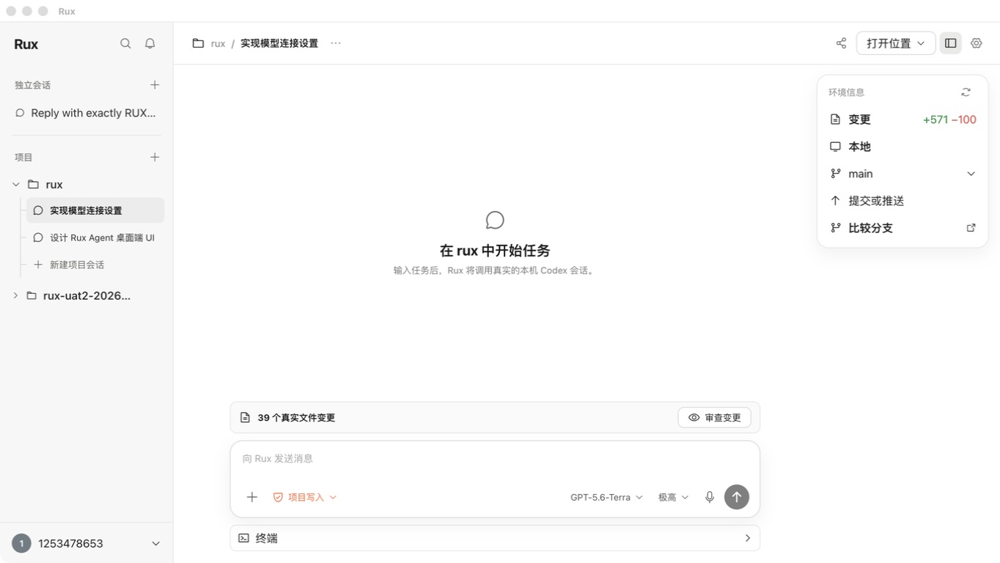

- Project conversations remain nested under their owning project.
- Git branch and change totals come from the selected repository.
- Account identity comes from Codex `account/read`; model and effort come from `model/list`.

### 2. Add project — healthy

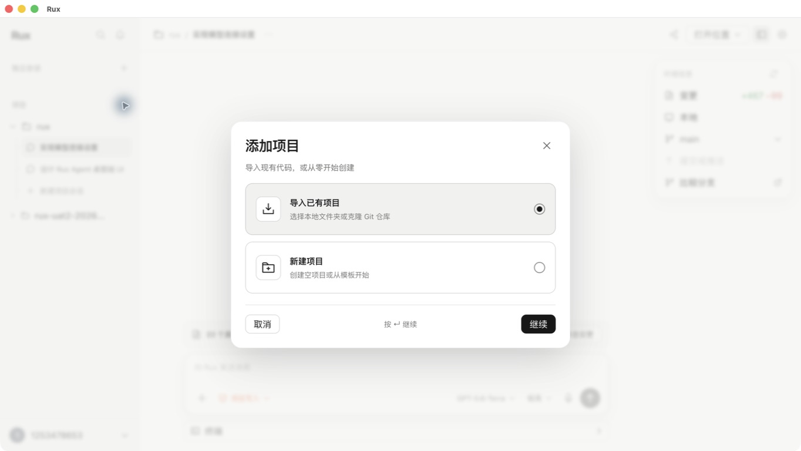

- Import and create paths are visually aligned with the reference modal.
- Choice, close, cancel, continue, keyboard focus, and entry animation were exercised.

### 3. Import project — healthy

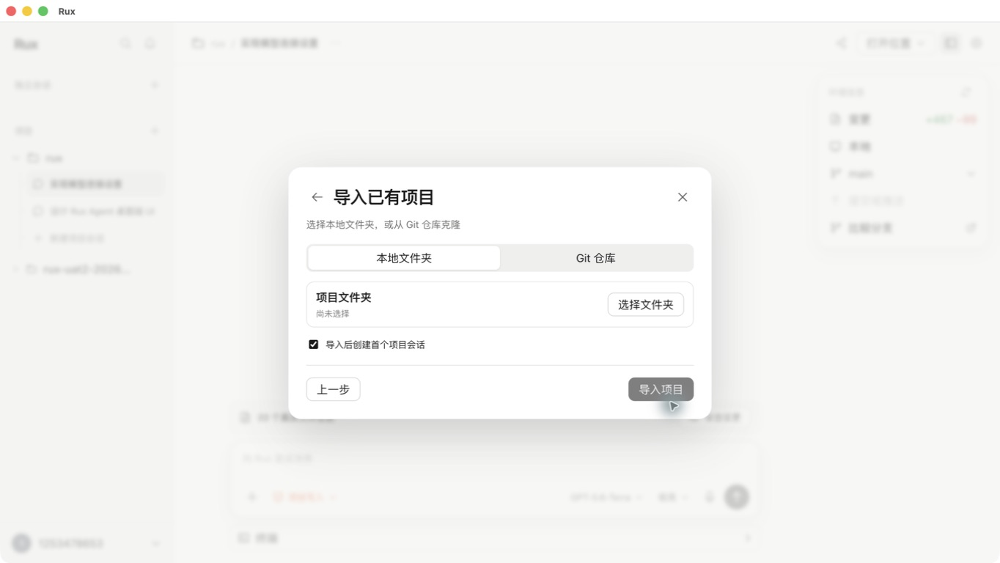

- Folder picker and Git URL modes are interactive.
- Import can optionally create the first nested project conversation.
- Project paths are selected through the native macOS directory picker.

### 4. Create project — healthy

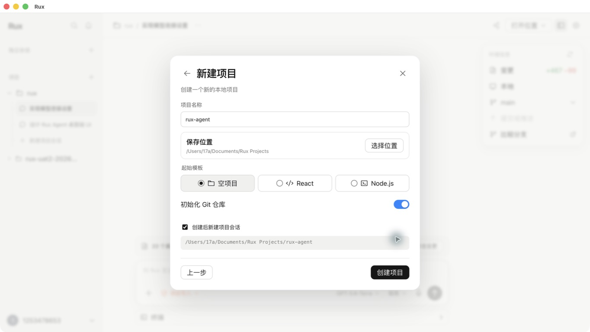

- Name, parent directory, template, Git initialization, and first-conversation controls are functional.
- The path preview is computed from the current form rather than example content.

### 5. Independent conversation — healthy

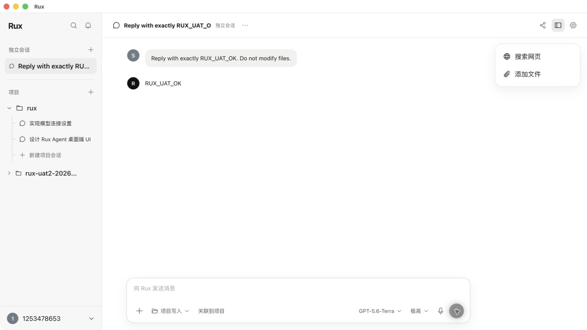

- The legacy sample conversations were removed from persisted workspace data.
- A new independent conversation was created and returned `RUX_UAT_OK` through the real local Codex login.
- Web search, files, sandbox selection, model, reasoning, and voice input controls expose real behavior.

### 6. Git review — healthy

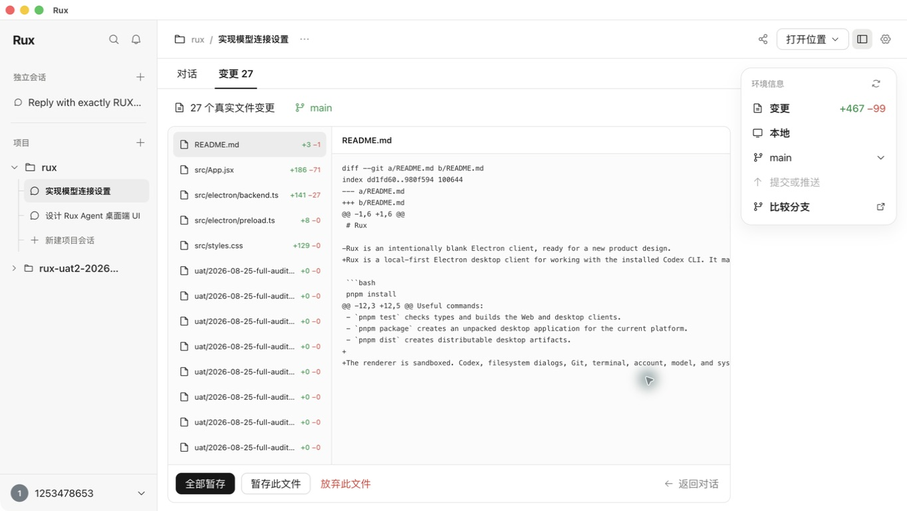

- File list, line counts, diff, stage, and discard controls use the real repository.
- Binary files now show a concise binary-file summary instead of decoded image bytes.
- Destructive discard remains confirmation-gated and refuses automatic untracked-file deletion.

### 7. Integrated terminal — healthy

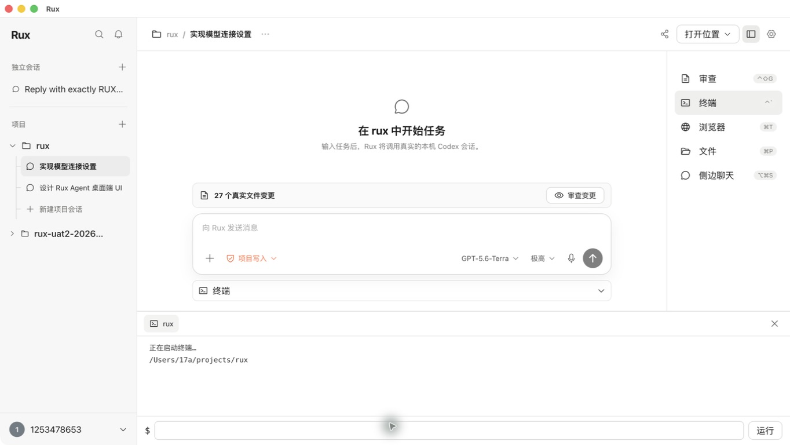

- Terminal starts in the registered project path and streams real shell output.
- Review, repository browser, Finder, and independent-chat launchers are connected to real actions.

### 8. Models and connections settings — healthy

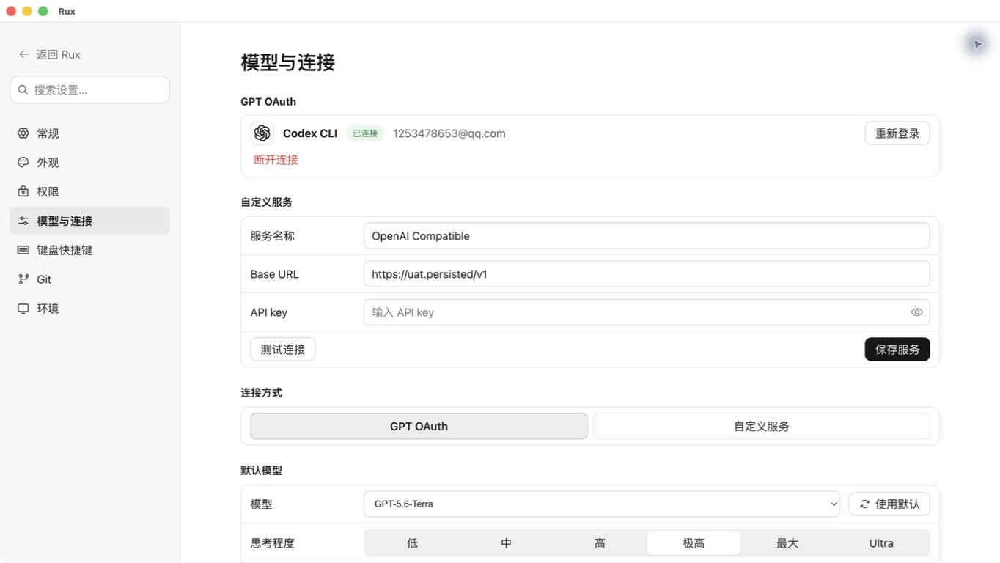

- OAuth account email and plan are read from Codex.
- Custom service, Base URL, secure API key, model catalog, reasoning efforts, and sandbox defaults persist through Electron IPC.
- General, appearance, permissions, shortcuts, Git, and environment categories are navigable and show current state.

## Interaction coverage

- Sidebar search filters persisted projects and conversations.
- Notification and account menus expose explicit empty/connected states.
- Conversation menu supports rename and removal.
- Share copies the current conversation as Markdown.
- Open-location menu opens Finder or copies the real project path.
- Git branch menu reads local branches and supports guarded switching.
- Commit/push uses staged Git changes, a user-supplied commit message, origin detection, and an explicit push confirmation.
- Attachments use the native file picker and are passed to Codex.
- Voice input starts and stops the available browser speech-recognition service.
- Menus, dialogs, toasts, and microphone state use short transitions with reduced-motion support.
- Keyboard shortcuts: settings, new independent conversation, terminal, and review.

## Accessibility findings

Confirmed: semantic buttons and inputs, explicit search labels, modal roles, visible focus treatment, live toast announcements, disabled-state semantics, and reduced-motion behavior.

Limits: this is not a full WCAG certification. Voice transcription accuracy, VoiceOver reading order across every diff, high zoom reflow, and dark-system appearance still require dedicated assistive-technology testing.

## Residual limits

- The macOS package is unsigned.
- A custom OpenAI-compatible service was not live-tested because no separate API key was supplied.
- Branch switching was not executed during the final run because the repository had active changes; the menu and guarded action path were verified.
- Static reference screenshots contain illustrative task transcripts and example repositories. The final client deliberately shows real current state instead of reproducing those sample values.

## Non-Git project conversation regression — 2026-08-25

The initial implementation incorrectly assumed every imported project was a Git worktree. `rux-demo` is a normal directory, so Codex rejected the first turn before starting a session. The backend now runs `git rev-parse --is-inside-work-tree` for every new or resumed turn and automatically supplies `--skip-git-repo-check` when needed.

Verified in the repackaged client at `/Users/17a/projects/rux-demo`:

- First turn returned `RUX_APP_NON_GIT_OK`.
- A second turn resumed the same Codex thread and returned `RUX_RESUME_OK`.
- No files were modified.

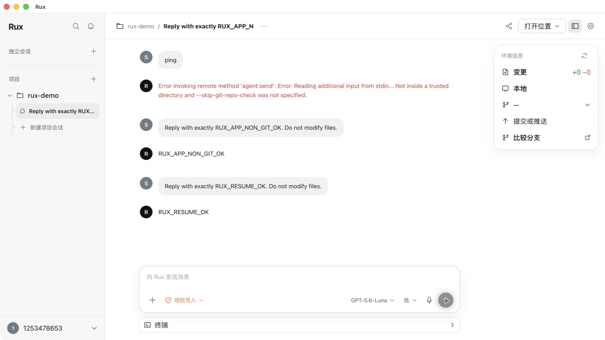

## Conversation alignment regression

Agent messages, errors, and loading states are left-aligned. User messages use right-aligned bubbles with the user avatar on the right. Reopened conversations automatically scroll to the latest response.

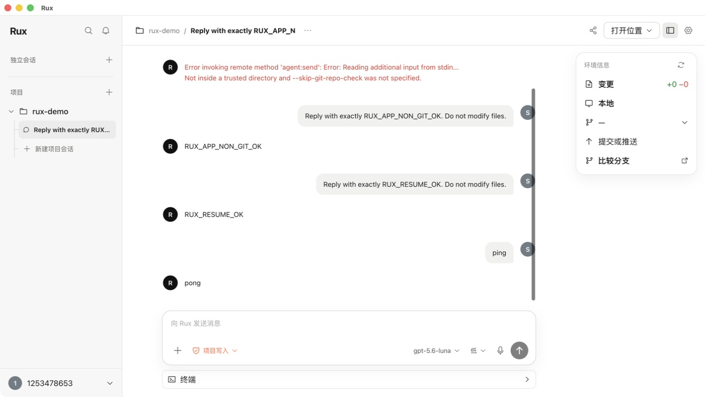

## Permission menu regression

The composer permission control now follows the three-option approval model: request approval, automatic approval help, and unrestricted full access. Each option includes its behavior description and selected state; full access requires a second confirmation.

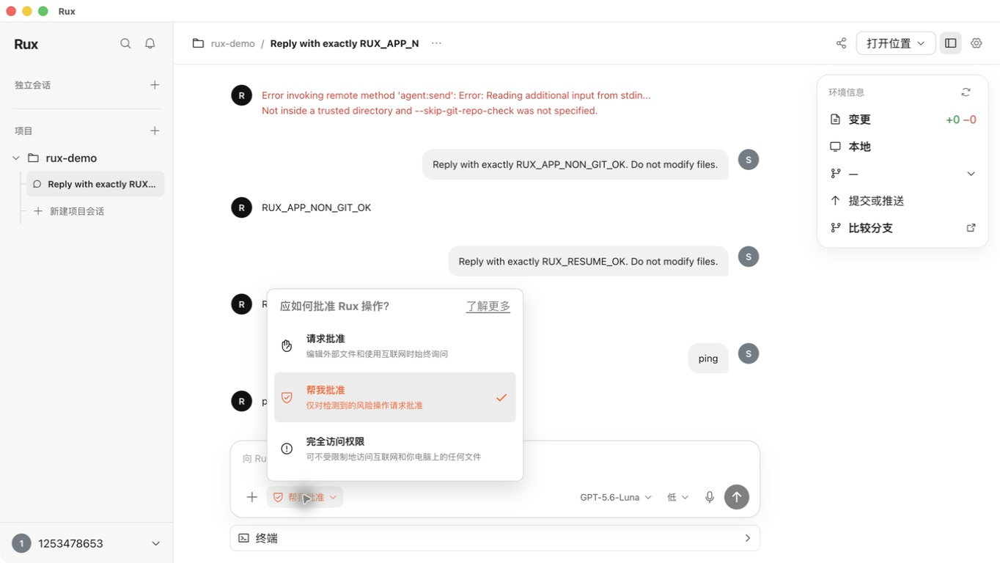

## Compact UI density regression

The application now uses a 14px UI baseline, tighter sidebar and toolbar rows, smaller headings, denser composer and modal spacing, and a narrower settings navigation. UI font size is persisted and configurable from 12–16px in Appearance settings.

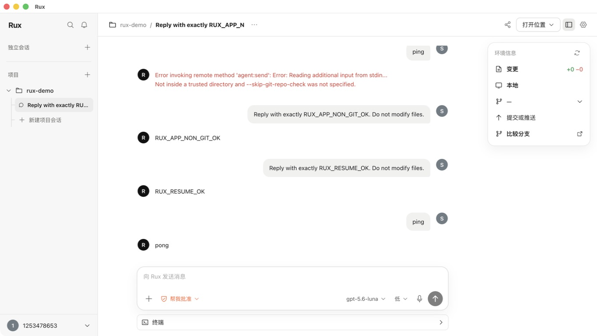

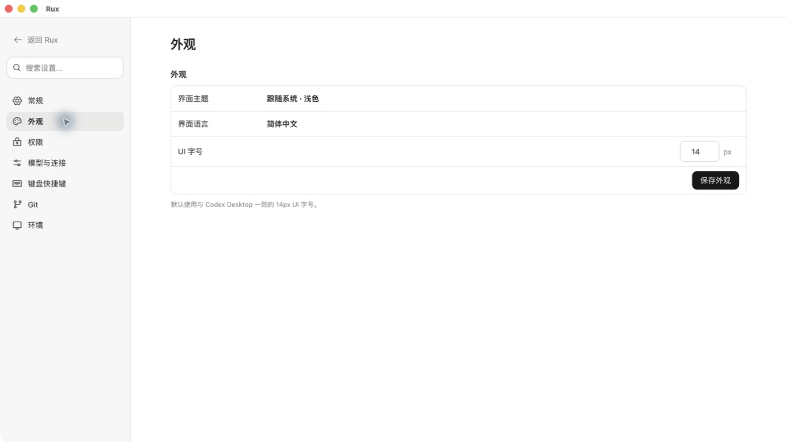
