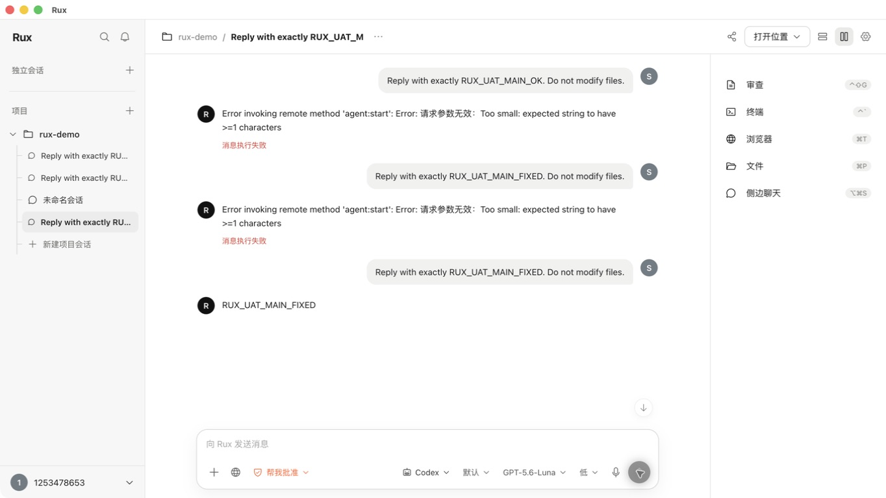
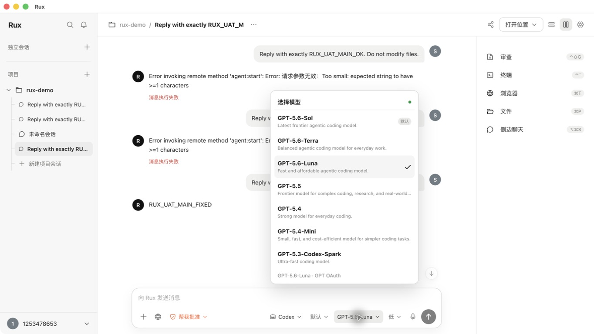
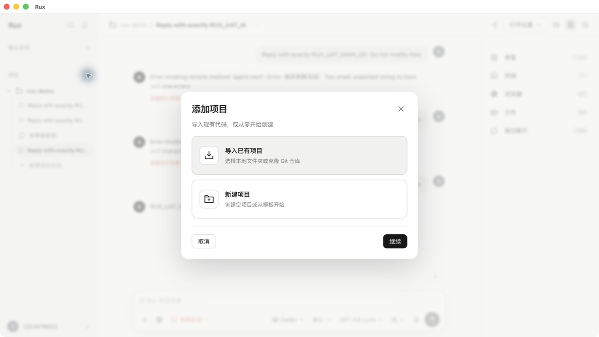

# Rux Complete UAT Report

Date: 2026-08-26  
Surface: running packaged macOS app at 1364 × 768  
Mode: combined visual, interaction, functional, and accessibility audit

## Verdict

**PASS WITH DOCUMENTED LIMITS — the acceptance blockers found in this run are fixed.** The packaged build now completes an unbound Codex first turn, keeps composer overlays mutually exclusive, restores keyboard-modal behavior, exposes terminal output to assistive technology, and prevents invalid Git actions. Account-changing and destructive scenarios remain outside this run as documented below.

## Step results

| Step | Surface | Health | Current-run evidence |
| --- | --- | --- | --- |
| 1 | Launch, project/sidebar hierarchy, panel toggles | PASS | `03-main-clean.png`; right panel toggle and sidebar filtering exercised |
| 2 | Composer popovers and keyboard dismissal | PASS after fix | Failure: `01-overlapping-popovers.png`, `02-escape-leaves-agent-mode-open.png`; retest: `15-overlay-mutual-exclusive-fixed.jpeg` |
| 3 | Add-project choice and create form | PASS after accessibility fix | Forms: `04-add-project-choice.png`, `05-create-project-form.png`; retest: `14-modal-accessibility-fixed.jpeg` |
| 4 | Models, OAuth, Provider, appearance, permissions, shortcuts, Git, environment settings | PASS for navigation/read state | `06-settings-models.png`, `07-settings-provider.png` |
| 5 | Main project conversation, first message | PASS after fix | Failure: `11-main-chat-failure.png`; packaged-build retest: `13-main-chat-fixed.jpeg`, returned `RUX_UAT_MAIN_FIXED` |
| 6 | Side chat with real Codex response | PASS | `10-side-chat-success.png`; returned `RUX_UAT_SIDE_OK` |
| 7 | PTY terminal | PASS | `09-terminal-command.png`; returned `RUX_UAT_TERMINAL` |
| 8 | Git review and empty state | PASS for read state | `08-review-empty.png`; destructive operations validated only by current-run temp-repo tests |
| 9 | File picker and project files | PASS / limited fixture | Native macOS picker opened and cancelled; selected project contained no displayable files |
| 10 | Browser/origin tool | BLOCKED BY FIXTURE | Current project has no origin; guarded empty state works, external navigation not executed |
| 11 | SQLite persistence, IPC, Git, Agent routing | PASS automated | 14 test files / 35 tests, typecheck/build, 2 Electron E2E, package, production dependency audit, and diff check passed |
| 12 | Keyboard and assistive access | PASS for remediated paths | Escape/focus restoration verified for overlays and modal; modal background absent from AX tree; `终端输出` present in AX tree |

## Remediation verification

1. **[Resolved P0] First main-conversation message.** Blank optional session identifiers are omitted from `agent:start`. A packaged, previously unbound Codex conversation returned `RUX_UAT_MAIN_FIXED` without a validation error.
2. **[Resolved P1] Overlay collisions.** Agent, Agent Mode, Model, Reasoning, and Permission now use one overlay controller. Current-build AX inspection showed the Model dialog without the Agent Mode option layer; Escape closed it and restored focus to the model trigger.
3. **[Resolved P1] Add-project modality.** Initial focus moves into the dialog, Tab is trapped, Escape closes it, background navigation is removed from the AX tree, and focus returns to `添加项目`.
4. **[Resolved P1 accessibility] Terminal transcript.** xterm screen-reader mode is enabled and a synchronized `终端输出` live region is exposed in the packaged build.
5. **[Resolved P2] Error presentation.** Electron transport and schema diagnostics are converted to concise Chinese recovery messages.
6. **[Resolved P2] Git context.** Commit/push and branch controls are disabled when branch is `—`, with an explanatory tooltip.
7. **[Resolved P2] Regression coverage.** Electron E2E now submits a main-chat turn, checks overlay exclusivity/Escape/focus restoration, verifies modal modality, and asserts accessible terminal output.

## Fix evidence

### Unbound main conversation succeeds

### Only one composer overlay remains open

### Add-project dialog is keyboard-modal

## Confirmed strengths

- Visual hierarchy is consistent across shell, modal, settings, review, and dock.
- Add-project forms have clear labels, path preview, template selection, and strong primary/secondary action contrast.
- Settings navigation and forms expose meaningful native labels in the accessibility tree.
- Empty states are clear and do not pretend unavailable data exists.
- Side chat, native PTY, SQLite persistence, Git service, runtime routing, and cross-platform packaging passed current-run tests.
- Dangerous Git discard behavior remains confirmation-gated and covered by a real temporary repository test.

## Acceptance follow-ups

1. Run a dedicated VoiceOver reading-order and announcement session on the terminal transcript and streaming conversation.
2. Exercise OAuth logout/login and persisted Provider mutation in a disposable test account/profile.
3. Exercise import/create/clone and destructive Git flows against a dedicated UAT fixture repository.

## Evidence limits

- Login/logout was not executed to avoid disrupting the active account.
- Provider save/delete/test was not executed because it would modify persisted configuration or require the local Ollama service.
- Project creation/import submission and destructive Git actions were not run against user data; their real filesystem/Git paths were covered by current-run isolated tests.
- Voice input was not exercised because microphone permission and transcription accuracy require an explicit assistive-device/privacy test.
- This is not a full WCAG certification; VoiceOver reading order, zoom reflow, contrast measurement, and reduced-motion behavior still need dedicated checks.
