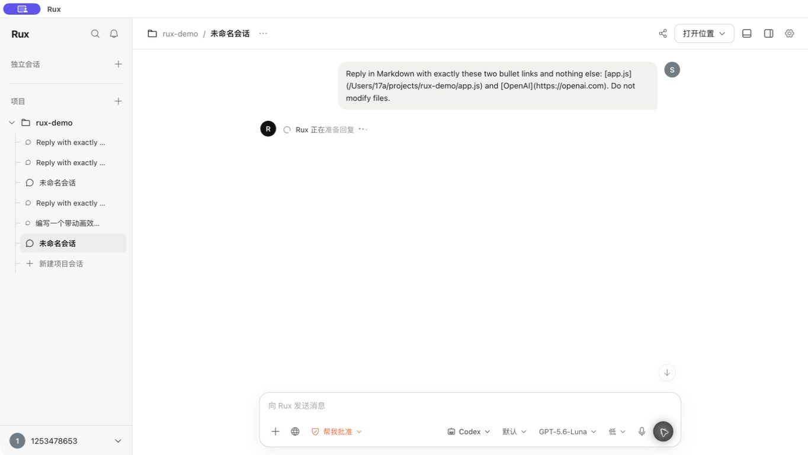
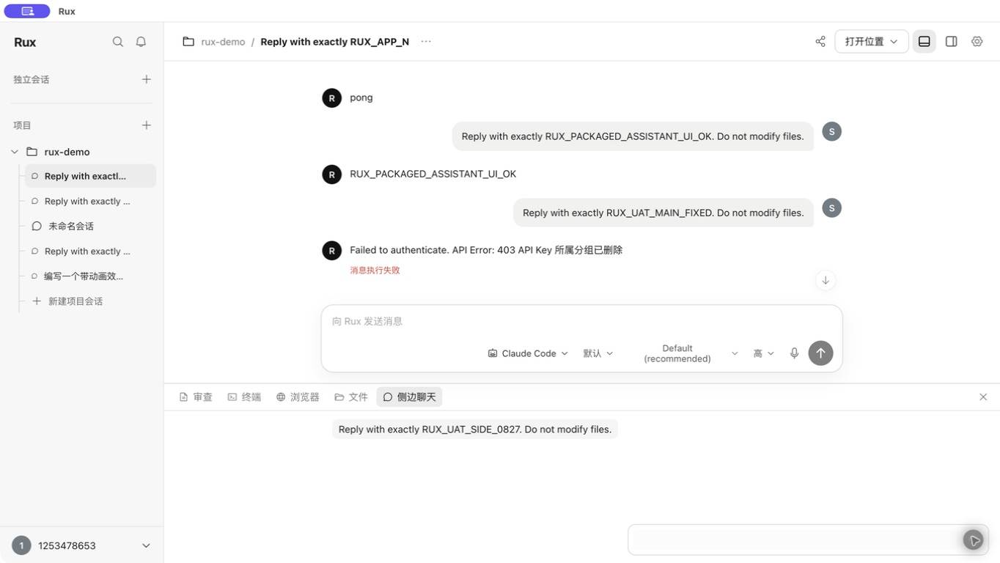
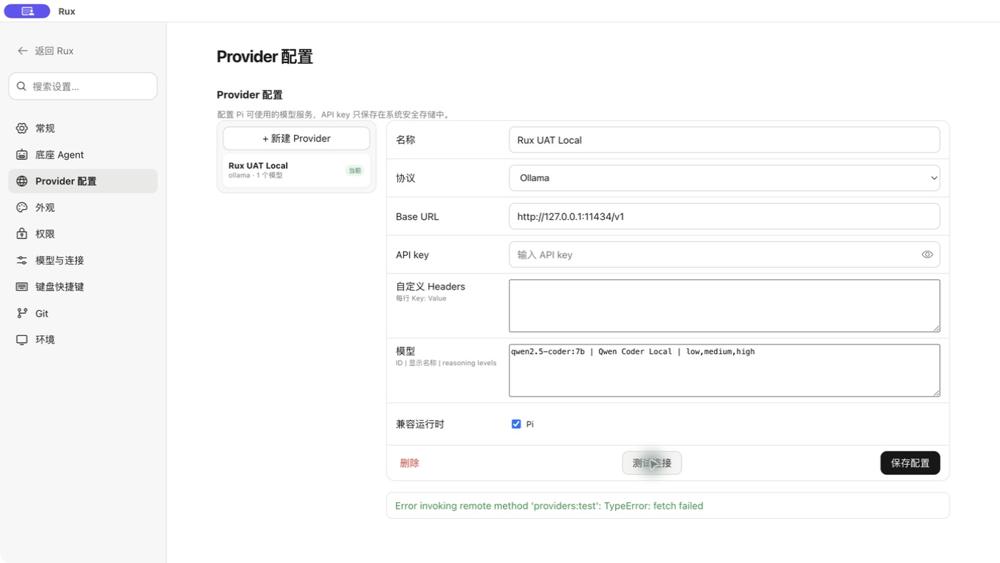
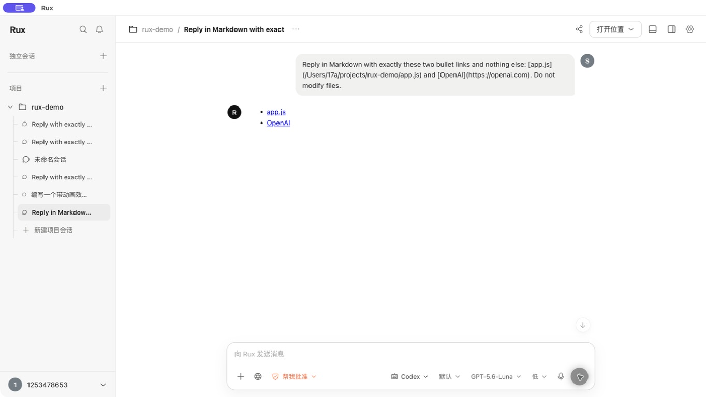
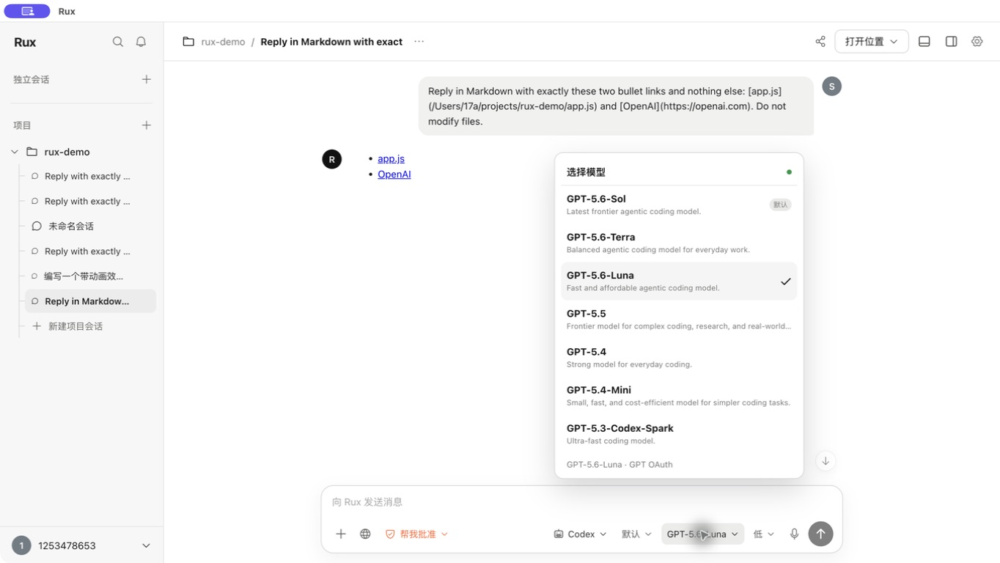
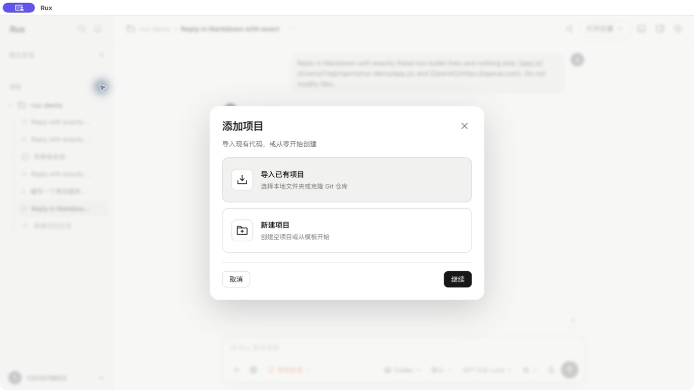
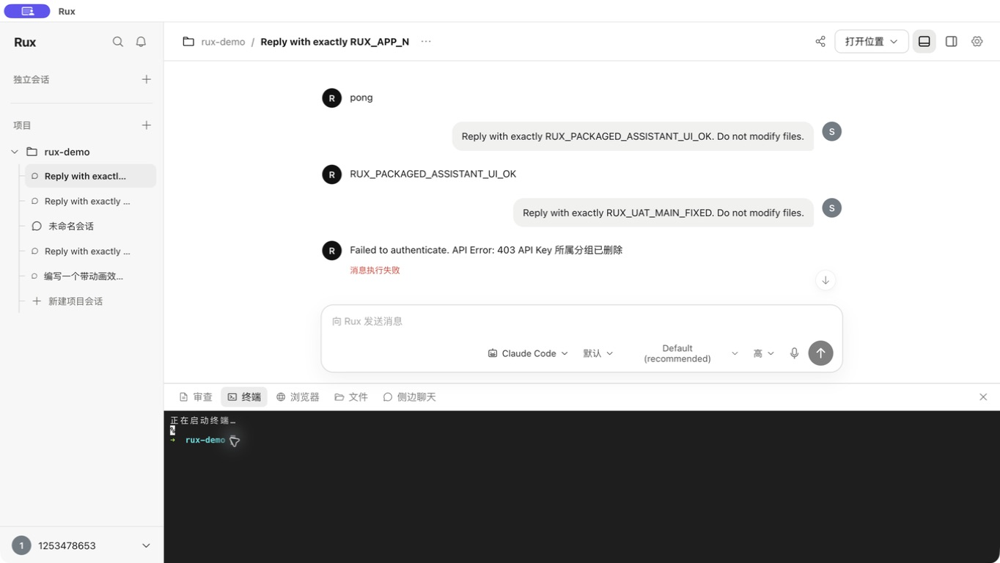

# Rux UAT Report

Date: 2026-08-27  
Build: current working tree packaged as `release/mac-arm64/Rux.app`  
Viewport: 1364 × 768  
Mode: visual, interaction, functional, UX, and assistive-technology inspection

## Verdict

**FAIL — not ready for acceptance under the requested “all visible functions work and no blank waiting” standard.** The primary conversation, terminal, file/link context menus, settings navigation, project forms, side chat result, and build pipeline work. Acceptance is blocked by a non-functional conversation rename action, a blank side-chat waiting state, a project menu that cannot be dismissed with Escape or outside click, and misleading/raw Provider error feedback.

## Step results

| Step | Surface | Health | Current-run evidence |
| --- | --- | --- | --- |
| 1 | Launch, persisted workspace, sidebar hierarchy | PASS | `01-launch-main.jpeg` |
| 2 | Sidebar search, notification, account menu | PASS | Search filtered to the matching conversation; `02-search-notification.jpeg` |
| 3 | Settings loading and navigation | PASS with issue | Loading spinner prevents a blank route; all nine sections open. Codex model select was empty while the composer later had seven models: `03-settings-general.jpeg` |
| 4 | Provider test feedback | FAIL UX | Connection test is interactive but failure is shown as a green raw Electron error: `16-provider-raw-error.jpeg` |
| 5 | Composer Agent/model/reasoning/permission overlays | PASS | Escape closes overlays and restores trigger focus; model list is usable: `13-model-picker.jpeg` |
| 6 | New Codex conversation and waiting state | PASS | Immediate spinner, shimmer text, disabled send and Stop action; real response completed: `10-main-chat-loading.jpeg`, `11-main-chat-links.jpeg` |
| 7 | File and web-link context menus | PASS | File native menu exposed Open, VS Code, Copy Path, Copy Contents, Finder; link menu exposed Open and Copy. The capture service exposed the native menus in AX but returned no bitmap. |
| 8 | Top and bottom panel transitions | PASS | Both layout buttons work; dock opens with a 160 ms transition: `05-bottom-panel.jpeg` |
| 9 | PTY terminal | PASS with polish/accessibility issue | Command returned `RUX_UAT_0827`: `06-terminal-success.jpeg` |
| 10 | Project files | PASS / launch confirmation limited | `app.js`, `index.html`, and `styles.css` were listed and clickable; the external default-editor launch was not visible in the capture service. |
| 11 | Browser/origin tool | PASS empty state | No-origin project shows a clear explanation and disables Open. |
| 12 | Side chat | FAIL waiting UX / PASS result | Request period contains only the user bubble and disabled composer: `07-side-chat-blank-wait.jpeg`; real response later returned `RUX_UAT_SIDE_0827`: `08-side-chat-success.jpeg` |
| 13 | Git review | PASS for non-Git fixture | Full review disables branch and commit/push and explains the empty state: `09-review-empty.jpeg` |
| 14 | Add/import/create project flows | PASS with focus/latency issues | Modal is visually polished, modal background is isolated, Escape restores focus: `14-add-project-modal.jpeg`, `17-create-project-form.jpeg` |
| 15 | Conversation rename from sidebar and top menu | **FAIL functional** | Both controls were activated by AX, keyboard, and visible coordinate; neither opened an input UI or produced feedback: `15-rename-no-feedback.jpeg` |
| 16 | Automated verification | PASS | 16 test files / 41 tests, typecheck, Web/Desktop builds, package, 2 Electron E2E, and diff check passed in this run. |

## Highest-impact findings

1. **[P1 functional] Conversation rename is non-functional.** The sidebar pencil and top `… > 重命名会话` close/focus normally but never present an input dialog or confirmation. The user cannot complete a newly exposed primary action.
2. **[P1 waiting UX] Side chat has a blank request state.** After Send, the user message remains, the composer disables, and no spinner, assistant placeholder, status text, elapsed indicator, or Cancel action appears. The same operation eventually succeeds, so this is a presentation gap rather than an Agent failure.
3. **[P1 interaction/accessibility] The project action menu is sticky.** Escape and clicking outside did not dismiss it; only clicking the same trigger closed it. While open, the AX tree exposes only the menu, making this especially disruptive for keyboard and screen-reader users.
4. **[P1 trust/error recovery] Provider failure is raw and styled as success.** `Error invoking remote method 'providers:test': TypeError: fetch failed` is shown verbatim in green because the error-style matcher only recognizes Chinese `失败/错误`. It provides no cause, endpoint, retry guidance, or local-service hint.
5. **[P1 functional consistency] Settings can show an empty Codex model selector.** When Settings was opened from a Claude-bound conversation, `模型与连接` rendered a blank select and the Agent overview reported `Codex 0 个可用模型`; after opening a Codex conversation, the composer correctly showed seven models. Global Codex settings should not depend on the active conversation's Agent fetch lifecycle.
6. **[P2 error copy] Historical/current Agent failures expose backend language.** The main conversation includes `Failed to authenticate. API Error: 403 API Key 所属分组已删除`; the error mapper does not recognize `authenticate`, and persistent raw errors continue to damage clarity.
7. **[P2 loading polish] Terminal never removes its initial loading text.** `正在启动终端…` remains above the ready prompt and in the accessible transcript. The transcript also contains raw ANSI/control sequences, which screen readers may vocalize.
8. **[P2 latency feedback] The lazily loaded Add Project modal gives no immediate acknowledgment.** The first post-click capture still showed the main screen; the dialog appeared roughly 0.8 seconds later. `Suspense fallback={null}` makes slower devices feel unresponsive.
9. **[P2 keyboard/accessibility] Selection semantics are visual-only.** Permission, reasoning, template, and import-mode segmented buttons do not expose `aria-pressed`, `aria-selected`, or an equivalent radio-group state in AX. Settings navigation also lacks current-page semantics.
10. **[P2 form focus] Project substeps focus the Back control rather than the first task field.** New Project retained focus on Back instead of Project Name; Git import retained focus on the Git toggle instead of Repository URL.

## Confirmed strengths

- The shell is visually coherent: consistent spacing, borders, radii, typography, icon weight, selected states, and restrained shadows.
- Main Agent waiting no longer goes blank. It provides a spinner, animated preparation copy, three loading dots, a Stop action, and message/content reveal animations.
- Motion is short and purposeful (roughly 120–220 ms), and `prefers-reduced-motion` collapses transitions and animations to 1 ms.
- The model picker is readable, keeps one overlay open, and marks the selected/default models clearly.
- Add Project uses a strong modal hierarchy, background blur, background AX isolation, Escape close, and trigger-focus restoration.
- Non-applicable actions are generally disabled: Send without input, browser without origin, import without source, and Git actions outside a repository.
- File/link context menus use native macOS menus and keep filesystem actions scoped to the active project.
- Terminal, side chat, and the main Codex conversation all completed real current-run operations.

## Evidence limits

- Native right-click menus were fully visible in the accessibility tree, but Computer Use returned no bitmap while the native menu owned focus; menu contents are therefore recorded as an explicit screenshot limitation.
- Login/logout was not executed to avoid disrupting the active account. Provider save/delete and project creation/import submission were not executed because they mutate persisted configuration or the filesystem.
- Voice input was not exercised because accepting microphone permission requires a separate privacy/device-permission test.
- Destructive project removal and Git discard were not executed against user data. The current fixture is not a Git repository, so branch switching, staging, commit, push, and real diff rendering require a dedicated Git UAT fixture.
- External editor launch after clicking a project file was not observable in the capture service; the button invocation succeeded without an in-app error.
- This is not a full WCAG certification. VoiceOver pronunciation/order, contrast measurement, zoom/reflow, and long-duration streaming still need dedicated sessions.

## Recommended acceptance order

1. Replace `window.prompt` rename with an in-app modal or inline rename editor and add E2E coverage for both entry points.
2. Add a side-chat assistant placeholder, spinner/status, Cancel action, and `aria-live` update while sending.
3. Move project/profile/toolbar popovers onto the shared overlay controller so outside click, Escape, mutual exclusion, and focus restoration are consistent.
4. Apply the shared user-facing error mapper to Provider, side chat, settings, and persisted Agent errors; classify English `Error/fetch/authenticate` as errors visually.
5. Load Codex models independently of the selected conversation Agent, and render an explicit loading/error/empty state instead of a blank select.
6. Clear terminal boot copy when the first prompt arrives and sanitize ANSI text before exposing the accessible transcript.
7. Provide an immediate modal-loading acknowledgment and correct initial focus for each Add Project substep.
8. Add selection semantics to segmented controls and active settings navigation.

## Evidence

### Main Agent waiting state

### Side chat blank waiting state

### Provider error is raw and green

### File and link output succeeds

### Model picker

### Add Project flow

### Terminal command succeeds

