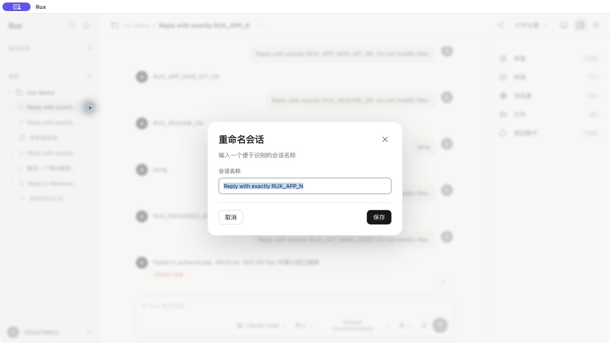
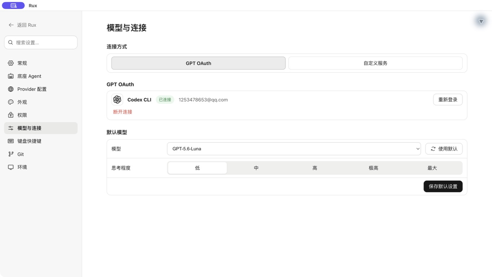
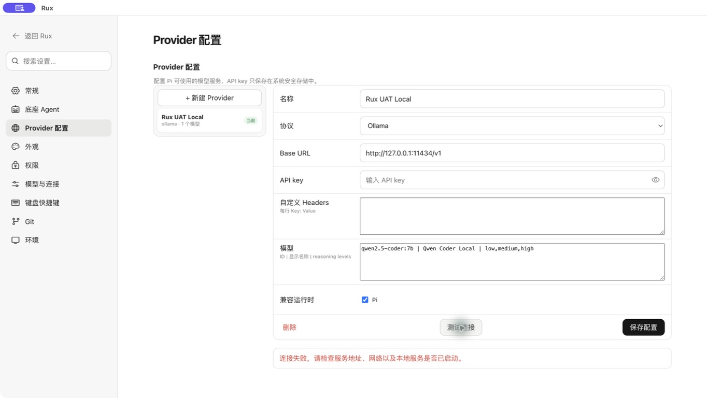
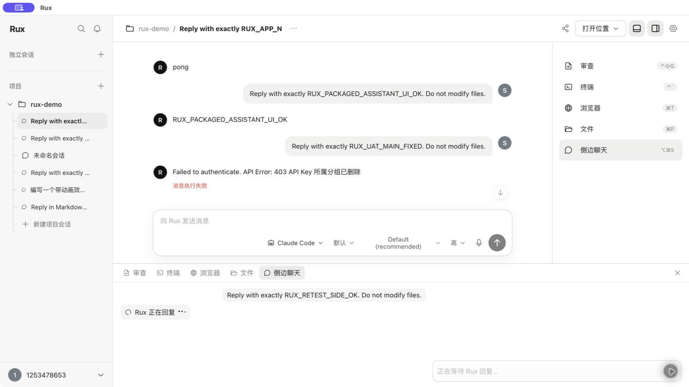
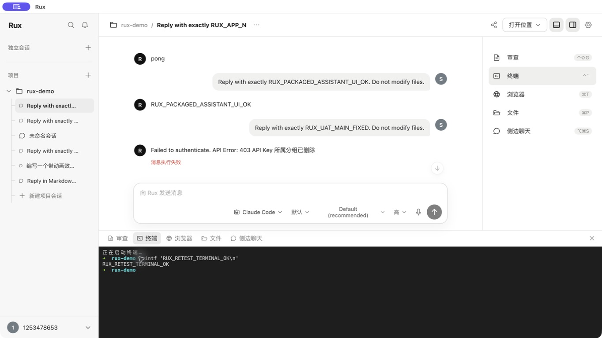
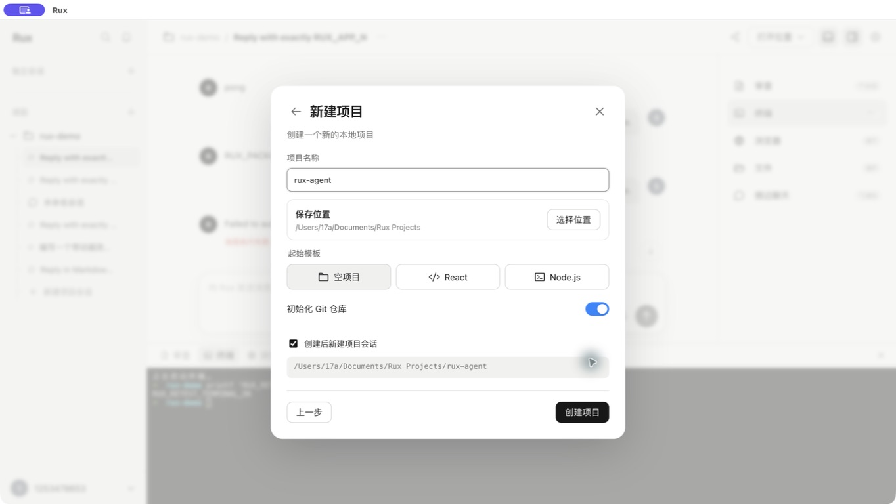

# Rux UAT Fix Retest

Date: 2026-08-27  
Build: current working tree packaged as `release/mac-arm64/Rux.app`  
Scope: targeted retest of the issues recorded in `uat/2026-08-27-complete-uat/UAT-REPORT.md`

## Verdict

**PASS WITH TWO P2 RESIDUALS.** All prior P1 acceptance blockers are resolved in the real packaged application. Eight targeted areas pass completely. Two non-blocking residuals remain: old persisted authentication failures still retain their original backend copy, and xterm's internal accessibility content list retains `正在启动终端…` even though the visible terminal and the dedicated accessible transcript are clean.

## Step results

| Step | Previous issue | Retest | Evidence |
| --- | --- | --- | --- |
| 1 | Conversation rename produced no UI | PASS | In-app dialog opens immediately, title is selected, background is removed from AX, Escape restores the pencil trigger: `01-rename-dialog.jpeg` |
| 2 | Side chat had a blank waiting period | PASS | Visible spinner, `Rux 正在回复`, animated dots, disabled composer placeholder, `aria-live`, and eventual real response `RUX_RETEST_SIDE_OK`: `04-side-chat-loading.jpeg` |
| 3 | Project action menu was sticky | PASS | Escape closes and restores focus; clicking outside also closes. |
| 4 | Provider error was raw and green | PASS | Error is concise, actionable Chinese and red: `03-provider-friendly-error.jpeg` |
| 5 | Codex model settings were blank from a Claude session | PASS | The Codex selector contains `GPT-5.6-Luna`; Agent overview reports Codex 7 / Claude 4 models: `02-codex-models-from-claude.jpeg` |
| 6 | Historical/raw Agent authentication copy | PARTIAL | New and normalized errors use friendly copy, but the existing persisted failure still displays `Failed to authenticate. API Error: 403...` in the conversation. |
| 7 | Terminal retained boot copy and exposed controls | PARTIAL | Visible terminal is clean and returned `RUX_RETEST_TERMINAL_OK`; dedicated `终端输出` contains no OSC/ANSI title text. xterm's separate internal AX content list still retains `正在启动终端…`: `05-terminal-clean-start.jpeg` |
| 8 | Add Project lazy-load felt unresponsive | PASS | Dialog is present on the first post-click state; no blank lazy fallback. |
| 9 | Selection controls lacked semantic state | PASS | Settings permissions and project choices/templates expose toggle-button values; workspace tools expose selected tabs. |
| 10 | Project forms focused Back/toggle controls | PASS | Create form focuses and selects Project Name; template states are exposed: `06-create-form-focus.jpeg` |
| 11 | Automated regression | PASS | 17 test files / 44 tests, typecheck, Web/Desktop builds, package, 2 Electron E2E, and diff check passed in this run. |

## Confirmed improvements

- Rename is now a complete keyboard-accessible workflow rather than a dead control.
- Side-chat latency is understandable and visually consistent with the main Agent loading treatment.
- Provider failures no longer expose Electron method names or suggest success through color.
- Settings no longer depend on the current conversation Agent to populate Codex models.
- Add Project is immediate, modal, focus-directed, and semantically selectable.
- Project and workspace overlays can be dismissed predictably.

## Remaining follow-ups

1. Normalize every persisted message part containing an incomplete/error status, even when the enclosing historical message is not marked `status: error`.
2. Clear or recreate the xterm instance when replacing the synthetic boot chunk, or disable xterm's duplicate screen-reader transcript and rely on the sanitized Rux live region.

## Evidence limits

- This was a targeted retest, not a second full-product audit.
- The Provider fixture intentionally remained offline so the failure experience could be verified; successful Provider connectivity still requires a running local endpoint.
- Voice input, account login/logout, destructive project/Git operations, and real Git branch/commit flows were outside this retest.
- The Computer Use capture overlay visible at the top-left of screenshots is test instrumentation, not Rux UI.

## Evidence

### Rename dialog

### Codex models available from a Claude-bound conversation

### Provider failure feedback

### Side-chat waiting state

### Terminal visible state

### Create-project initial focus

